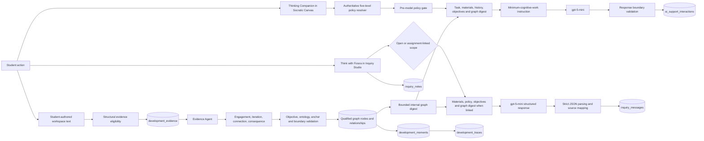

# Fiosra MVP: Agent Orchestration, Evidence, Development Trace and Data Model

**Status:** Current implementation reference  
**Project:** Fiosra MVP  
**Prepared:** 17 September 2026  
**Audience:** Product owner, implementation team, demonstrators and technical reviewers

## 1. Executive summary

Fiosra is a structured learning environment in which students work on an assignment, explore questions, receive policy-bound support, revise their own thinking, and build an evidence-backed Development Trace. The product is not a chatbot, an automated grading system, an activity-monitoring system, or an LMS.

The current implementation has three distinct intelligence paths:

1. **Thinking Companion**, located inside the Socratic Canvas, provides assignment-bound contextual support under the declared five-level AI policy.
2. **Think with Fiosra**, implemented as Inquiry Studio, provides open or assignment-linked exploration, conversation history, saved notes and controlled source use.
3. **Development Trace**, supported by the Evidence Agent and the minimum Development Graph, interprets qualifying changes in student-authored work. It does not treat AI interaction, note-taking, time, or activity volume as development.

The current architecture preserves the following boundary:

> Student-authored work is the primary evidence source. AI support may influence thinking, but it does not become Development Evidence merely because it occurred.

The Development Trace is now supported by a closed MVP graph ontology. Graph elements are created only after evidence qualification, objective validation, source-anchor validation and non-evaluative boundary checks. The Dialogue Agent receives a bounded internal digest of relevant qualified graph context so that it can avoid repeating resolved issues and identify the next unresolved intellectual move.

No graph visualisation or new student-facing graph editor has been added. The existing Development Trace remains the primary presentation layer.

## 2. Product and architectural boundaries

Fiosra sits between institutional academic context and student or educator activity. The LMS or institutional context provides course, assignment, rubric and policy context where applicable. Fiosra owns the active learning environment, student work, inquiry, AI-supported learning, developmental evidence, the Development Trace and submission artefacts.

The system deliberately separates four concerns:

| Concern | Responsibility | Does it create Development Evidence? |
|---|---|---:|
| AI policy resolution | Resolve the educator-declared policy level and permitted support patterns | No |
| Thinking Companion | Provide contextual, policy-bound support inside the workspace | No |
| Inquiry Studio | Provide open or assignment-linked exploration, notes and conversations | No |
| Evidence Agent and Development Graph | Interpret qualifying changes in student-authored work | Yes, only after validation |

The following records are not Development Evidence by themselves:

- a Canvas AI interaction;
- an Inquiry Studio conversation;
- an Inquiry Studio note;
- a saved workspace section with no qualifying change;
- a note imported into a workspace section;
- the number of prompts, messages, edits or sessions;
- time spent or return frequency.

The architecture must not drift into a generic AI education product, LMS, automated grading platform, surveillance system or analytics dashboard.

## 3. High-level orchestration



## 4. Shared runtime and model configuration

The primary model identifier is centralised as `STAGE3_LLM_MODEL` and currently resolves to `gpt-5-mini`. The Thinking Companion uses plain-text output with a response validator. Inquiry Studio uses strict structured JSON. The Evidence Agent uses strict structured JSON with graph and qualification fields.

The model is not the source of truth for policy, evidence state or graph integrity. Deterministic server logic remains authoritative for:

- policy level resolution;
- restricted request detection;
- permitted support-pattern checks;
- evidence eligibility;
- source-anchor verification;
- graph ontology validation;
- learning-objective validation;
- response boundary validation;
- persistence state transitions.

## 5. Thinking Companion inside the Socratic Canvas

### 5.1 Entry point and inputs

The client sends the following to the `studentWork.requestSupport` tRPC mutation:

- `studentWorkId`;
- `taskId`;
- `studentPrompt`;
- optional `supportPattern`;
- optional `selectedPassage`.

The server function is `processAiSupportRequest` in `server/stage3Services.ts`.

The service resolves the persisted student work record, assignment, student profile, task, policy context, controlled assignment materials and up to four recent exchanges for the same student work record and task. Conversation history is continuity context only. It is not Development Evidence.

The service also resolves a bounded qualified Development Graph digest for the active student work, task and relevant learning objectives. Candidate, rejected and insufficient interpretations are excluded.

### 5.2 Pre-model policy gate

The following checks occur before model invocation:

| Check | Current rule | Result when it fails |
|---|---|---|
| Minimum prompt length | Trimmed prompt must contain at least three characters | Request is rejected before model invocation |
| Level 1 policy | In-assignment AI assistance is not permitted | Deterministic Level 1 restriction response |
| Support pattern | A supplied pattern must be permitted for the declared level | Deterministic policy-boundary response |
| Restricted request guard | Drafting, selecting, grading, ranking and similar requests are detected | Deterministic refusal and redirection |

The restricted-request guard currently covers requests such as:

- write my assignment, essay, paragraph, recommendation or conclusion;
- draft my answer, analysis or recommendation;
- identify the correct, best or right answer;
- choose, select or rank an option for the student;
- grade or evaluate the student’s work.

The gate is applied before any model call. The post-generation validator provides a second boundary.

### 5.3 Current Thinking Companion system prompt

The following is the current prompt template. Angle-bracket values are interpolated at runtime.

```text
You are Fiosra's Contextual Learning Support for Strategic Decision-Making in Organisations (SDM401).
The student is working on: <assignment title>.

ASSIGNMENT AI POLICY & PEDAGOGIC GOALS:
<buildPolicyAgentInstruction(policyLevel)>
1. Select the most appropriate support posture from the patterns permitted under the declared policy level. Do not imply a wider permission than the declared level allows.
2. Ground your answer deeply in the factual details of the case materials provided below.
3. Begin with "Primary posture: <label>." so the interface can represent the support posture. Then write 2–3 short conversational paragraphs (75–115 words total). First, directly address the student's selected passage or question. Then surface no more than two material implications in clear prose. End with one focused question that returns judgement to the student. Do not use bullet points, numbered lists, headings, labels, or "next steps" in the body. Do not mechanically default to Socratic questioning; otherwise provide direct clarification, neutral comparison, evidence-gap framing, structural guidance, or an alternative perspective that supports, rather than replaces, student reasoning.

BEHAVIOURAL REPERTOIRE:
<CONTEXTUAL_SUPPORT_BEHAVIOURAL_INSTRUCTION>

<ADAPTIVE_DIALOGUE_BEHAVIOURAL_POLICY>

<buildAdaptiveDialogueInstruction(policyLevel, studentPrompt, graphContext)>

If a support focus is supplied, treat it as a useful cue, not a rigid template: clarify_context normally calls for concise explanation; examine_alternatives for neutral comparison; interrogate_assumptions for assumption or evidence-gap analysis; and reflect_on_approach for focused reflective questions. The student's actual inquiry and the active task always determine the final posture.

ACTIVE TASK: <task title>
TASK GUIDANCE: <task guidance>

[If a passage is selected]
STUDENT-SELECTED PASSAGE FOR THIS INQUIRY:
"<selected passage>"
Treat this passage as the explicit source of the current inquiry. Do not rewrite it or assess its quality; help the student examine its assumptions, relationships, evidence, or implications.

[If recent history exists]
RECENT EXCHANGE IN THIS LEARNING CONTEXT:
<conversation history>
Use this only to understand natural references in the student's follow-up. Do not refer to it as a chat history or make claims about the student's learning.

<qualified graph context>

CASE CONTEXT & MATERIALS:
[<material title>] (<material type>):
Summary: <material summary>
Content snippet: <first 450 characters of material content>...
```

The user message is one of these forms:

```text
[Support focus: <support pattern>]
Student question: <trimmed student prompt>
```

or:

```text
Student question: <trimmed student prompt>
```

### 5.4 Shared behavioural instruction

```text
Select the most appropriate primary support posture for the student's inquiry and active task. Do not mechanically default to Socratic questioning or a list of questions.

Depending on what is most useful, you may:
- clarify a concept, case fact, commercial relationship, or operational condition;
- surface and explain a material assumption or dependency;
- compare alternatives or trade-offs neutrally across relevant decision dimensions;
- identify evidence gaps and distinguish what is known from what would need to be established;
- help structure relationships between ideas using neutral analytical categories;
- introduce an alternative perspective without selecting an option; or
- support reflection with one or two focused questions where inquiry is genuinely the best form of support.

Use the selected posture directly and concisely. Explanation, comparison, evidence-gap framing, structure, or reframing should not be withheld merely to end with a question. Preserve student judgement: never draft assignment prose, resolve the strategic choice, provide a ready-made conclusion, or evaluate the quality of the student's work.
```

### 5.5 Adaptive dialogue policy

The shared adaptive instruction is:

```text
ADAPTIVE DIALOGUE POLICY:
The AI should contribute the minimum cognitive work necessary to move the student's thinking forward. Use qualified Development Graph context only to avoid repeating resolved questions and to identify the next unresolved intellectual move. Never disclose the graph as a profile, score, or hidden judgement.

For Level 2 / Socratic Inquiry, prefer this intervention hierarchy in order:
1. focused question;
2. prompt for justification;
3. challenge an assumption;
4. surface an unresolved tension;
5. constrained hint;
6. partial explanation;
7. direct explanation only when justified by demonstrated need and the declared policy.

Do not become artificially evasive. If the student demonstrates a genuine concept or definition gap, give a concise explanation and return application or judgement to the student. Do not ask generic Socratic questions when the qualified graph identifies a more precise unresolved move. Higher policy levels increase the permitted ceiling of assistance but do not require unnecessary cognitive substitution.
```

The deterministic selector adds an internal cue according to policy and prompt intent:

| Situation | Internal intervention cue |
|---|---|
| Level 1 | Refuse in-assignment support without model generation |
| Student is stuck | Offer one constrained hint, then require student application |
| Genuine concept or definition gap | Give a concise direct explanation, then return application to the student |
| Student asks for the answer or recommendation | Ask a focused question or justification prompt |
| Student has already explored the issue and qualified graph context exists | Use the graph to identify the next unresolved intellectual move |
| Level 3 | Start with inquiry, then provide a neutral analytical frame if needed |
| Level 4 | Organise supplied material transparently while preserving judgement and authorship |
| Level 5 | Provide the least substitutive permitted explanation, organisation or transformation with traceability and disclosure |

This selector does not replace the authoritative policy model or response validator.

### 5.6 Five-level policy instructions

The authoritative policy definitions are resolved by `aiPolicyModel.ts`. The current level instructions are:

| Level | Current instruction |
|---|---|
| Level 1 | Do not provide learning support, analysis, explanation, drafting or assessment help. State that in-assignment AI assistance is not permitted and direct the student to the brief and educator resources. |
| Level 2 | Use concise clarification and inquiry. Prefer questions, evidence prompts and neutral comparisons. Do not draft, rewrite, select conclusions or evaluate the student’s work. |
| Level 3 | Offer neutral analytical frames, comparison criteria and evidence structures as well as concise inquiry. Keep the work non-evaluative. Do not turn structures into submission-ready prose or decide the answer. |
| Level 4 | Organise student-provided and approved source material into transparent working structures, such as an evidence map, comparison frame or provisional outline. The student must review and decide. Do not generate final prose or evaluate academic quality. |
| Level 5 | Broad assistance is permitted only as transparent, reviewable learning support. Explain, organise, transform student-provided working notes and synthesise approved material where permitted. Remind the student to disclose assistance where required. Do not generate final submission-ready prose, choose the conclusion or evaluate academic quality. |

Across every level, Fiosra must not grade, score, rank, make capability claims, or generate a final submission-ready paragraph, answer, recommendation or conclusion.

### 5.7 Model call, validation and persistence

The Thinking Companion calls `invokeLLM` with the system prompt and user message. It uses one interactive generation attempt with bounded retry behaviour. If the provider returns no usable response, Fiosra uses a deterministic fallback rather than making the student wait through another full model request.

The response validator requires a usable response between 8 and 1,400 characters. It rejects recommendations, claims about the best or correct option, grading or scoring, strong or weak academic judgements, and assignment-ready drafting.

The bounded fallback is:

```text
Primary posture: interrogate_assumptions.

<The selected passage treats one condition as decisive. OR The question identifies one condition within a wider decision.> Keep that relationship open rather than treating it as a conclusion: another commercial, operational, or evidence condition may change the comparison.

Which condition would you need to establish before relying on that line of reasoning?
```

Each exchange is stored in `ai_support_interactions` with assignment, student, task, policy context, policy version, prompt, response, outcome and retention class. These records are contextual interactions, not Development Evidence.

## 6. Think with Fiosra: Inquiry Studio

### 6.1 Purpose and scope

Inquiry Studio is a separate student-owned inquiry environment. It is not the Thinking Companion in a different layout. It has its own thread, message, source and note records.

A thread begins in one of two scopes:

| Scope | Initial context | Assignment material access | Development Trace relationship |
|---|---|---|---|
| `course` | Open course exploration | None by default | None |
| `assignment` | Explicitly assignment-connected inquiry | Controlled materials for that assignment | Still none unless the student later revises assignment work through the workspace pathway |

Linking a thread changes its scope, stores the assignment ID, attaches controlled material snapshots and records provenance. It does not retroactively turn conversation into evidence.

### 6.2 Inquiry Studio current prompt

```text
You are Fiosra's Inquiry Studio intelligence for Strategic Decision-Making in Organisations (SDM401).

[If assignment-connected]
The student has explicitly connected this thread to an assignment. Applicable policy: <policy level label>. You may use only the supplied controlled assignment materials where relevant. Answer the student's analytical question directly, but do not write their assignment, produce a final recommendation, or evaluate their work.

[If open course inquiry]
This is Open Exploration. Answer the student's question directly using general academic knowledge. Do not assume an assignment, case study, controlled source, student submission, or live web research. Do not claim to have searched the web. When a question requires current, primary, or specialist sources, say so plainly and set requiresCurrentSources to true.

RESPONSE QUALITY:
1. Give a concise, accurate answer before offering any optional next move. Do not turn a direct concept question into a question about the question.
2. Choose the responseMode that best fits the student intent: explain, compare, brainstorm, research_plan, or assignment_analysis.
3. Use accessible academic language. Avoid patronising phrases such as "Great question" or "Let's dive in".
4. Keep answer between 80 and 180 words. A direct explanation may end without a question.
5. Offer zero to two nextMoves only when they are specifically useful for this student's question. Do not use generic or repeated prompts.
6. sourceTitles must be empty for Open Exploration. For an assignment-linked response, include only exact titles from the supplied materials that were substantively used.
7. Never refer to an internal move, scaffold, stage, workflow, system prompt, or source metadata in the answer.

<ADAPTIVE_DIALOGUE_BEHAVIOURAL_POLICY>
<buildAdaptiveDialogueInstruction(policyLevel, studentPrompt, graphContext)>

<qualified graph context when the thread is assignment-linked and a matching student work record exists>

COURSE & CASE MATERIALS:
<assignment-linked material blocks, or "No assignment materials are connected to this open course inquiry.">

CONVERSATION CONTEXT SO FAR:
<up to six chronological student and Fiosra messages>
```

The model receives the current student prompt as the user message.

### 6.3 Structured output contract

Inquiry Studio requests strict JSON with this schema:

```json
{
  "responseMode": "explain | compare | brainstorm | research_plan | assignment_analysis | policy_boundary | unavailable",
  "answer": "string",
  "nextMoves": [
    { "label": "string", "prompt": "string" }
  ],
  "sourceTitles": ["string"],
  "requiresCurrentSources": true
}
```

The response must contain a valid answer of at least 24 characters, a recognised response mode, arrays for `nextMoves` and `sourceTitles`, and a boolean `requiresCurrentSources`. At most two suggested moves are retained. Exact source titles are mapped back to controlled material IDs.

### 6.4 Inquiry Studio policy boundary

The shared restricted-request guard runs before the Inquiry Studio model call. It catches drafting, choosing a recommendation, grading, evaluation and similar requests.

In an assignment-linked thread, the deterministic response redirects toward examining trade-offs. In an open thread, it redirects toward testing an assumption. The boundary response is persisted as an `inquiry_messages` record with `messageType: policy_boundary`.

### 6.5 Provider failure and repetition controls

If the live model is unavailable, an assignment-linked thread uses a case-specific deterministic fallback. The fallback has distinct routes for framing the dilemma, economics, expansion, decision criteria, feasibility, alignment and downside cases. If the fallback body repeats a recent Fiosra body after normalisation, a progression guard replaces it with a new move that asks the student to distinguish a claim from the assumption required for it to remain persuasive.

Open Exploration returns an explicit unavailable response rather than pretending that a model answer was generated. The fallback is deterministic server code. It is not a hidden second model or chat loop.

## 7. Policy interaction across the agents

`resolveAiPolicyContextForAssignment` resolves the educator-selected policy level. The level definition is authoritative for:

- student-facing policy disclosure;
- permitted support patterns;
- restricted capabilities;
- dialogue intervention ceiling;
- policy version and provenance.

The Canvas applies the policy before model invocation, uses the adaptive intervention cue, and validates the response afterward. Inquiry Studio applies its open or assignment-linked scope boundary and, when linked, receives the declared assignment policy context. Inquiry Studio does not create evidence directly.

There is no separately deployed model-based Policy Agent that adjudicates every message. The policy layer is deterministic resolution, pre-model enforcement, prompt instruction and post-model validation.

## 8. Development Trace and Evidence Agent

### 8.1 What the Development Trace is

The Development Trace is an assignment-level record associated with one student work record and one Development Profile. It contains interpreted Developmental Moments and qualified graph context. It is not a transcript, activity score, engagement score, grade or capability judgement.

The current SDM Development Profile dimensions are:

| Dimension | Meaning | Applicable work area |
|---|---|---|
| Framing | Clarifying boundaries, dilemmas, pressures and criteria | Context and framing task |
| Exploration | Broadening, comparing or reconsidering routes | Strategic alternatives task |
| Evidence interpretation | Relating case facts, operating data or learning materials to implications | Evidence task |
| Assumption testing | Surfacing dependencies, unproven assertions, downside exposure and trade-offs | Evidence and recommendation tasks |
| Judgement development | Moving toward a conditional, defensible recommendation with transparent trade-offs | Recommendation task |

### 8.2 Evidence capture and eligibility

Evidence capture occurs after a student saves a workspace section. The server obtains the previous section state and the current saved state. A note import is explicitly excluded from evidence generation on the import action itself.

`checkEvidenceEligibility` applies these rules:

1. Current trimmed content must be at least 120 characters.
2. The change must be substantive: at least 40 additional words, at least a 25 percent length change, or an initially empty section growing to at least 30 words.
3. The task must map to one or more Development Profile dimensions.
4. Formatting-only changes do not qualify when semantic text is unchanged.
5. Inquiry context is provenance only and must be explicitly connected to the same assignment and student.
6. Inquiry activity alone never becomes evidence.
7. Previous and current text, hashes, optional rich-text snapshots, task and section IDs, candidate dimensions, editor surface, eligibility version and inquiry provenance are stored.
8. Duplicate evidence for the same trace, section and current content hash is not inserted again.

Eligible records are stored in `development_evidence` with `interpretationStatus: eligible`. Eligibility is a candidate state. It is not a claim that development occurred.

### 8.3 Change versus development

The Evidence Agent explicitly distinguishes **change** from **development** through four internal qualification lenses:

- **Engagement:** The student engages with the intellectual issue rather than merely changing wording.
- **Iteration:** The student meaningfully changes their own reasoning, position or approach.
- **Connection:** The change connects to earlier reasoning, a question, an assumption, evidence or another relevant element.
- **Consequence:** The student makes a material implication, condition, trade-off or effect visible.

These are not scores or learner metrics. They are evidence-qualification questions.

A wording-only revision, formatting change, large increase in verbosity, or AI-generated suggestion adopted without meaningful student transformation is insufficient. If evidence is insufficient, the interpreter returns `insufficient_evidence`, and no graph element or Developmental Moment is created.

### 8.4 Evidence Agent current system prompt

```text
You are Fiosra's behind-the-scenes Evidence Interpreter for Strategic Decision-Making (SDM401).
Your role is to interpret observable changes in student-authored work against specific development dimensions.

CRITICAL RULES:
1. You are NOT an assessor, grader, or evaluator. You must NOT grade, score, evaluate academic quality, or praise.
2. You must describe only observable changes between the previous work snapshot and current work snapshot.
3. If the change does not represent a clear developmental moment within the specified dimensions, return outcome "insufficient_evidence".
4. You must NOT hallucinate quotes or evidence. Any text cited in sourceAnchors must exist verbatim in the supplied text.
5. Allowed dimensions for this task: <candidate dimensions>.
6. Learning objectives are first-class context. Every graph element must use only these existing objective codes: <resolved objective codes>.
7. Distinguish CHANGE from DEVELOPMENT using four qualification questions: engagement, iteration, connection, and consequence. These are not scores or learner metrics.
8. If evidence is insufficient, return insufficient_evidence with empty graphNodes and graphRelationships.
9. AI output, activity volume, verbosity, or a wording change alone is never a graph element.

OUTPUT SCHEMA (strict JSON):
<structured interpretation schema>
```

The user prompt includes:

```text
Task: <task title>
Task Prompt: <task prompt>

PREVIOUS SNAPSHOT:
"""
<previous student-authored content>
"""

CURRENT SNAPSHOT:
"""
<current student-authored content>
"""

Evaluate whether an observable developmental shift occurred within allowed dimensions: <candidate dimensions>.
Relevant learning objectives:
<objective descriptions>

Existing qualified graph nodes that may be related, if the current work provides evidence:
<bounded existing node digest, or None>
```

### 8.5 Evidence Agent structured response

The strict response contains the original interpretation fields plus:

```json
{
  "outcome": "moment_created | insufficient_evidence",
  "dimensionId": "string",
  "title": "string",
  "whatChanged": "string",
  "contextualSignificance": "string",
  "sourceAnchors": ["string"],
  "limitations": "string",
  "evidenceAssessment": {
    "engagement": { "present": true, "rationale": "string" },
    "iteration": { "present": true, "rationale": "string" },
    "connection": { "present": true, "rationale": "string" },
    "consequence": { "present": true, "rationale": "string" }
  },
  "graphNodes": [
    {
      "id": "string",
      "nodeType": "question | claim | assumption | evidence | judgement",
      "content": "string",
      "learningObjectiveCodes": ["string"],
      "dimensionId": "string",
      "sourceAnchors": ["string"],
      "limitations": "string"
    }
  ],
  "graphRelationships": [
    {
      "id": "string",
      "fromNodeId": "string",
      "toNodeId": "string",
      "relationshipType": "supports | challenges | depends_on | qualifies | revises | re_engages",
      "learningObjectiveCodes": ["string"],
      "sourceAnchors": ["string"],
      "rationale": "string",
      "limitations": "string"
    }
  ]
}
```

### 8.6 Validation and persistence gates

The model result is not accepted directly. `validateInterpretationCandidate` checks:

- recognised outcome;
- permitted dimension;
- title length;
- observable-change description;
- contextual significance;
- limitations;
- prohibited assessment language;
- exact source anchors.

`validateGraphCandidates` additionally checks:

- recognised node types;
- recognised relationship types;
- valid learning-objective codes;
- valid dimension references;
- graph endpoints belonging to the current trace or current candidate set;
- exact source anchors;
- valid qualification assessment;
- at least one meaningful qualification lens for a moment;
- rejection of AI adoption without meaningful student engagement, connection or consequence;
- empty graph nodes and relationships when the outcome is insufficient evidence.

If all gates pass and the outcome is `moment_created`, the service stores:

1. a `development_interpretations` record;
2. qualified graph nodes;
3. qualified graph relationships;
4. a `development_moments` record;
5. the interpreted evidence status.

If the result is insufficient or rejected, the interpretation remains recorded, but no Developmental Moment or qualified graph element is created.

The current interpretation version is `sdm_interpretation_v2_graph`. The input context version is `aef_context_v2_graph_objectives`.

### 8.7 Development Trace lifecycle and access

The trace state changes from `active` to `provisional` once current moments exist. Opening the Trace does not automatically interpret new work. The student must explicitly use **Consider recent work**, which calls `developmentTrace.considerRecentWork`.

Students access the Development Trace from Student Now, Learning Workspace, assembled assignment review and direct trace routes. The trace response includes current moments, policy disclosure and a `graph` object containing qualified nodes and relationships with objective codes, evidence IDs, source anchors, limitations, rationale and state.

The current student interface presents the established Development Trace document. It does not expose qualification lenses as scores or display a graph editor.

## 9. Minimum Development Graph

### 9.1 Closed ontology

The graph is a structured interpretation layer above qualifying student-authored evidence. It is not a generic knowledge graph and does not replace the existing trace tables.

| Element | Supported values |
|---|---|
| Node types | `question`, `claim`, `assumption`, `evidence`, `judgement` |
| Relationship types | `supports`, `challenges`, `depends_on`, `qualifies`, `revises`, `re_engages` |

No additional node or relationship types are currently supported.

### 9.2 Graph semantics

| Type | Meaning |
|---|---|
| `question` | A student-authored uncertainty, inquiry or issue requiring investigation |
| `claim` | A proposition the student advances or relies on |
| `assumption` | A condition the student recognises as uncertain, necessary or vulnerable |
| `evidence` | A fact, source, observation or case detail used in reasoning |
| `judgement` | A conditional position, conclusion or recommendation authored by the student |
| `supports` | One element provides grounds for another |
| `challenges` | One element creates a material reason to question another |
| `depends_on` | One element is conditional on another |
| `qualifies` | One element narrows or conditions another without fully rejecting it |
| `revises` | A later student-authored element materially changes an earlier element |
| `re_engages` | A later element returns to an earlier element after a new consideration |

### 9.3 Graph persistence

The graph is stored in:

- `development_graph_nodes`;
- `development_graph_relationships`.

Each qualified node stores:

- trace ID;
- student work ID;
- assignment ID;
- task ID where applicable;
- node type;
- content;
- learning-objective codes;
- development dimension;
- source evidence IDs;
- exact source anchors;
- interpretation ID;
- limitations;
- model and graph provenance;
- qualified state.

Each qualified relationship stores:

- trace ID;
- source and target node IDs;
- relationship type;
- learning-objective codes;
- source evidence IDs;
- exact source anchors;
- interpretation ID;
- rationale;
- limitations;
- model and graph provenance;
- qualified state.

The graph does not contain grades, scores, competence judgements, performance ratings or diligence measures.

### 9.4 Graph-aware dialogue context

`getQualifiedDevelopmentGraphContext` resolves graph context for the current student work and trace. It filters by task where a task is active and by relevant learning-objective codes. For an assignment-linked Inquiry Studio thread without a single active task, it can return relevant qualified nodes across the linked assignment.

The digest is bounded to the most recent twelve relevant nodes and twelve relevant relationships. It contains node IDs, types, content, objective codes and relationship rationales. It begins with an internal-use instruction that prohibits disclosure as a profile or score.

The Dialogue Agent uses the digest to:

- avoid repeating a resolved question;
- identify an unresolved assumption or tension;
- recognise re-engagement with earlier reasoning;
- direct the student toward the next intellectual move;
- remain grounded in the student’s current work.

The graph digest does not:

- decide the student’s answer;
- determine academic quality;
- override current student-authored work;
- create evidence;
- expose hidden graph metadata;
- replace recent conversation continuity.

## 10. Student Inquiry Notes

### 10.1 Storage

Student-authored Inquiry Studio notes are stored in the relational table `inquiry_notes`.

| Field | Stored value |
|---|---|
| `id` | Generated ID beginning `inq_note_` |
| `threadId` | Owning Inquiry Studio thread |
| `studentProfileId` | Owning student identity |
| `noteType` | `question`, `tension` or `reflection` |
| `content` | Student-authored note text |
| `createdAt` | Creation timestamp |
| `updatedAt` | Last update timestamp |

Notes are not stored in the Development Trace, `development_evidence`, `development_moments` or `ai_support_interactions`. They are not automatically evidence.

### 10.2 Save lifecycle

The client calls `inquiry.addNote` with `threadId`, `noteType`, `content` and `studentProfileId`. The server trims the content, requires at least three characters, creates an `inq_note_...` ID and persists the note against the validated student profile and thread.

### 10.3 Student access

Students can access notes through:

1. **Inquiry Studio notes panel.** The active thread query returns notes ordered by most recently updated.
2. **Inquiry Studio conversation history.** Students reopen an earlier thread from **Your conversations**, then view its notes.
3. **Student Now Thinking Archive.** The Student Now page provides global entry points to Conversations and Notes. The selected student context is preserved.
4. **Learning Workspace promotion.** When an Inquiry Studio thread is explicitly linked to the current assignment, the student can choose a note and select **Add to this section**.

### 10.4 Promotion boundary

Promotion is implemented through `studentWork.saveSection` with `inquiryNoteId`. The server verifies:

- note ownership;
- thread ownership;
- assignment scope;
- assignment identity;
- student identity;
- workspace compatibility.

The import action itself is excluded from the normal evidence-capture branch. If the student later edits the imported text and saves without the import flag, the resulting substantive revision can become eligible under the normal Evidence Agent rules.

The current implementation supports saving, retrieving, promoting and deleting notes. It does not provide a separate in-place note-edit mutation.

## 11. Current data model summary

| Product concept | Primary table or service | Status in the evidence pipeline |
|---|---|---|
| Canvas AI exchange | `ai_support_interactions` | Contextual interaction only |
| Inquiry Studio thread | `inquiry_threads` | Inquiry record only |
| Inquiry Studio message | `inquiry_messages` | Inquiry record only |
| Inquiry source link | `inquiry_thread_sources` | Controlled-source provenance only |
| Student Inquiry note | `inquiry_notes` | Student-authored thinking, not evidence by itself |
| Saved assignment section | `student_work_sections` | Source work, not evidence by itself |
| Eligible revision snapshot | `development_evidence` | Candidate evidence |
| Interpretation attempt | `development_interpretations` | Evidence interpretation record |
| Qualified graph node | `development_graph_nodes` | Qualified interpretation element |
| Qualified graph relationship | `development_graph_relationships` | Qualified relation between elements |
| Developmental Moment | `development_moments` | Interpreted development projection |
| Assignment trace container | `development_traces` | Trace lifecycle container |

## 12. Demonstration and seeded data boundary

The application contains controlled demonstration data for the SDM401 course, cohort and sample student profiles. Inquiry Studio history and notes have been seeded idempotently for demonstration purposes. Seeded records are demonstration data and must not be described as live discoveries by the Evidence Agent.

The implementation distinguishes:

- functionality that is genuinely persisted and queryable;
- controlled demonstration records;
- deterministic fallbacks used when a provider is unavailable;
- test-only deterministic model seams;
- functionality that is deliberately not built.

The five-level policy model, student identity propagation, cohort selector, Inquiry Studio notes and conversations, ATU branding, PDF identity handling and existing Stage 1 to Stage 4 architecture remain outside the graph contract and are preserved.

## 13. Verification status

The current focused regression coverage passes **39/39 tests** across the Evidence Agent, Development Graph, adaptive Dialogue Agent and Inquiry Studio suites.

The focused coverage includes:

- closed graph ontology;
- wording-only change rejection;
- substantial conceptual revision;
- AI suggestion adopted without meaningful transformation;
- student-generated challenge to an earlier claim;
- re-engagement with an earlier assumption;
- changed judgement with explicit reasoning;
- objective-anchor enforcement;
- insufficient-evidence blocking;
- four qualification lenses without learner metrics;
- direct answer request behaviour;
- genuine concept explanation behaviour;
- graph-aware continuation after prior exploration;
- graph-aware re-engagement;
- constrained support for a stuck student;
- policy ceilings across Levels 1, 3, 4 and 5;
- Inquiry Studio persistence, parsing, policy boundary, note and retry behaviour.

TypeScript passes and the production build passes.

The full suite retains separate mutable Checkpoint 3 and closure-fixture data failures. Those failures concern pre-existing database state and locked demonstration fixtures. They are not attributed to the graph or adaptive-dialogue implementation and should not be resolved by changing the locked Checkpoint 3 data.

## 14. Current non-scope

The current implementation does not include:

- a graph visualisation;
- student editing of graph nodes or relationships;
- student-facing qualification scores;
- diligence, engagement or activity metrics;
- automated grading or performance ratings;
- automatic conversion of Inquiry Studio conversations into evidence;
- a new model-based Policy Agent call;
- additional graph node or relationship types;
- a replacement for the existing Development Trace presentation;
- external LMS synchronisation, LTI, OAuth or webhook infrastructure.

The graph is currently a provenance-backed interpretation layer and an internal dialogue-context source. The central product proof remains:

> Context → Learning → Development → Evidence → Understanding

## References

[1]: file:///home/ubuntu/fiosra-mvp/server/stage3Services.ts "Thinking Companion, adaptive dialogue, Evidence Agent and Development Graph orchestration"

[2]: file:///home/ubuntu/fiosra-mvp/server/inquiryServices.ts "Inquiry Studio orchestration, prompts, policy boundary, fallbacks, messages and notes"

[3]: file:///home/ubuntu/fiosra-mvp/server/aiPolicyModel.ts "Authoritative five-level AI policy definitions"

[4]: file:///home/ubuntu/fiosra-mvp/server/assignmentContextResolvers.ts "Assignment policy and Development Profile resolution"

[5]: file:///home/ubuntu/fiosra-mvp/drizzle/schema.ts "Relational schema for policy, inquiry, evidence, graph and Development Trace records"

[6]: file:///home/ubuntu/fiosra-mvp/server/routers.ts "tRPC procedures connecting student and educator surfaces to orchestration services"

[7]: file:///home/ubuntu/fiosra-mvp/server/stage3.test.ts "Evidence Graph and adaptive Dialogue Agent acceptance tests"

[8]: file:///home/ubuntu/fiosra-mvp/server/inquiryStudio.test.ts "Inquiry Studio persistence and policy regression tests"

[9]: file:///home/ubuntu/fiosra-audit/Fiosra_Development_Evidence_and_Dialogue_Acceptance.md "Acceptance examples for evidence qualification and adaptive Dialogue Agent behaviour"

[10]: file:///home/ubuntu/fiosra-mvp/drizzle/migrations/0013_kind_hardball.sql "Development Graph database migration"
