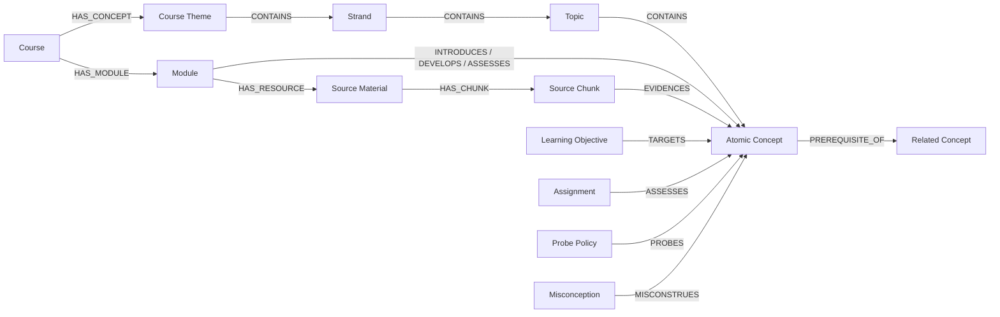
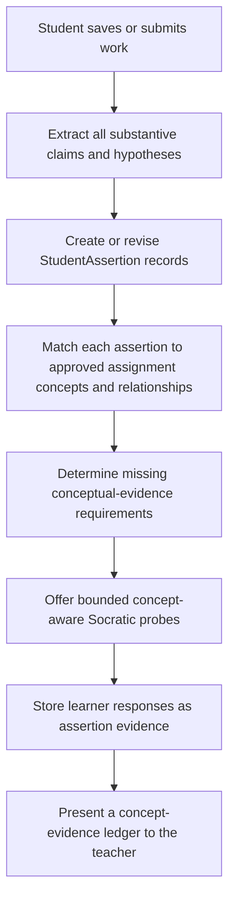

# Curriculum Concept Graph, Teacher Co-Pilot, and Student Concept-Evidence Plan

**Author:** Manus AI
**Date:** 11 September 2026
**Status:** Revised draft for approval
**Decision requested:** Approve the concept-graph architecture and phased implementation before development begins.

## Executive recommendation

Fiosra should build a **true syllabus and curriculum knowledge graph**. Its purpose is to model what a course teaches, how concepts decompose from high-level ideas into lower-level concepts, which concepts depend on one another, where each concept is evidenced in teaching materials, and which concept a Socratic probe should help a student examine next.

The graph must therefore become the source of truth for four connected activities:

1. **Curriculum design:** Teachers organize the course’s central ideas, topics, subtopics, and atomic concepts across modules.
2. **Material grounding:** Uploaded sources supply evidence for concepts and help the system propose additions or refinements to the concept graph.
3. **Assessment design:** Learning objectives, assignments, and rubric criteria target explicit concepts rather than an unstructured module label.
4. **Socratic probing and evaluation evidence:** Every substantive learner claim or hypothesis is matched to the relevant target concept or relationship, and the system selects bounded, source-aware conceptual probes that collect evidence for later teacher evaluation rather than only a generic rhetorical question.

The recommendation is to retain the existing `KnowledgeComponent` capability as a compatibility layer, but evolve it into a broader **Concept** ontology. This prevents a second parallel graph from emerging. A Knowledge Component becomes a concept with a defined instructional role and graph position, not merely a flat identifier.

Every student claim, hypothesis, and conceptual assertion made in an assignment will enter a **student concept-evidence ledger**. The ledger links the assertion to the approved curriculum concept or relationship it concerns, records the supporting source evidence and learner explanation gathered through probing, and makes the result available to the teacher during evaluation. It is evidence for teacher judgment, not an automatic mastery decision or grade.

> **Core principle:** The graph is not a record of what was uploaded. It is the machine-readable conceptual structure of the curriculum, which enables the teacher, assignment designer, and Socratic probe system to reason about the same course model.

## Current-state findings

| Area | Current capability | Gap relative to a true concept graph |
|---|---|---|
| Curriculum co-pilot | The course studio creates and revises course drafts through a narrow 360px sidebar. | The AI has no durable selected-concept context and cannot explain proposed changes through the course’s conceptual structure.[1] |
| Module materials | A teacher can upload PDF/TXT/Markdown, paste text, or attach a link note to one module. | Upload creates searchable chunks and an optional flat KC match, but it does not propose or maintain a concept hierarchy.[2] [3] |
| Knowledge graph | Neo4j stores `KnowledgeComponent` nodes and `REQUIRES` prerequisite edges. | Nodes are effectively flat, lack syllabus/module/source relationships, and are not used by the current proactive probe selector.[4] |
| Socratic probes | The probe service detects rhetorical signals such as causal claims, evidence language, absolute claims, and alternatives. | It selects a question focus from text patterns only. It does not identify the relevant course concept, a child/parent distinction, a prerequisite gap, or an assessed relationship.[5] |

The existing concept/KC graph is a valuable starting point. It already supports prerequisite traversal and frontier logic. The required change is to give it curriculum scope, hierarchy, evidence, instructional use, and a teacher review loop instead of treating it as a detached list of IDs.[4]

## Product outcomes

The proposed release should allow a teacher to build and govern a course concept map while using AI as a transparent assistant. The teacher can upload material to a module, receive graph proposals, approve or revise them, and immediately see how the material changes the course’s high-to-low concept tree. When a learner writes, Fiosra can determine which approved concept family is relevant and choose a Socratic probe that asks the learner to explain an evidence, relationship, dependency, distinction, or misconception associated with that concept.

| Outcome | Teacher-visible result | System result |
|---|---|---|
| Conceptual curriculum map | A navigable tree from course themes to atomic teachable concepts. | A structured graph with scope, parent/child, and prerequisite semantics. |
| Material-informed enrichment | Uploading a source produces proposed concepts and links with evidence snippets. | Ingestion extracts concept candidates, resolves duplicates, and proposes graph changes. |
| Module-level planning | Each module shows concepts introduced, developed, and assessed. | Module-to-concept edges guide retrieval, assignment generation, and probe selection. |
| Explainable AI | Co-pilot changes name the affected concepts and source evidence. | AI requests receive only the approved course/module subgraph and relevant source chunks. |
| Concept-evidence ledger | Teachers can inspect each claim, its target concept, supporting evidence, probe response, and unresolved gaps. | Every detected claim/hypothesis is matched to the approved graph and receives the required conceptual evidence checks. |
| Concept-aware Socratic help | A probe refers to the learner’s relevant concept or relation without giving the answer. | Probe selection uses assignment targets, claim matching, graph relations, source evidence, and unresolved evidence requirements. |

## Scope and non-goals

The first implementation will support teacher-uploaded PDFs, text files, Markdown, pasted excerpts, and teacher-supplied links with pasted notes. It will build a hierarchy inside one course and its modules. It will not automatically import a universal ontology, scrape arbitrary web links, or publish unreviewed AI-generated concepts to students.

| In scope | Explicitly deferred |
|---|---|
| Course, module, source, concept, objective, assignment, and probe-target graph nodes | Institution-wide cross-course concept federation and deduplication |
| High-level to low-level concept hierarchy | Automatic source crawling and copyright-sensitive webpage extraction |
| Prerequisite and conceptual-relation edges | Fully automatic concept acceptance without teacher review |
| AI-proposed concept extraction with evidence spans | Student-facing graph editing |
| Teacher approval, merge, rename, re-parent, and archive controls | Automated mastery claims or automatic grading |
| Concept-aware probe selection and immutable probe provenance | Image-only PDF OCR beyond extractable-text documents |

## The proposed curriculum concept ontology

### 1. Concept nodes are the core of the graph

A **Concept** is any meaningful unit of the syllabus that can be taught, related to evidence, broken down into lower-level concepts, assessed, or probed. It is not restricted to a narrow factual term. A concept may be a theme, a process, a relationship, a method, a distinction, or an atomic claim that a student must understand.

Each concept will have a canonical name, a concise teacher-facing definition, a hierarchy level, a concept type, course scope, approval state, and source provenance. The hierarchy level is a pedagogical scope marker, not a proxy for difficulty.

| Concept level | Meaning | Example in a history curriculum |
|---|---|---|
| `course_theme` | A high-level organizing idea that spans several modules. | State formation and institutional power |
| `strand` | A coherent conceptual branch of a theme. | Fiscal institutions in the Ancien Régime |
| `topic` | A module-sized object of study. | Tax farming and unequal fiscal burden |
| `subtopic` | A specific mechanism, case, distinction, or process. | Exemptions of the privileged estates |
| `atomic_concept` | The smallest concept that can be directly evidenced, assessed, or probed. | The *taille* was a direct tax borne disproportionately by commoners |

| Concept type | Use | Example |
|---|---|---|
| `domain` | Broad disciplinary concept | Historical causation |
| `entity` | Institution, actor, place, or artifact | Estates-General |
| `process` | Change or mechanism | Tax collection through farming contracts |
| `relationship` | Causal, comparative, or structural link | Privilege limited state revenue capacity |
| `method` | Disciplinary way of knowing | Corroborating a claim across source types |
| `threshold` | A difficult, transformative understanding | Fiscal collapse was multi-causal rather than solely caused by debt |
| `misconception` | A predictable but flawed conceptual model | “All French estates paid equal taxes” |

### 2. Graph nodes and relationships

The graph must represent curriculum structure, evidence, and learning use in one connected model.

| Node | Required properties | Purpose |
|---|---|---|
| `Course` | `course_id`, `title`, `domain` | Defines the conceptual universe for one curriculum. |
| `Module` | `module_id`, `course_id`, `title`, `position` | Connects a sequence unit to the concepts it teaches and assesses. |
| `Concept` | `concept_id`, `course_id`, `canonical_label`, `definition`, `level`, `type`, `status`, `created_by`, `source` | Represents the actual curriculum knowledge model. |
| `LearningObjective` | `objective_id`, `module_id`, `text`, `bloom_level` | Links teacher goals to concepts. |
| `SourceMaterial` | `resource_id`, `title`, `source_type`, `status`, `content_hash` | Represents one teacher-attached document, excerpt, or link note. |
| `SourceChunk` | `chunk_id`, `resource_id`, `ordinal`, `title`, `content_hash` | Represents one citable material segment. Raw source content remains in PostgreSQL/object storage. |
| `Assignment` | existing assignment ID and state | Makes assessment scope explicit. |
| `ProbePolicy` | `policy_id`, `concept_id`, `probe_type`, `priority`, `prompt_template` | Defines allowable kinds of conceptual questions. |
| `Misconception` | existing misconception ID and evidence | Links known mistaken models to the concept they distort. |

| Relationship | Direction | Semantics |
|---|---|---|
| `(:Course)-[:HAS_MODULE]->(:Module)` | Course → Module | The course contains the sequenced module. |
| `(:Course)-[:HAS_CONCEPT]->(:Concept)` | Course → Concept | The concept is part of the approved course model. |
| `(:Concept)-[:CONTAINS]->(:Concept)` | Higher concept → lower concept | A high-level concept decomposes into a more specific child concept. This hierarchy must be acyclic. |
| `(:Concept)-[:PREREQUISITE_OF]->(:Concept)` | Foundational concept → dependent concept | Understanding the source concept supports the target concept. This dependency graph must be acyclic. |
| `(:Module)-[:INTRODUCES|DEVELOPS|ASSESSES]->(:Concept)` | Module → Concept | States how a module uses a concept in the sequence. |
| `(:LearningObjective)-[:TARGETS]->(:Concept)` | Objective → Concept | Connects teacher-intended outcomes to graph nodes. |
| `(:SourceChunk)-[:EVIDENCES {confidence, spans, method, reviewed_at}]->(:Concept)` | Source chunk → Concept | Identifies where a concept is supported in approved material. |
| `(:Assignment)-[:ASSESSES]->(:Concept)` | Assignment → Concept | Defines a task’s intended conceptual scope. |
| `(:ProbePolicy)-[:PROBES]->(:Concept)` | Probe policy → Concept | Enables probe selection without exposing answers or grading. |
| `(:Misconception)-[:MISCONSTRUES]->(:Concept)` | Misconception → Concept | Associates a faulty inference with the concept it distorts. |

The existing `KnowledgeComponent` label should be migrated or aliased to `Concept` rather than duplicated. Existing KC identifiers remain valid for current APIs and data. The migration will add a concept ID, type, hierarchy level, scope, and status; compatibility views will preserve existing `kc_id` use while the product transitions to concept-aware terminology.

## Teacher experience design

### 1. Teacher AI workbench

The narrow co-pilot sidebar will become a resizable **Teacher Co-Pilot Workbench**. It opens at approximately 42% of the desktop width, can expand to 680px, and can collapse into a rail. The curriculum canvas remains visible. The panel separates conversation from suggested prompts and from applied changes so a teacher can conduct a real design dialogue without a nested scrolling trap.

| Workbench area | Teacher interaction | Graph-aware behavior |
|---|---|---|
| Context selector | Select **Course**, **Module**, or one **Concept**. | The AI receives only the selected subgraph, approved material chunks, objectives, and current draft. |
| Concept breadcrumb | See the path from theme to the active lower-level concept. | Shows the parent/child relationship that frames the request. |
| Conversation | Ask to reorganize, clarify, expand, or question a concept. | The answer names affected concepts, objectives, source evidence, and graph relationships. |
| Change review | See a plain-language proposed change and expandable graph diff. | Teacher can apply, edit, dismiss, or undo a draft-level change. |
| Suggestions menu | Open concise task suggestions when useful. | Suggestions are specific to the active concept, such as “add a prerequisite,” “split this topic,” or “add evidence.” |

The workbench will never silently alter the approved concept graph. AI-generated graph changes remain **proposals** until a teacher accepts them.

### 2. Concept map and module workbench

Each course will gain a **Concept Map** workspace beside its module sequence. Teachers can view the graph in two coordinated representations: a hierarchical outline for precise editing and a graph view for relationships and dependencies.

The module card will show a compact concept summary: concepts introduced, developed, and assessed; source coverage; and unresolved proposals. Selecting a concept opens a detail panel with its definition, hierarchy path, prerequisite/dependent concepts, linked sources, related objectives, assignments, misconceptions, and probe policies.

| Teacher action | Result |
|---|---|
| Accept an AI concept proposal | Creates the node and reviewed provenance links. |
| Merge duplicates | Resolves two labels to one canonical concept and rewires relationships without losing audit history. |
| Re-parent a concept | Moves a topic or subtopic under a different high-level concept after cycle validation. |
| Add prerequisite | Creates a directional dependency after cycle validation. |
| Link a source chunk | Marks concrete evidence for one concept; stores a source excerpt and mapping method. |
| Set module role | Marks whether a module introduces, develops, or assesses the concept. |
| Add a misconception or probe policy | Gives the Socratic system an approved conceptual concern without providing a student answer. |

### 3. Material ingestion as concept-graph enrichment

Uploading material is not only a storage event. It becomes a graph-enrichment request with a transparent review step.

1. The teacher attaches a source to a selected module and confirms title, source type, and optional citation/URL.
2. Fiosra stores the source, extracts text, segments it into chunks, and creates a durable ingestion job.
3. The system retrieves the active course/module concept subgraph and asks the configured model for **candidate concepts, hierarchy placements, prerequisite suggestions, and source evidence spans** in a structured response.
4. Entity resolution compares candidates to approved concepts by canonical label, semantic similarity, and parent context.
5. Existing concepts receive new `EVIDENCES` links. New or ambiguous concepts become proposals rather than active graph nodes.
6. The teacher reviews a concise graph diff: **new concepts**, **new child relationships**, **candidate prerequisite links**, and **source evidence**.
7. On approval, the graph is upserted atomically and the material status becomes `Ready` or `Needs concept review`.

The ingestion user interface will make progress and meaning visible: **Uploading → Extracting → Segmenting → Proposing concepts → Resolving duplicates → Awaiting review → Ready**.

## Concept extraction and review policy

### Candidate extraction contract

The configured local model may propose concepts, but it must return structured data only. Each candidate needs a canonical label, definition, type, suggested hierarchy level, evidence spans, confidence, and suggested parent or prerequisite relation. The model must select from existing course concepts when possible and must not invent a relation that lacks either source evidence or explicit teacher confirmation.

| Candidate field | Purpose |
|---|---|
| `canonical_label` | Normalized short name for matching and display. |
| `definition` | Teacher-readable description of the concept. |
| `concept_type` | Domain, entity, process, relationship, method, threshold, or misconception. |
| `suggested_level` | Theme, strand, topic, subtopic, or atomic concept. |
| `evidence_spans` | Chunk ID plus exact text spans that support the proposal. |
| `parent_candidate_id` | Existing or proposed higher-level concept. |
| `prerequisite_candidate_ids` | Concepts that need to be understood first. |
| `confidence` | Calibrated proposal score, never a substitute for teacher approval. |

### Review rules

| Situation | System behavior | Teacher authority |
|---|---|---|
| Strong match to an approved concept | Proposes an `EVIDENCES` edge and displays the cited source span. | May accept, replace, or reject. |
| Candidate lower-level concept has an obvious approved parent | Proposes a `CONTAINS` relationship. | Must approve before the graph changes. |
| Candidate has no reliable parent | Places it in an **Unplaced proposals** queue. | Selects a parent, promotes it to a theme, or discards it. |
| Prerequisite would create a cycle | Rejects the relationship and explains the cycle path. | Can choose a different relationship or remove the proposal. |
| Candidate duplicates an existing concept | Proposes a merge, preserving aliases and source evidence. | Chooses merge, keep separate, or rename. |
| Model cannot provide source support | Marks the candidate `needs_evidence`. | It cannot become approved through one-click acceptance. |

## Student concept-evidence ledger and graph-driven probing

### Current limitation

The present proactive probe system selects a rhetorical focus such as causal bridge, warrant, alternative explanation, qualification, or direct observation from textual patterns. This is useful as a narrow writing aid, but it treats an eligible paragraph as the principal unit of analysis. It does not create a durable record for every claim or hypothesis, does not determine which syllabus concept the student is using, and does not assemble the evidence a teacher needs to evaluate understanding of that concept.[5]

### Proposed claim-level concept-evidence model

The new unit of analysis is a **student assertion**. An assertion is a claim, hypothesis, causal proposition, interpretation, comparison, classification, or other substantive conceptual statement in a student's submitted work. Assertions may occur in a paragraph, sentence, table cell, response field, or later supported assignment format; they are not limited to one paragraph event.

Each detected assertion receives a durable ledger record. The system links it to zero or more approved concepts and relationships, determines which types of evidence are needed to demonstrate understanding, offers bounded Socratic prompts until the relevant evidence is present or the teacher-configured attempt boundary is reached, and preserves every learner response for teacher evaluation.

### Student assertion and evidence records

| Record | Required fields | Role in evaluation |
|---|---|---|
| `StudentAssertion` | `assertion_id`, `session_id`, `document_id`, `source_block_id`, text span, assertion type, revision, status | Represents one student claim or hypothesis. A revised claim supersedes rather than erases an earlier assertion. |
| `AssertionConceptLink` | `assertion_id`, `concept_id`, optional relationship key, match confidence, match method, graph snapshot hash | States which approved syllabus concept or relationship the assertion invokes. It may be `unresolved` when no safe match exists. |
| `AssertionEvidenceRequirement` | assertion/concept link, requirement type, priority, status | States what must be elicited to show conceptual understanding: source evidence, mechanism, boundary, prerequisite, alternative, or qualification. |
| `AssertionEvidenceResponse` | requirement ID, probe ID, learner response, response revision, timestamp | Preserves the learner's own explanation in response to one bounded question. |
| `TeacherConceptEvaluation` | assertion/concept link, teacher judgment, notes, timestamp | Records teacher evaluation only. It is never inferred automatically from the presence of a response. |

### Every claim or hypothesis is processed

The system will process every substantive assertion visible in an assignment. A claim detector creates a candidate record whenever a learner makes an explanatory, causal, comparative, classificatory, evidentiary, or hypothetical statement. The detector may use local model assistance for segmentation, but the server validates the assertion record and its document span. A single paragraph can generate multiple assertions, and a single assertion can relate to multiple concepts or relationships.

The system must not block writing or force a probe for trivial text, quotations, headings, citations, or repeated unchanged assertions. It will mark these records as `not_eligible`, `duplicate`, or `superseded` with a transparent reason. This preserves the requirement that every meaningful claim/hypothesis be considered while avoiding repetitive interruption.

| Assertion state | Meaning | Student experience | Teacher evidence view |
|---|---|---|---|
| `identified` | A substantive claim or hypothesis was detected. | No interruption yet. | Shows the claim and candidate concept links. |
| `matched` | The claim maps to one or more approved concepts or relationships. | The system can select an appropriate next probe. | Shows the concept path and mapping confidence. |
| `unresolved` | No adequate approved concept match exists. | The system can ask a neutral clarification question or defer. | Flags a potential curriculum-graph gap. |
| `evidence_pending` | The claim has one or more missing evidence requirements. | Offers at most one timely, bounded question at a time. | Shows exactly what evidence is still absent. |
| `evidence_submitted` | The learner supplied an explanation, source reference, or qualification. | The response is saved; writing remains editable. | Shows learner evidence, but not an automatic pass/fail status. |
| `superseded` | The learner materially revised or withdrew the claim. | Older probes close without penalty. | Keeps an auditable revision path. |
| `not_eligible` | The text is not a claim/hypothesis suitable for conceptual evidence. | No probe. | Shows the safe exclusion reason when relevant. |

### Concept matching and evidence requirements

The server selects the concept before it selects the question. It loads only the published assignment's assessed concepts, their approved lower-level children, prerequisite paths, linked source chunks, and linked misconceptions. The system then matches an assertion to that bounded subgraph using canonical labels, aliases, source vocabulary, semantic retrieval, and relation cues. It must prefer an `unresolved` state over a weak or unsupported concept match.

| Selection signal | Priority | Example outcome |
|---|---:|---|
| Concept explicitly assessed by the active assignment | Highest | A fiscal-institutions assignment restricts matching to its approved concept family. |
| Course concept, alias, or relationship expressed in the assertion | High | “Privilege reduced revenue capacity” links to the approved privilege–fiscal-capacity relationship. |
| Source vocabulary from material assigned to the task | High | A phrase from an approved tax record strengthens the link to the relevant lower-level concept. |
| Parent/child scope | High | A broad reference to state power can be linked to a lower-level fiscal mechanism only when the assertion contains supporting detail. |
| Prerequisite path | Contextual | A claim about a fiscal outcome may require evidence of the tax structure concept that precedes it. |
| Linked misconception | Contextual | An absolute one-cause claim activates the associated multi-causality misconception check. |

Each matched concept relationship defines evidence requirements. The requirements are configurable by concept type, module role, and assignment design, so the system does not assume that every concept is demonstrated in the same way.

| Evidence requirement | Applied when | Student-safe Socratic intent |
|---|---|---|
| `source_evidence` | The claim is supposed to be grounded in an assigned text, artifact, or data source. | Ask which approved detail supports the claim. |
| `mechanism` | The learner asserts a causal or structural relationship. | Ask how the stated condition produces the proposed effect. |
| `concept_boundary` | A broad concept is used where a lower-level distinction matters. | Ask the learner to distinguish the named mechanism from its parent theme. |
| `prerequisite` | The claim relies on an earlier concept not yet demonstrated in the reasoning. | Ask the learner to explain the necessary foundational idea in their own words. |
| `alternative` | The claim is one of several approved explanatory paths. | Ask the learner to compare a plausible alternative within the same concept family. |
| `qualification` | The evidence cannot fully support an absolute claim. | Ask what the available evidence does and does not establish. |
| `misconception_check` | The claim resembles a linked misconception. | Ask the learner to test the claim against the relevant conceptual distinction without revealing the answer. |

### Bounded probing without automatic evaluation

Every concept or claim is analyzed, but probing remains deliberately bounded. The system maintains one active prompt at a time per assertion, respects quiet periods, collapses duplicate claims, and closes obsolete prompts when the learner revises. It never demands a response before the learner can continue writing. The student may answer, defer, dismiss, or revise the assertion. Dismissal does not create an automatic penalty; it remains visible to the teacher as part of the evidence record.

The LLM may rephrase a server-selected question into clear student-facing language. It may not select concepts, infer mastery, decide whether evidence is sufficient, create facts, expose an answer, or assign a grade. The assignment’s approved graph subgraph, linked sources, and assertion evidence requirements determine the scope of every prompt.

### Teacher concept-evidence ledger

The educator review workspace will add a **Concept Evidence** tab alongside the existing trace and criterion views. It will organize a student’s work by assessed concept, not merely by chronology.

| Teacher view element | Content |
|---|---|
| Concept coverage map | Each assessed high-level concept and its relevant lower-level concepts, with counts of student assertions. |
| Assertion list | The learner’s claim/hypothesis, source paragraph or response location, claim revision, and matched concept path. |
| Evidence checklist | The concept-specific requirements: evidence, mechanism, boundary, prerequisite, alternative, qualification, or misconception check. |
| Learner responses | The student’s answer to each relevant Socratic probe, preserving time and revision. |
| Source provenance | Approved source chunks connected to the concept and any citation or detail referenced by the learner. |
| Teacher decision | Educator-only judgment, feedback, and optional return-for-revision action. |

The interface will use statuses such as **Evidence supplied**, **Evidence still needed**, **Claim revised**, and **Teacher review required**. It will not show a machine-generated “understood,” “mastered,” or final score. A teacher decides what the concept evidence demonstrates.

## Architecture options for ingestion and graph enrichment

Material ingestion is an event-triggered workflow. A teacher upload must initiate deterministic extraction and graph work, while AI-assisted concept proposals require review before becoming active.

| Approach | How it works | Trade-offs | Cost | Setup complexity |
|---|---|---|---|---|
| Direct synchronous ingestion | The upload request waits for extraction, chunking, concept proposals, and graph writes. | Simplest implementation, but long PDFs leave teachers waiting and transient failures are difficult to retry safely. | No additional service cost. | Low. |
| Durable queued graph enrichment — recommended | The upload immediately creates a source and job. A worker performs extraction, chunking, candidate creation, duplicate resolution, and graph proposals. Teacher approval commits the proposed graph changes. | Adds a job table and worker process, but gives reliable progress, retry, audit history, and long-document handling. | No new external service for the local Docker deployment. | Moderate. |

The recommended architecture is **durable queued graph enrichment**. It will run as a dedicated worker service in the existing Docker Compose stack, use a PostgreSQL job table for claiming/retrying work, and communicate status to the UI through a resource-status endpoint with short-lived client polling. It does not require a separate scheduled task, third-party webhook, or external service.

## Data model and migration plan

### PostgreSQL records

| Record | Core fields | Purpose |
|---|---|---|
| `module_resources` | `resource_id`, `course_id`, `module_id`, `title`, `source_type`, `original_filename`, `source_url`, `content_hash`, `status`, `error_summary` | One teacher-attached source with durable status. |
| `resource_ingestion_jobs` | `job_id`, `resource_id`, `status`, `attempt_count`, `locked_at`, `completed_at`, `failure_reason` | Durable, idempotent worker queue. |
| `syllabus_chunks` extension | `resource_id`, `ordinal`, `extraction_metadata` | Existing retrieval chunks associated with one source. |
| `concept_proposals` | candidate data, source references, `status`, reviewer, timestamps | Separates AI proposal from teacher-approved graph state. |
| `concept_aliases` | `concept_id`, `alias`, `source` | Supports merge, vocabulary variation, and learner-text matching. |
| `student_assertions` | `assertion_id`, `session_id`, `document_id`, block/text span, normalized text, assertion type, revision, lifecycle state | Durable ledger of each substantive student claim or hypothesis. |
| `assertion_concept_links` | `assertion_id`, `concept_id`, optional relationship key, match method, confidence, graph snapshot hash | Links a student claim to the approved curriculum graph without mutating the graph itself. |
| `assertion_evidence_requirements` | assertion/concept link, requirement type, priority, state, selection reason | States the conceptual evidence that remains to be elicited for a particular claim. |
| `assertion_evidence_responses` | requirement ID, probe ID, learner response, revision, timestamps | Stores learner-authored evidence without interpreting it as mastery. |
| `teacher_concept_evaluations` | assertion/concept link, teacher judgment, feedback, timestamps | Stores the only authoritative evaluative conclusion. |
| `socratic_probes` extension | `assertion_id`, `concept_id`, `relationship_key`, `source_chunk_ids`, `graph_snapshot_hash`, `selection_reason` | Records why a concept-evidence question was offered. |

### Neo4j constraints and integrity rules

The implementation will create uniqueness constraints for `Course.course_id`, `Module.module_id`, `Concept.concept_id`, `SourceMaterial.resource_id`, `SourceChunk.chunk_id`, `LearningObjective.objective_id`, and `ProbePolicy.policy_id`. All graph writes will use idempotent `MERGE` operations.

The concept graph models shared curriculum knowledge. Student assertions, probe responses, and teacher evaluations remain in the access-controlled PostgreSQL/event record because they are student-specific, revisioned, and potentially sensitive. Each ledger record points to the exact approved graph version and concept IDs used at the time, preserving graph-based evidence without placing learner data in the shared curriculum graph.

Two graph rules are non-negotiable:

1. The `CONTAINS` hierarchy must not contain a cycle.
2. The `PREREQUISITE_OF` dependency graph must not contain a cycle.

A candidate relationship is validated before activation. A rejected relation remains in the proposal record, not the active graph.

## Phased implementation plan

### Phase 0 — Canonical concept graph foundation

Create the concept ontology, Neo4j constraints, concept migration/compatibility layer for existing KCs, PostgreSQL concept proposals, concept aliases, and graph-version tracking. Add graph services for hierarchy traversal, prerequisite validation, concept retrieval by course/module, and subgraph snapshots.

**Deliverable:** A teacher-created or migrated course can hold an approved, acyclic high-to-low concept hierarchy plus prerequisite relations.

### Phase 1 — Concept-map teacher experience and co-pilot redesign

Replace the narrow co-pilot sidebar with a resizable teacher workbench. Add course/module/concept context selection, graph breadcrumbs, proposal review cards, and draft undo. Add the Concept Map workspace with an outline editor, graph view, concept details, parent/child management, prerequisite editing, and module-role controls.

**Deliverable:** A teacher can inspect and edit the curriculum’s conceptual structure without working directly in Neo4j.

### Phase 2 — Material ingestion and graph proposals

Introduce parent resource records, file storage, a durable ingestion worker, and source status UI. Uploading material extracts chunks and creates AI-assisted, source-evidenced concept, hierarchy, and prerequisite proposals. The teacher reviews and approves proposals before they enter the active graph.

**Deliverable:** A module source enriches the syllabus concept graph rather than only adding vector chunks.

### Phase 3 — Objectives, assignments, and concept-based retrieval

Map learning objectives and assignments to approved concepts. Update assignment generation to retrieve the selected module’s concept subgraph and linked source chunks. Require generated task metadata to name its assessed concepts and sources. Continue to allow clearly marked generic mode when a module has no approved grounding.

**Deliverable:** Tasks and sources are anchored to an explicit course concept model.

### Phase 4 — Claim-level concept evidence ledger and graph-driven Socratic probes

Add student assertion extraction, assertion-to-concept/relationship links, concept-specific evidence requirements, and immutable learner-response records. Process every substantive claim and hypothesis in the assignment, including multiple assertions from one paragraph. Extend the probe service so it selects the next unresolved evidence requirement for the matched concept, then offers one bounded question at a time. Persist graph selection provenance, assertion revision lineage, and learner responses. Preserve all current quiet-period, idempotency, learner-control, and non-grading protections.

Add the educator Concept Evidence ledger, organized by assessed concept and lower-level concept path. It will show assertions, evidence requirements, learner responses, linked source chunks, graph version, and teacher-controlled evaluative judgments.

**Deliverable:** Every substantive student claim or hypothesis has a durable conceptual-evidence trail for teacher evaluation, and the system can probe the missing evidence required for the relevant concept without automatically judging mastery.

### Phase 5 — Quality assurance, migration, and release validation

Add unit tests for hierarchy and dependency cycle prevention, ingestion proposal formation, duplicate resolution, concept merge/re-parent behavior, assertion extraction, concept matching, assertion supersession, evidence-requirement selection, source-bound question generation, and teacher-only evaluation records. Add an end-to-end teacher workflow test: create course → build concept hierarchy → upload material → approve proposals → map assignment → student makes several claims → assertion-level probes collect evidence → educator evaluates the concept evidence ledger.

**Deliverable:** A release-ready flow with trustworthy graph semantics and regression protection.

## Acceptance criteria

| Area | Acceptance criterion |
|---|---|
| Concept hierarchy | A teacher can create, inspect, and edit a multi-level concept tree. The system blocks containment cycles. |
| Prerequisite model | A teacher can define concept dependencies. The system blocks prerequisite cycles and displays the affected path. |
| Source enrichment | One uploaded module material produces source chunks plus explainable concept proposals with evidence spans. |
| Teacher authority | No AI-generated concept, relation, or mapping becomes active until the teacher accepts it. |
| Retrieval integrity | A module-scoped AI request uses only that module’s approved concepts, linked material, objectives, and explicitly allowed course context. |
| Assignment alignment | Published assignments identify the concepts they assess and the approved sources that ground them. |
| Claim coverage | Every substantive student claim or hypothesis is represented as an assertion record linked to approved concepts/relationships or explicitly marked unresolved/not eligible with a reason. |
| Probe relevance | Each offered probe is tied to one assertion, selected concept/relationship, evidence requirement, source basis where applicable, and a selection reason. It remains a single bounded student-safe question. |
| Concept evidence | Each assertion shows its evidence requirements and learner-supplied evidence separately from teacher evaluation. A response is never treated as automatic mastery. |
| Probe safeguards | The claim-level selector does not assign grades, claim mastery, expose answer keys, introduce unapproved facts, or block continued writing. |
| Auditability | An educator can inspect the graph version, concept path, relationship, source chunks, assertion revision, evidence requirement, and policy that led to every probe. |
| Reliability | Retrying one ingestion job does not duplicate source chunks, concept proposals, graph nodes, or relationships. |

## Delivery sequence and estimate

| Increment | Main deliverable | Estimated effort | Prerequisite |
|---|---|---:|---|
| 1 | Canonical concept ontology, migration, constraints, and graph services | 3–4 engineering days | Approval of ontology and teacher-review policy |
| 2 | Teacher co-pilot workbench and concept map experience | 3–4 engineering days | Increment 1 |
| 3 | Queued material ingestion and source-evidenced concept proposals | 4–5 engineering days | Increments 1–2 |
| 4 | Objective/assignment alignment, student concept-evidence ledger, and graph-driven probing | 5–7 engineering days | Increments 1–3 |
| 5 | End-to-end tests, migration validation, and release hardening | 3–4 engineering days | Increments 1–4 |

The total implementation estimate is **18–24 engineering days**. The phases are intentionally ordered so that the graph model and teacher approval loop exist before the AI begins to act on graph proposals or uses graph structure to create concept-evidence records for student claims.

## Approval requested

Please approve or revise these architectural decisions before implementation:

1. **Canonical graph model:** Use `Concept` nodes as the central curriculum ontology and transition existing Knowledge Components into that model without breaking current IDs or APIs.
2. **Hierarchy semantics:** Represent high-level to low-level conceptual structure with `CONTAINS` and learning dependencies with a separate, acyclic `PREREQUISITE_OF` graph.
3. **Teacher governance:** Allow local AI to propose concepts and edges from materials, but require teacher approval before graph activation.
4. **Claim-evidence integration:** Process every substantive student claim and hypothesis as a graph-linked assertion, collect concept-specific evidence through bounded Socratic probes, and present the resulting ledger to the teacher without automated mastery or grading judgments.
5. **Ingestion architecture:** Use durable queued graph enrichment so material uploads produce reliable, reviewable source and concept proposals.
6. **Teacher experience:** Replace the narrow co-pilot sidebar with the resizable graph-aware workbench and Concept Map editing surface.

## References

[1]: https://github.com/darkaengl/fiosra/blob/feat/proactive-socratic-probes/frontend/src/routes/CourseStudio.svelte "Course Studio co-pilot implementation"
[2]: https://github.com/darkaengl/fiosra/blob/feat/proactive-socratic-probes/frontend/src/lib/AddResourceModal.svelte "Module resource attachment interface"
[3]: https://github.com/darkaengl/fiosra/blob/feat/proactive-socratic-probes/fiosra/mvp/courses/ingestion.py "Syllabus and module material ingestion service"
[4]: https://github.com/darkaengl/fiosra/blob/feat/proactive-socratic-probes/fiosra/mvp/graph_service.py "Neo4j knowledge graph service"
[5]: https://github.com/darkaengl/fiosra/blob/feat/proactive-socratic-probes/fiosra/mvp/socratic_probe_service.py "Proactive Socratic probe selection service"
