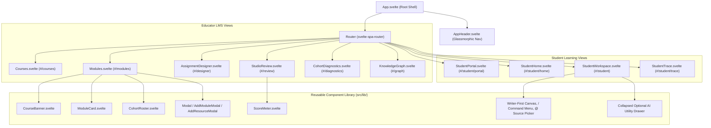
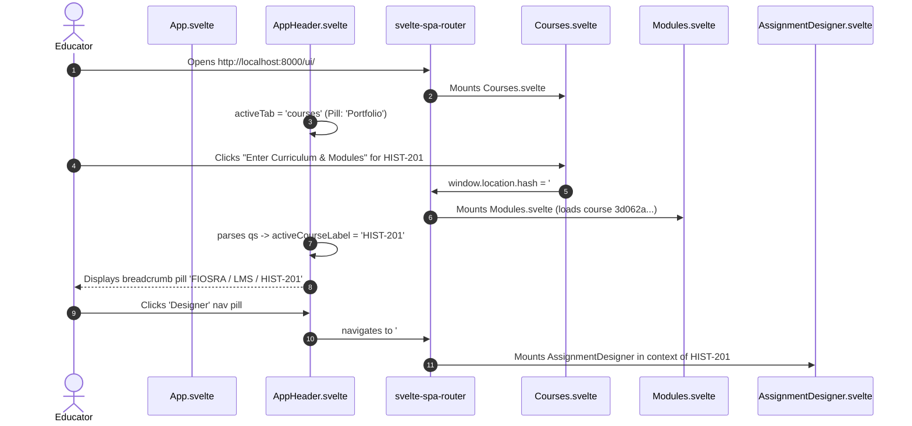
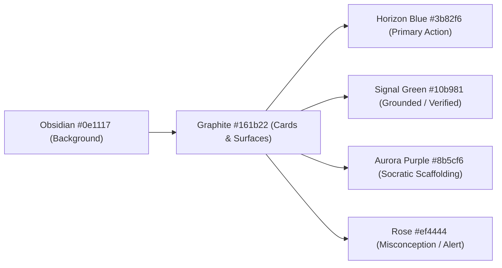

# Chapter 3: Frontend Architecture (Svelte 5 SPA)

The Fiosra frontend is a client-rendered **Single Page Application (SPA)** written in **Svelte 5** and bundled using **Vite 8**. It communicates with the FastAPI backend over REST/JSON and mounts in production at `/ui/#/`.

---

## 🏛️ Component & View Hierarchy

The diagram below illustrates the hierarchical relationship between the root shell, the glassmorphic navigation header, and the modular route controllers:



---

## 🔄 SPA Navigation & Course Context State Flow

In Fiosra, when an educator enters a course workspace from the portfolio, the active `course_id` is propagated smoothly across all subsequent tabs via client URL hash query parameters:



---

## ⚡ Svelte 5 Runes Architecture

Fiosra uses Svelte 5's modern **Runes** reactivity system (`$state`, `$derived`, `$props`, `$effect`), providing explicit and fine-grained reactivity.

### 1. State Declaration (`$state`)
```svelte
<script>
  let courses = $state([]);
  let searchQuery = $state('');
  let isCreating = $state(false);
</script>
```

### 2. Derived Computations (`$derived` / `$derived.by`)
Filtered views and query parameter parsers compute reactively without boilerplate:
```svelte
<script>
  let filteredCourses = $derived(
    courses.filter(c => 
      c.title.toLowerCase().includes(searchQuery.toLowerCase()) ||
      c.code.toLowerCase().includes(searchQuery.toLowerCase())
    )
  );

  let activeCourseLabel = $derived.by(() => {
    if (!parsed.courseId) return '';
    const match = courses.find(c => c.id === parsed.courseId);
    return match ? match.code : 'Course';
  });
</script>
```

### 3. Component Properties (`$props`)
Standardized type-safe prop destructuring:
```svelte
<script>
  let {
    courseId = '',
    title = 'Unit Module',
    isExpanded = false,
    onAddResource = () => {}
  } = $props();
</script>
```

---

## 🎨 Design System & Visual Aesthetics

Fiosra uses a **curated dark-mode design system** inspired by modern high-end developer tools (Linear, Vercel). The design tokens are declared in `frontend/src/css/design-system.css`.

### Semantic Color Matrix


### Glassmorphism & Micro-Interactions
Interactive surfaces incorporate subtle backdrop blur filters and layered borders:
```css
.nav-segmented {
  background: rgba(255, 255, 255, 0.03);
  border: 1px solid rgba(255, 255, 255, 0.06);
  border-radius: 9999px;
  backdrop-filter: blur(8px);
}

.nav-pill.active {
  background: rgba(59, 130, 246, 0.18);
  border: 1px solid rgba(59, 130, 246, 0.4);
  box-shadow: 0 1px 4px rgba(0, 0, 0, 0.2);
}
```

---

## 🧱 Reusable Component Library

| Component | File Path | Purpose & Capabilities |
| :--- | :--- | :--- |
| **`AppHeader`** | `src/lib/AppHeader.svelte` | Fixed glassmorphic navigation bar. Provides brand toggle, context pill, 6 educator tabs / 4 student tabs, grounding status indicator, and role switch button. |
| **`CourseBanner`** | `src/lib/CourseBanner.svelte` | Top header for module views displaying course code, domain, syllabus grounding badge, and quick actions ("+ Add Module", "+ New Assignment"). |
| **`ModuleCard`** | `src/lib/ModuleCard.svelte` | Accordion card for curriculum units. Houses grounded primary source links, unit position badges, and assigned Socratic tasks. |
| **`CohortRoster`** | `src/lib/CohortRoster.svelte` | Tabular display of enrolled students showing live status, autonomy rating, hint consumption counts, and last activity timestamps. |
| **`Modal`** | `src/lib/Modal.svelte` | Base modal overlay with ESC key dismiss, backdrop blur, click-outside handling, and focus trapping. |
| **`AddModuleModal`** | `src/lib/AddModuleModal.svelte` | Form modal for adding units with title, description, and position sequencing. |
| **`AddResourceModal`** | `src/lib/AddResourceModal.svelte` | Form modal for attaching grounded readings, URLs, or primary source texts to a unit. |
