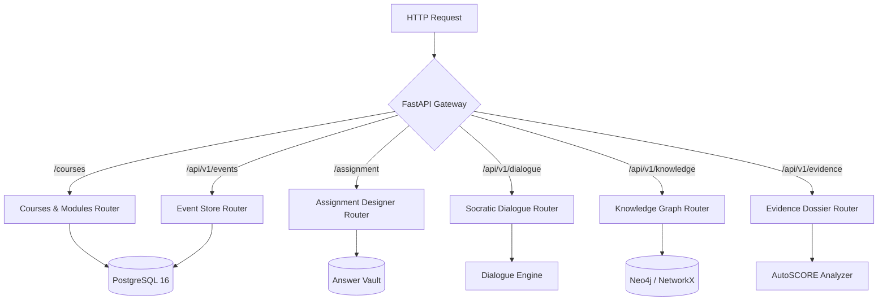
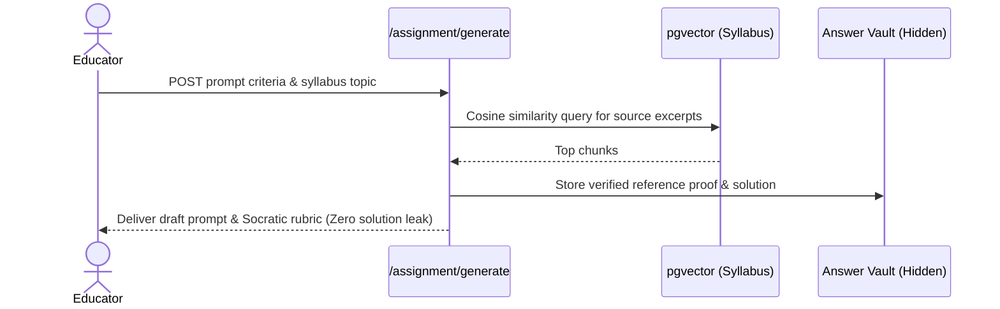
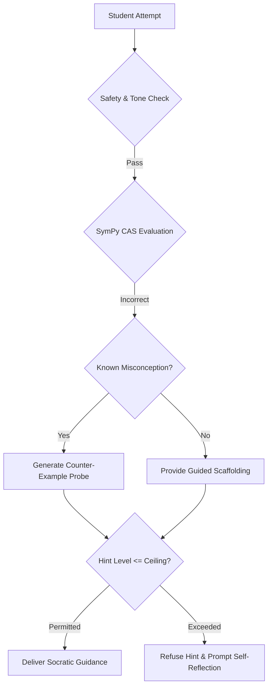

# Chapter 4: Comprehensive API Reference

This chapter documents the REST endpoints exposed by the Fiosra FastAPI backend. Interactive OpenAPI/Swagger documentation is also available live at [http://localhost:8000/docs](http://localhost:8000/docs).

---

## 🌐 API Request Routing Architecture



---

## 1. Courses & Curriculum Management (`/courses`)

### `GET /courses`
Lists all institutional course workspaces with nested module counts and grounded KC metadata.
- **Response `200 OK`**:
```json
[
  {
    "id": "3d062a47-865f-4782-8e5e-e6b7bc044c82",
    "code": "HIST-201",
    "title": "The French Revolution & Modern Statehood",
    "description": "Analysis of Ancien Régime fiscal collapse and popular sovereignty.",
    "domain": "History",
    "instructor": "Dr. Vance",
    "module_count": 3,
    "kc_grounded_count": 14,
    "created_at": "2026-09-08T18:30:00Z"
  }
]
```

---

### `POST /courses`
Creates a new sovereign course workspace.
- **Request Body**:
```json
{
  "code": "PHIL-102",
  "title": "Moral Reasoning & Epistemology",
  "description": "Deontological vs consequentialist frameworks and epistemic justification.",
  "domain": "Philosophy",
  "instructor": "Prof. Somerville"
}
```
- **Response `201 Created`**: Returns created `CourseResponse` object.

---

### `GET /courses/{course_id}/modules`
Fetches all curriculum units ordered by sequence position.
- **Path Parameters**: `course_id` (UUID)
- **Response `200 OK`**:
```json
[
  {
    "id": "9f21b7c3-118e-4a7b-842f-89bc44d18101",
    "course_id": "3d062a47-865f-4782-8e5e-e6b7bc044c82",
    "title": "Unit 01: The Fiscal Breakdown",
    "description": "Deep dive into sovereign bankruptcy and Jacques Necker's Compte rendu.",
    "position": 1,
    "resource_count": 2,
    "assignment_count": 1
  }
]
```

---

### `POST /courses/{course_id}/modules`
Appends a new unit module to a course.
- **Request Body**:
```json
{
  "title": "Unit 02: The Estates-General & Sovereign Will",
  "description": "Analysis of Sieyès' Qu'est-ce que le Tiers-État? and voting mechanisms.",
  "position": 2
}
```
- **Response `201 Created`**: Returns created `ModuleResponse`.

---

### `POST /courses/{course_id}/ingest`
Ingests, chunks, and computes vector embeddings for a course syllabus document.
- **Form Data**:
  - `file`: (Optional UploadFile, PDF or text)
  - `raw_text`: (Optional string)
- **Response `200 OK`**:
```json
{
  "status": "success",
  "chunks_created": 12,
  "vector_dimensions": 1536,
  "index_status": "ready"
}
```

---

### `POST /courses/modules/{module_id}/resources`
Attaches a grounded syllabus reading or primary source to a curriculum module.
- **Request Body**:
```json
{
  "title": "Necker's Compte Rendu au Roi (1781)",
  "resource_type": "primary_source",
  "source_url": "https://gallica.bnf.fr/ark:/12148/bpt6k1040523",
  "grounding_notes": "Key reading on French royal finance balance sheet presentation."
}
```
- **Response `201 Created`**: Returns created `ResourceResponse`.

---

## 2. Assignment Designer & Answer Vault (`/assignment`)



### `POST /assignment/generate`
Generates an assignment prompt grounded in ingested course syllabus chunks.
- **Request Body**:
```json
{
  "course_id": "3d062a47-865f-4782-8e5e-e6b7bc044c82",
  "topic": "Ancien Régime Fiscal Crisis",
  "scaffold_tier": "tier_2_structural",
  "word_limit": 1200
}
```
- **Response `200 OK`**:
```json
{
  "assignment_id": "a1b2c3d4-e5f6-7890-abcd-ef1234567890",
  "prompt_stem": "Analyze how Jacques Necker's 1781 Compte rendu obscured French state insolvency...",
  "grounded_kc_ids": ["KC_HIST_FISCAL_CRISIS_1786", "KC_HIST_ESTATE_SYSTEM"],
  "scaffold_tier": "tier_2_structural"
}
```

---

## 3. Socratic Dialogue Engine (`/api/v1/dialogue`)

### `POST /api/v1/dialogue/turn`
Executes an answer-blind Socratic conversation turn. Evaluates student premise and delivers dialectical questions bounded by the deterministic hint ceiling.



- **Request Body**:
```json
{
  "session_id": "550e8400-e29b-41d4-a716-446655440000",
  "assignment_id": "a1b2c3d4-e5f6-7890-abcd-ef1234567890",
  "student_id": "student_julian_hayes",
  "message": "The nobility didn't pay any taxes because they had complete feudal immunity.",
  "requested_hint": false
}
```
- **Response `200 OK`**:
```json
{
  "role": "assistant",
  "socratic_message": "You note that the nobility enjoyed complete immunity. How did indirect taxes, such as the octrois and the vingtième, apply across social orders under Calonne's assessment?",
  "active_kc": "KC_HIST_ESTATE_SYSTEM",
  "misconception_addressed": "MC_NOBLE_TAX_EXEMPTION_ABSOLUTE",
  "current_hint_level": 1,
  "hint_ceiling": 2
}
```

---

## 4. Knowledge Graph Service (`/api/v1/knowledge`)

### `GET /api/v1/knowledge/kc/{kc_id}`
Retrieves atomic Knowledge Component metadata, parent prerequisite KCs, and associated misconceptions.
- **Response `200 OK`**:
```json
{
  "kc_id": "KC_HIST_FISCAL_CRISIS_1786",
  "name": "1786 French State Insolvency",
  "description": "Understanding the structural deficit driven by American War debt and revenue shortfall.",
  "bloom_level": "Analyze",
  "prerequisites": ["KC_HIST_TAX_FARMING"],
  "common_misconceptions": [
    {
      "id": "MC_NOBLE_TAX_EXEMPTION_ABSOLUTE",
      "description": "Belief that nobility paid zero taxes of any kind."
    }
  ]
}
```

---

## 5. Append-Only Event Store (`/api/v1/events`)

### `POST /api/v1/events`
Appends a telemetry record to the student's immutable flight recorder.
- **Request Body**:
```json
{
  "session_id": "550e8400-e29b-41d4-a716-446655440000",
  "student_id": "student_julian_hayes",
  "event_type": "EVENT_STUDENT_ATTEMPT",
  "payload": {
    "attempt_index": 2,
    "word_count": 342,
    "claim_assertions": ["Necker hid deficit through ordinary accounts"]
  }
}
```
- **Response `201 Created`**: Returns `{ "event_id": "...", "status": "recorded" }`.

---

## 6. AutoSCORE Evidence Dossier (`/api/v1/evidence`)

### `GET /api/v1/evidence/{submission_id}`
Aggregates the entire trajectory ($Z$) of a student assignment session into an auditable dossier.
- **Response `200 OK`**:
```json
{
  "submission_id": "sub_987654321",
  "student_id": "student_julian_hayes",
  "autonomy_index": 74.5,
  "metrics": {
    "total_turns": 6,
    "hints_consumed": 2,
    "misconceptions_encountered": 1,
    "misconceptions_resolved": 1,
    "struggle_duration_seconds": 1840
  },
  "rubric_breakdown": [
    {
      "criterion": "Causal Historical Analysis",
      "score": 4,
      "max_score": 5,
      "evidence_quote": "Necker distinguished between ordinary budget and extraordinary war expenses..."
    }
  ],
  "verification_status": "pending_educator_review"
}
```

---

## 7. Long-Form Student Documents (`/learning-documents`)

The long-form document API is the protected, server-authoritative persistence boundary for the student writer-first workspace. It stores typed Tiptap/ProseMirror blocks rather than browser HTML, has no artificial total-document character cap, and does not return Answer Vault, reference-solution, rubric-answer, or provider data.

Every endpoint in this group requires the opaque `X-Fiosra-Session-Token` capability issued when the assignment-bound student session was created. A missing or incorrect capability receives `403 Forbidden`.

### `GET /learning-documents/sessions/{session_id}`

Loads the current canonical document for an authorized session. On the first request, it creates the document and imports any existing legacy canvas section drafts as heading/paragraph blocks. The response includes a monotonically increasing `document_revision` used for optimistic concurrency.

- **Response `200 OK`**:

```json
{
  "document_id": "f7d839ca-7a4c-4a03-a12f-437177db52e0",
  "session_id": "550e8400-e29b-41d4-a716-446655440000",
  "assignment_id": "a1b2c3d4-e5f6-7890-abcd-ef1234567890",
  "title": "Reasoning document",
  "status": "active",
  "schema_version": 1,
  "document_revision": 2,
  "blocks": [
    {
      "block_id": "bb7d98ad-c253-48e6-bc58-50c852ff1c95",
      "block_type": "paragraph",
      "position": 2,
      "section_id": "working_claim",
      "author_type": "student",
      "revision": 3,
      "plaintext": "The drainage pattern supports an inference about coordination.",
      "content": {
        "type": "paragraph",
        "attrs": {
          "blockId": "bb7d98ad-c253-48e6-bc58-50c852ff1c95",
          "sectionId": "working_claim",
          "authorType": "student"
        },
        "content": [{"type": "text", "text": "The drainage pattern supports an inference about coordination."}]
      }
    }
  ]
}
```

### `PUT /learning-documents/sessions/{session_id}`

Saves an incremental block patch. The client sends `upserts` only for changed blocks and `deleted_block_ids` only for removed blocks; it never needs to send a 100-page document for each keystroke. A new section is simply a new heading/paragraph pair with unique block IDs and positions.

- **Request body**:

```json
{
  "base_revision": 2,
  "upserts": [
    {
      "block_id": "bb7d98ad-c253-48e6-bc58-50c852ff1c95",
      "block_type": "paragraph",
      "position": 2,
      "section_id": "working_claim",
      "author_type": "student",
      "content": {
        "type": "paragraph",
        "attrs": {
          "blockId": "bb7d98ad-c253-48e6-bc58-50c852ff1c95",
          "sectionId": "working_claim",
          "authorType": "student"
        },
        "content": [{"type": "text", "text": "The drainage pattern supports an inference about coordination, not a proof of its governing institution."}]
      }
    }
  ],
  "deleted_block_ids": []
}
```

- **Response `200 OK`**: The complete current document state plus `changed_block_ids`.
- **Important rejection cases**: `409 Conflict` for a stale `base_revision` or a submitted/completed session; `422 Unprocessable Content` for duplicate positions, block identity mismatch, malformed nested nodes, unsupported node types, or blocks above their safe transport limit.

See [Chapter 6](./06-learning-canvas-and-assistance.md) for the Tiptap editor lifecycle, long-document size policy, migration steps, and the approved but not-yet-implemented assistance roadmap.
