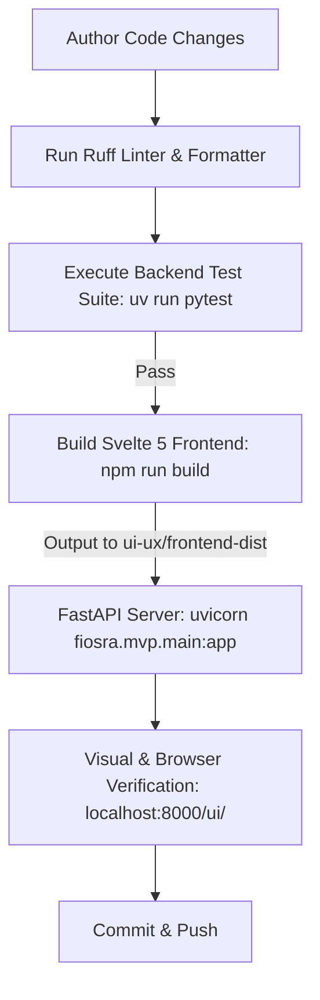
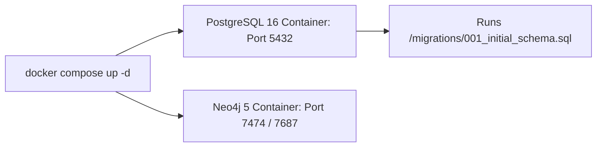
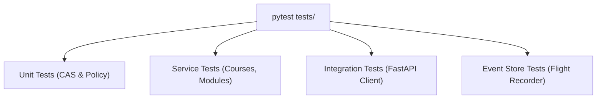

# Chapter 5: Developer Workflows & Operations

This chapter outlines standard operating procedures for setting up a local development environment, managing Docker containers, executing tests, compiling the Svelte frontend, and maintaining database migrations.

---

## 🔁 Developer Lifecycle & Verification Pipeline



---

## 🛠️ Prerequisites

Before developing locally, ensure the following toolchains are installed:
- **Python**: 3.11+ (Python 3.14 compatible)
- **Node.js**: 20+ & npm 10+
- **Docker & Docker Compose**: For PostgreSQL 16 + pgvector and Neo4j
- **uv**: (Recommended) Fast Python package and test runner (`curl -LsSf https://astral.sh/uv/install.sh | sh`)

---

## 📦 1. Python Environment Setup

```bash
# Clone the repository
git clone https://github.com/darkaengl/fiosra.git
cd tutor

# Create and activate a Python virtual environment
python3 -m venv .venv
source .venv/bin/activate

# Install dependencies using pip or uv
pip install -r requirements.txt

# Copy environment template
cp .env.example .env
```

---

## 🐳 2. Running Docker Infrastructure

Fiosra uses Docker Compose to orchestrate **PostgreSQL 16 with pgvector** and **Neo4j 5**:



### Start Database Services
```bash
docker compose up -d
```

### Inspecting Container Health
```bash
docker compose ps
docker compose logs -f postgres
```

### Stopping Database Services
```bash
docker compose down
# Or to clean volumes:
docker compose down -v
```

---

## 🗄️ 3. Applying Database Migrations

Database DDL migrations are located under `fiosra/mvp/migrations/`.
When the PostgreSQL container initializes for the first time, scripts mounted to `/docker-entrypoint-initdb.d/` execute automatically.

To manually apply incremental migrations:
```bash
# Apply initial schema
psql -h localhost -U fiosra -d fiosra_db -f fiosra/mvp/migrations/001_initial_schema.sql

# Apply syllabus chunk vector table
psql -h localhost -U fiosra -d fiosra_db -f fiosra/mvp/migrations/002_syllabus_chunks.sql

# Apply module resources table
psql -h localhost -U fiosra -d fiosra_db -f fiosra/mvp/migrations/004_module_resources.sql

# Apply session capability and learning canvas tables
psql -h localhost -U fiosra -d fiosra_db -f fiosra/mvp/migrations/005_learning_canvas.sql

# Apply protected long-form learning document tables
psql -h localhost -U fiosra -d fiosra_db -f fiosra/mvp/migrations/006_long_form_document.sql

# Apply proactive paragraph-level Socratic probe and response tables
psql -h localhost -U fiosra -d fiosra_db -f fiosra/mvp/migrations/007_proactive_socratic_probes.sql
```

---

## 🌐 4. Building the Svelte 5 Frontend

The frontend source code lives in `frontend/`. When built, Vite packages the compiled assets directly into `ui-ux/frontend-dist/`, where FastAPI mounts them at `/ui`:

```bash
cd frontend

# Install node dependencies
npm install

# Run Vite development server (port 5173 with HMR)
npm run dev

# Build optimized production bundle
npm run build
```

> [!TIP]
> Always run `npm run build` after editing files in `frontend/src/` before testing against FastAPI's `/ui/` static mount.

---

## 🚀 5. Running the Backend Server

Start the FastAPI application with auto-reload enabled:
```bash
# Using uvicorn directly:
uvicorn fiosra.mvp.main:app --reload --port 8000

# Or via Makefile:
make dev
```

Access points:
- **Single Page App**: [http://localhost:8000/ui/#/courses](http://localhost:8000/ui/#/courses)
- **OpenAPI / Swagger UI**: [http://localhost:8000/docs](http://localhost:8000/docs)
- **System Healthcheck**: [http://localhost:8000/healthz](http://localhost:8000/healthz)

---

## 🧪 6. Testing & Quality Assurance

Fiosra features a comprehensive PyTest test suite testing all 6 modular reasoning engines, Answer Vault isolation, and CAS mathematical verifiers.



### Running All Tests
```bash
# Fast execution via uv:
uv run pytest

# Verbose execution with standard pytest:
pytest tests/ -v
```

### Running Specific Test Modules
```bash
# Test assignment designer & Answer Vault:
uv run pytest tests/test_assignment_designer.py

# Test course portfolio and curriculum sequencing:
uv run pytest tests/test_courses_and_modules.py

# Test Socratic dialogue guardrails:
uv run pytest tests/test_dialogue_guardrails.py

# Test event store append-only telemetry:
uv run pytest tests/test_event_store.py

# Test student-owned canvas, attribution, source validation, and revision conflicts:
uv run pytest tests/test_learning_canvas.py

# Test long-form document import, capability protection, large-document storage, and revision conflicts:
uv run pytest tests/test_learning_documents.py

# Test session-capability authorization and assignment binding:
uv run pytest tests/test_session_capability.py

# Test proactive question authorization, lifecycle, policy fallback, and evaluator evidence:
uv run pytest tests/test_socratic_probes.py tests/test_llm_orchestration.py -q
```

### Code Formatting & Linting
```bash
# Run Ruff linting:
ruff check .

# Automatically apply Ruff fixes & formatting:
ruff check --fix .
ruff format .
```
