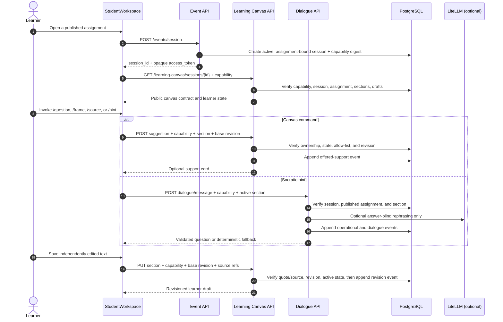

# Chapter 6: Writer-First Learning Canvas and Bounded Assistance

The Fiosra student workspace is a **writer-first, evidence-grounded reasoning environment**. It enables learners to construct a visible argument in their own words while giving them access to contextual, answer-blind support. The active text editor is the primary surface. Assignment detail, course-source browsing, and Socratic assistance are available through progressive disclosure rather than permanent competing panels.

> **Core invariant:** The application may help a learner ask a question, structure a next step, and select an approved source. It may not silently author a learner’s assessed text, disclose Answer Vault content, grade the learner, publish an assignment, or change learning state without a permitted server-side operation.

## 1. Component model

`StudentWorkspace.svelte` is the route controller for `#/student`. It restores an assignment-bound learner session, loads the public assignment and canvas state, and coordinates the central editor with the FastAPI APIs. It uses Svelte 5 runes for local display state. The browser does not determine whether a source, section, suggestion, session, or hint is valid; it renders state returned by the API and sends the session capability on protected calls. [1]

| Client surface | Default presentation | Responsibility | Server authority preserved |
|---|---|---|---|
| **Section rail** | Narrow numbered navigation rail | Selects the active canvas section and exposes persisted completion state. | The assignment defines sections, their order, requirements, and character limits. |
| **Focused editor** | Broad central writing surface | Holds unsaved local text, attached evidence chips, and a save action. | The save endpoint validates session ownership, section membership, source references, quotations, revision number, and active session status. |
| **Assignment bar** | Compact top bar | Opens the full brief on demand and shows current draft/session state. | The public assignment projection is generated by the server and excludes educator-only material. |
| **`/` command menu** | Hidden until typed or opened with the toolbar | Invokes one bounded assistance action for the active section. | Only allow-listed canvas suggestion types and explicit hint requests reach the API. |
| **`@` source picker** | Hidden until typed or opened with the toolbar | Attaches an approved source to the local section draft. | The persisted source must belong to the assignment. A selected quotation must occur in its approved excerpt. |
| **AI utility drawer** | Closed on initial page load | Displays the most recent support card and concise Socratic dialogue history. | Suggestions remain server records and cannot write a draft merely by being displayed. |
| **Reasoning trace** | Separate review route | Lets the learner inspect the event sequence before submission. | Events are append-only and distinguish learner work, offered support, accepted learner edits, and integrity boundaries. |

## 2. Writer-first interaction contract

The workspace opens with the editor as the dominant element. The assistant drawer remains closed after loading and after ordinary typing. A learner can open it through the **Assist** control or an explicit editor command. An incoming result never moves the cursor, inserts text, expands the drawer automatically, or replaces student work.

The assignment prompt, target knowledge components, approved excerpts, and hint-policy statement are available through **View brief**. This prevents the core writing surface from becoming a three-column dashboard while preserving the full learning context when it is needed.

The editor uses ordinary textarea behavior and intentionally does not attempt to masquerade as a general-purpose autonomous writing agent. Its controls are limited to the bounded commands below.

| Command | Client operation | Server operation | Permitted result | Explicit learner action required |
|---|---|---|---|---|
| `/question` | Opens the assistant drawer | `POST /learning-canvas/sessions/{session_id}/suggestions` with `section_question` | A question about the active public section. | The learner decides whether and how to respond in their own draft. |
| `/frame` | Opens the assistant drawer | Same endpoint with `writing_frame` | A neutral editable writing frame. | The learner must choose **Use as editable frame**, then revise and save their own text. |
| `/source` | Opens the assistant drawer | Same endpoint with `source_reminder` | A prompt to reconsider approved sources. | The learner selects any source reference and writes the rationale. |
| `/hint` | Opens the assistant drawer | `POST /dialogue/message` with `hint_requested=true` | The server-selected Socratic hint rung. | The learner independently changes their work. |
| `/brief` | Opens assignment brief | No mutating request | The public task, knowledge-component list, and approved excerpts. | None; this operation only reveals existing public context. |
| `@` | Opens source picker | No mutating request until section save | A list filtered to assignment-approved sources. | The learner selects a source, optionally sets a permitted quote, and saves the draft. |

The command palette contains no `/write`, `/answer`, `/thesis`, `/complete`, `/rewrite paragraph`, or provider/model-selection action. The only model-enabled work remains the server-guarded rephrasing of an already permitted Socratic prompt. The deterministic support card remains usable when no provider is configured or a provider fails. [2]

## 3. Persisted canvas model and attribution

The durable canvas model uses the tables created by `005_learning_canvas.sql`. `canvas_section_drafts` stores a revisioned text value, structured source references, author label, and timestamp for each session/section combination. `canvas_suggestions` stores each optional support card separately from the draft. It records its base revision and lifecycle state: `offered`, `accepted`, or `dismissed`. [3]

The `author_type` value describes the learner’s relationship to the saved text. `student` means the learner saved the text directly. `student_edited_assistance` means the learner chose a support card, placed it in the editable field, and saved their own resulting edit. It does not mean the system wrote the text automatically.

| Event type | Meaning | Student work changed? | Educator/trace interpretation |
|---|---|---:|---|
| `canvas_section_saved` | A learner saved a section revision. | Yes, through an explicit save. | Student-authored revision. |
| `canvas_suggestion_offered` | The system made a scoped optional card available. | No. | Optional support was offered. |
| `canvas_suggestion_accepted` | A learner saved an edited version after using a card. | Yes, through an explicit save. | Learner-edited assistance. |
| `canvas_suggestion_dismissed` | A learner rejected the card. | No. | Learner chose to continue independently. |
| `student_prompt_submitted` | A learner asked the Socratic guide a question. | No. | Learner reasoning attempt. |
| `tutor_turn_completed` | The server delivered a bounded Socratic response. | No. | Socratic assistance, separate from authored draft text. |
| `adversarial_probe_defended` | The answer-extraction guard intercepted the request. | No. | Integrity boundary and Socratic redirection. |

## 4. Protected API sequence

A client receives an opaque session capability only when it creates a valid session for a published assignment and its published question identity. The database stores a SHA-256 digest, not the raw capability. Browser requests supply the raw capability in `X-Fiosra-Session-Token`; the server uses constant-time comparison against the stored digest before returning state or mutating the session. [4]



### Canvas API endpoints

| Method and path | Required capability | Purpose | Important rejection cases |
|---|---:|---|---|
| `GET /learning-canvas/sessions/{session_id}` | Yes | Loads public section definitions, active session status, draft state, and outstanding cards. | Missing/wrong capability: `403`; unlinked/unavailable assignment: validation error. |
| `PUT /learning-canvas/sessions/{session_id}/sections/{section_id}` | Yes | Saves a learner-owned revision with source references. | Stale base revision: `409`; submitted/completed session: `409`; invalid section/source/quote: `422`. |
| `POST /learning-canvas/sessions/{session_id}/suggestions` | Yes | Creates one allowed, section-scoped support card. | Existing unresolved card or stale revision: `409`; unsupported kind: `422`. |
| `POST /learning-canvas/sessions/{session_id}/suggestions/{suggestion_id}/accept` | Yes | Saves a learner-editable text result and marks the card accepted. | Empty text, stale card, or source issue: `409`/`422`. |
| `POST /learning-canvas/sessions/{session_id}/suggestions/{suggestion_id}/dismiss` | Yes | Records an explicit refusal of a card. | Missing or already-handled card: `409`. |
| `POST /dialogue/message` | Yes | Sends a learner’s Socratic question or explicit hint request. | Mismatched assignment/question/learner or undeclared section: `409`; answer extraction: bounded integrity response. |

## 5. Safe modification guidance

When changing the student workspace, retain the following properties:

1. Keep the initial assistant drawer closed. Assistance should never be visually dominant on first render.
2. Do not send the Answer Vault, reference solution, rubric answer, session capability digest, student identifier, or complete event history to an LLM provider.
3. Do not use model output as a direct editor mutation. A learner must make and save their own revision.
4. Preserve `base_revision` values on section saves and support requests. The server uses them to prevent stale-tab overwrites.
5. Preserve the `X-Fiosra-Session-Token` header on canvas, dialogue, session replay, and submission calls.
6. Extend `allowed_suggestion_kinds` and server-side validations before adding a new palette command. A client-only menu item is not an authorization mechanism.
7. Keep the AI drawer keyboard-dismissible with Escape. Editor focus must remain stable when assistance is requested or returned.
8. Test every new display label against the trace and educator-review meaning. Do not describe offered support as authored student work.

## 6. Local validation workflow

Start PostgreSQL and Neo4j as configured for local development, apply the latest database migrations to an existing database, build the frontend, and launch FastAPI. The static Svelte bundle served at `/ui/` must be rebuilt after changes under `frontend/src/`.

```bash
# From the repository root
uv run ruff check fiosra tests
uv run python -m compileall -q fiosra
uv run pytest tests -q

cd frontend
npm run build
cd ..

# Deterministic safe fallback
FIOSRA_LLM_PROVIDER=deterministic uv run uvicorn fiosra.mvp.main:app --host 0.0.0.0 --port 8000
```

Validate the browser journey at desktop and mobile widths:

1. Open a published assignment. Confirm the editor dominates the first viewport and the assistant is closed.
2. Type `/frame`. Confirm the palette has only the bounded matching action and that the editor text is unchanged after the card opens.
3. Open `@ Sources`. Confirm the picker shows only assignment-approved sources; select one and confirm the source appears as an attachment, not copied prose.
4. Save a learner-written section with a selected approved source. Confirm the rail count, revision, and `Student-authored` label update.
5. Request a Socratic question and an explicit answer. Confirm the drawer remains peripheral and the answer request is redirected by the integrity boundary.
6. Reload the workspace. Confirm the protected session restores the saved draft and source attachment.
7. Submit a complete trace and inspect the educator review. Confirm student revisions and optional co-pilot actions appear separately.

The regression suite includes `test_learning_canvas.py` and `test_session_capability.py` for revision, source, suggestion, lifecycle, and authorization rules. The verification record in `docs/learning-canvas-verification.md` documents a real local Ollama journey and the writer-first UI checks. [5]

## References

[1]: https://github.com/darkaengl/fiosra/blob/main/frontend/src/routes/StudentWorkspace.svelte "Writer-first student workspace route"
[2]: https://github.com/darkaengl/fiosra/blob/main/fiosra/mvp/llm/orchestrator.py "Guarded LiteLLM provider orchestration"
[3]: https://github.com/darkaengl/fiosra/blob/main/fiosra/mvp/migrations/005_learning_canvas.sql "Learning canvas persistence migration"
[4]: https://github.com/darkaengl/fiosra/blob/main/fiosra/mvp/event_store.py "Session capability verification service"
[5]: https://github.com/darkaengl/fiosra/blob/main/docs/learning-canvas-verification.md "Learning canvas validation record"
