# Long-Form Provenance-Aware Learning Editor Plan

**Author:** Manus AI  
**Status:** Proposed for approval; this document authorizes no implementation work by itself  
**Supersedes:** The writer-first canvas plan’s fixed-section textarea interaction. It refines—not removes—the current session capability, source-validation, hint, trace, and answer-isolation controls.  
**Coordinates with:** The proposed Evidence Packet PDF plan. The document model and evidence records specified here must ship before PDF snapshot work, which will become migration `007` after this plan introduces `006`.

## Product decision

Fiosra will evolve from a fixed-size collection of canvas textareas into a **long-form, block-based document editor**. A learner can write a one-paragraph response or a 100-page essay in one continuous document, arrange it with headings and sections, and add outline items when needed. “Pages” are a presentation concern: the editor flows continuously like Notion or Obsidian, while print/PDF rendering creates pages automatically. The product will not impose the current 1,800–8,000-character section caps on the document as a whole.

AI will have two complementary roles:

1. **Socratic examiner:** after a meaningful learner-authored paragraph or revision, it proactively poses one concise question that tests an assumption, use of evidence, causal connection, alternative explanation, or claim boundary. The learner’s response becomes structured evidence for human evaluation.
2. **Provenance-aware co-author:** on the learner’s explicit request, it may correct grammar, reformat existing wording, or propose a passage based only on knowledge that has already been demonstrated by the learner and sources that have been approved for the assignment. Every proposed change is reviewable as a diff, requires explicit learner acceptance, and carries a durable provenance record.
3. **Answer-blind brainstorming guide:** on the learner’s explicit request, it may offer neutral questions, research/evidence lenses, counterfactual checks, and outline prompts related to the public assignment. It does not offer a thesis, a conclusion, factual content, a source interpretation, or submit-ready prose.

> **The AI may improve expression or compose a draft from verified learner knowledge; it may not manufacture unverified subject knowledge, silently write assessed work, leak answer-vault content, or represent AI-authored language as independent student work.**

Learners remain free to defer or dismiss a probe. However, when a probe targets a claim that the learner wishes an evaluator to credit, the related claim remains visibly **not yet evidenced** until the learner supplies a qualifying response and source support where the assignment requires it. The evaluator sees the offered question, the learner’s response or explicit non-response, and the evidence state. A decision to ignore a probe does not cause an automatic penalty, but it can leave insufficient evidence for the educator to award rubric credit for that claim. This gives students a clear incentive to demonstrate understanding without making AI participation coercive or allowing the system to invent the missing demonstration.

This gives the learner meaningful editorial help without turning the system into answer delivery. It also gives the evaluator a more useful record: the evolving essay, the evidence behind contested claims, the questions that tested understanding, the learner’s responses, and each accepted AI contribution.

## Why the present implementation cannot support this yet

The database column for a canvas draft is already PostgreSQL `TEXT`, but the public canvas contract (`CanvasSectionDefinition.max_characters`, `SaveCanvasSectionRequest.text`, and `AcceptSuggestionRequest.text`) caps a single section at 8,000 characters. The browser applies `maxlength={activeSection.max_characters}` to a plain textarea. These were safe MVP controls for short structured reasoning, not an intentional product limit on learner expression.

Raising the `maxlength` alone would allow more text but would not provide a real long-form experience: there would still be separate textareas, no document outline, no heading/block semantics, no safe selected-text transformation, no edit diff, no paragraph-linked Socratic evidence, and no scalable persistence strategy. A document model is therefore required rather than a cosmetic character-limit change.

## Design principles

| Principle | Product consequence |
|---|---|
| **Learner writing is primary** | The document remains central. AI is opened through an inline slash command, selected-text action, or collapsed utility drawer—not a persistent chat column. |
| **No artificial essay cap** | Store a document as structured blocks and update only changed blocks. Apply practical request and per-block safeguards, not a low document-wide character limit. |
| **Evidence before generative expansion** | An AI-written passage may use only claims with a recorded demonstration record and assignment-approved source references. Missing evidence leads to a Socratic probe, not a completed paragraph. |
| **Explicit, reversible agency** | AI returns a proposed patch, never an automatic in-place change. The learner can preview, accept, edit before accepting, reject, or continue independently. |
| **Provenance is first-class** | Every AI action has a type, input scope, validated knowledge/evidence references, result hash, and disposition. The final review packet renders this in human-readable form. |
| **One secure truth source** | Server-side authorization, source validation, knowledge-evidence state, document revisions, and policy decisions remain authoritative. Browser state and LLM output are never trusted as proof. |
| **Pedagogy over surveillance** | Probes fire proactively only at meaningful learner checkpoints, are rate-limited, and can be deferred. They do not interrupt every sentence or treat stylistic fluency as conceptual mastery. |
| **Transparent evidence consequences** | The interface explains which claim a probe tests and that an unanswered probe leaves the claim unverified for rubric evidence. Deferral is recorded without an automatic grade deduction; the educator evaluates the available evidence. |
| **Human evaluation remains sovereign** | A proof-of-understanding record is evidence, not an automatic high-stakes grade. The educator can inspect and overrule all automated classifications. |

## User experience

### 1. Document workspace

The student sees a centered, distraction-minimal document surface with a lightweight outline on the left and a contextual utility drawer hidden by default. The learner can add headings, paragraphs, quotations, lists, evidence callouts, and section breaks. Assignment sections appear as initial headings and outline anchors; the learner can add subheadings and paragraphs beneath them. They do not need to create “Page 2” manually. The editor paginates only in print preview and in the submission PDF.

A small document status bar indicates local saving state, document word count, source attachments, and, when relevant, the selected paragraph’s evidence status. It does not show a running AI conversation by default.

| Interaction | Learner action | Result |
|---|---|---|
| Add content | Enter, markdown shortcut, or toolbar | Creates a typed document block: paragraph, heading, quotation, bullet list, or evidence callout. |
| Add an outline section | Use **Add section** in the outline or a heading command | Inserts a learner-named heading and related paragraph block. |
| Navigate | Click a heading in the outline | Scrolls to the corresponding document anchor without fragmenting writing across separate forms. |
| Cite approved material | Type `@` or use **Sources** | Searches assignment-approved sources and attaches a selectable citation/evidence mark to the active block. |
| Ask for support | Type `/` or select text | Opens only contextually relevant safe actions; AI remains hidden after ordinary typing. |
| Preview pages | Select **Print preview** | Shows page flow without changing the continuous writing model. |

### 2. Assistance commands

The command menu exposes only bounded functions appropriate to the active selection and its demonstrated knowledge state.

| Command | Preconditions | Allowed output | Required learner action | Attribution |
|---|---|---|---|---|
| `/brainstorm` | Public assignment context and optional current heading; no student answer is required. | Three to five neutral questions, evidence lenses, counterargument categories, or research-planning prompts. | Consider, dismiss, or independently translate a prompt into a learner-authored outline/note. Nothing is inserted. | `ai_brainstorm_card_offered` and its dismissal/use disposition. |
| `/grammar` | Selected student-authored text | Grammar, spelling, punctuation, readability, and sentence-level clarity edits that preserve meaning. | Review a side-by-side patch; accept or edit it. | `ai_grammar_patch_accepted` with input/output hashes. |
| `/reformat` | Selected student-authored text | Paragraphing, heading hierarchy, lists, or citation presentation without adding claims or facts. | Review/accept a patch. | `ai_reformat_patch_accepted`. |
| `/clarify` | Selected student-authored text | A clarification alternative that preserves the asserted content and source links. | Review/accept/edit. | `ai_clarity_patch_accepted`. |
| `/draft-from-evidence` | Every requested claim is linked to qualifying demonstrated-knowledge evidence and approved sources. | A clearly marked proposed passage using only those claims and citations. | Review, edit, and explicitly accept; the learner may reject it. | `ai_verified_draft_accepted`, with links to each evidence record. |
| `/check-understanding` | Active paragraph has one or more claims | A short, bounded probe plan; not a score. | Opt in to answer the questions. | `ai_probe_offered`. |
| `@source` | Assignment has published approved sources | Source-search picker and citation attachment. | Select source/quote and provide rationale where required. | Learner-authored source reference. |

The menu deliberately excludes `/answer`, `/finish`, `/write essay`, `/thesis`, `/complete section`, and broad “make this better” actions that could evade content-scoping controls. A learner can always ask for answer-blind brainstorming, grammar, or format help, but source- and knowledge-expanding draft help is withheld until its preconditions are met.

### 2a. Answer-blind brainstorming contract

Brainstorming helps a student decide *what to investigate or explain next*; it must never decide *what the answer is*. It is learner-invoked, not automatically inserted and not a basis for a grade. The initial card contains a maximum of five concise, labelled prompts selected from an allow-list: **question to investigate**, **direct observation to locate**, **claim boundary to test**, **alternative explanation to consider**, **counterargument category**, **evidence gap**, and **outline question**. It may refer to an approved source by title but must not provide a source quotation, interpret the source, assert a fact, name a conclusion, rank an answer, or compose a submission-ready sentence.

The provider receives the public assignment prompt, target knowledge-component labels, active heading label, source titles (not full excerpts by default), and any learner-selected constraints such as “compare causes” or “plan my evidence search.” It never receives an Answer Vault record, reference solution, hidden rubric answer, other student work, raw model output from another session, or an instruction to solve the task. A deterministic prompt-template fallback generates generic inquiry prompts when no live provider is available.

Every brainstorm response is parsed as a structured `BrainstormCard` and passes two policy layers before display. The first layer enforces five short prompts, allowed prompt labels, and a question/imperative inquiry form. The second rejects a card containing answer-like patterns, declarative conclusions, factual assertions not present in learner-supplied text, source quotations, grades, or directions that ask the learner to copy/submit the card. A rejected result becomes a bounded fallback such as “Which direct observation in an approved source could you locate before deciding?” It never reaches the editor.

The learner may dismiss the card, record an item as a **personal planning note**, or independently write from it. Converting a card item to a planning note does not create a demonstrated-knowledge record, a source citation, a document paragraph, or evaluation credit. The trace records the card and learner disposition so an evaluator can distinguish planning assistance from authored academic work.

### 3. Proactive Socratic probe rhythm

A probe is **proactively offered by the system**, not manually requested by the learner. After a block has been saved and remains unchanged through a short quiet period, the server evaluates whether the new or materially revised learner-authored writing contains a meaningful claim, inference, evidence use, or causal bridge worth testing. When it does, the system creates one concise, assignment-scoped question and displays a discreet margin marker beside that block. The marker states the claim under examination and explains that a response can provide evidence an educator may use when assessing that claim. The learner does not have to decide whether to seek a probe; they see the question when it is pedagogically useful.

The question remains non-blocking: learners may answer in a linked evidence-response field, choose **Later**, dismiss it, or continue composing. A probe never steals editor focus, opens a center-stage chat panel, prevents saving, or fires on every keystroke. If the learner answers, the verbatim response is preserved as a `student_probe_response` that can support a demonstrated-knowledge record and later human evaluation. If the learner defers or dismisses it, the evaluator sees that disposition and the claim remains `unverified`; the system applies no automatic grade penalty, while the educator may assess the available evidence under the published rubric.

The server enforces an assignment-scoped policy: only one pending probe per block; no probe until a minimum meaningful change threshold is reached; a configurable per-session ceiling; and a cool-down after a response, deferral, or dismissal. The first production policy will use a five-second quiet period after a durable block save, a 100-character material-change threshold, and at most one automatic probe for each stable block revision. These are deliberately configurable educator/product policy settings, not client-side heuristics. The probe service receives only the current block, nearby heading, approved-source excerpts, explicitly linked evidence records, and active assignment context—not the entire essay by default.

A useful probe follows a testable pattern:

1. Identify a single claim, inference, or evidence use in the learner’s newly saved paragraph.
2. Proactively offer one direct-observation, warrant, counterexample, causal-bridge, or bounded-qualification question.
3. Record the learner’s response verbatim, with its source/section context and evidence links when they choose to respond.
4. Validate whether the response supplies the requested kind of reasoning; it never treats wording style alone as mastery.
5. Make that response, or its explicit deferral/dismissal, visible to the evaluator and eligible evidence for a later bounded drafting request only when the response qualifies.

## Demonstrated-knowledge protocol

“AI may write from knowledge the student already knows” must not be interpreted as an opaque model verdict. Fiosra will instead keep a **demonstrated-knowledge record** for a specific, assignment-scoped knowledge claim.

| State | Meaning | Entry rule | May support AI drafting? |
|---|---|---|---:|
| `unverified` | A claim appears in the draft but has no qualifying supporting evidence; it cannot yet receive evidence-based rubric credit. | Default state, or an unanswered/deferred/dismissed probe. | No. |
| `probing` | The learner opted into a targeted question about the claim. | A bounded probe was offered or accepted. | No. |
| `evidence_submitted` | The learner supplied a verbatim explanation, source observation, or revision response. | The response is saved with block and source context. | No; validation is pending. |
| `demonstrated` | The response meets the assignment-specific evidence rule and is linked to an approved source/knowledge component. | Deterministic verifier passes where one exists; otherwise a transparent low-confidence classifier creates **reviewable evidence**, not a mastery claim. | Yes, for the specific linked claim/source scope only. |
| `needs_educator_review` | Automation cannot reliably validate the claim. | Ambiguous history/interpretive claim, mixed evidence, classifier uncertainty, or policy concern. | No. |
| `withdrawn` | The learner later revises/rejects the premise. | Learner changes source/claim or educator resets the record. | No. |

For mathematically or formally verifiable concepts, existing deterministic engines (for example SymPy/CAS and rule checks) decide whether the evidence rule is met. For interpretive humanities claims, the system should not certify global “understanding” from a single model judgment. It may establish a **reviewable demonstrated-evidence record** only when the learner gives a relevant response anchored to an approved excerpt and a second, independent validation method agrees on structural adequacy. Low confidence, disagreement, a new factual assertion, or lack of a valid quotation routes the claim to `needs_educator_review` and blocks `/draft-from-evidence`.

The first production version must use **specific evidence rules authored or approved in the assignment definition**. A generic LLM taxonomy is not sufficient evidence of knowledge. An educator should be able to inspect the prompt, the learner’s exact response, cited source, verifier result, and confidence before treating a record as significant.

## Co-authoring safety policy

### Grammar and reformatting

Grammar, punctuation, document hierarchy, and reformatting help may be requested for student-authored selected text without requiring a demonstrated-knowledge record, because these actions are constrained to expression rather than knowledge expansion. The service will use a patch policy that:

- receives a selection-sized context, never the full document unless the learner explicitly selects it;
- instructs the provider to preserve factual propositions, numerical values, quotations, citations, uncertainty language, and source links;
- rejects a patch that adds new named entities, dates, quantities, citations, factual propositions, or source assertions not present in the selection/context;
- returns structured patch operations rather than HTML from the provider;
- displays a semantic diff before insertion; and
- makes acceptance or edit-before-acceptance explicit and traceable.

If validation cannot determine whether a patch preserved content, Fiosra returns a non-mutating explanation and asks the learner to try a narrower selection. It does not fall back to silently applying an unvalidated model rewrite.

### Verified drafting

`/draft-from-evidence` can produce a proposed paragraph only when the request passes all gates below:

1. The active assignment is published and the session capability is valid.
2. Every requested knowledge claim has a non-withdrawn `demonstrated` record scoped to this assignment.
3. Every factual source assertion is tied to an approved source excerpt and learner-selected citation.
4. The prompt context contains only the verified claim/evidence bundle, active heading, formatting instruction, and bounded target length—not an answer key, rubric answer, vault content, or unrelated learner history.
5. A post-generation validator confirms every proposition/citation maps to the allowed evidence bundle. Unknown content, a new assertion, or a solution-style output causes rejection.
6. The learner sees a diff and may accept, edit, or reject it. Acceptance records the evidence-record identifiers and hashes; the block is visibly labelled as AI-assisted rather than independent work.

This makes “co-author” a transparent capability with a narrow evidence boundary, not unrestricted ghostwriting.

## Technical architecture

### Editor technology

Adopt **Tiptap/ProseMirror** as the frontend editing engine with Svelte 5 lifecycle integration. It is headless, block-structured, supports commands/extensions and JSON persistence, and has an official Svelte integration pattern. [1] The initial extension set should remain intentionally small: document, heading, paragraph, hard break, bullet/ordered list, block quote, source-citation mark, evidence-callout block, and a custom provenance mark/node. Tables, embedded media, real-time collaboration, and arbitrary HTML paste normalization are outside the first slice.

Persist canonical editor JSON, not browser HTML. The API accepts and returns validated document/block structures. The backend maintains a safe plaintext projection for deterministic checks and PDF rendering; it treats frontend HTML as untrusted derived content.

### Data model

Migration `006_long_form_document.sql` will introduce these server-owned entities.

| Entity | Key fields | Purpose |
|---|---|---|
| `learning_documents` | `document_id`, `session_id` unique, `schema_version`, `title`, `outline_json`, `document_revision`, `status`, timestamps | One long-form document per protected reasoning session. |
| `learning_document_blocks` | `block_id`, `document_id`, `parent_block_id`, `position`, `block_type`, `content_json`, `plaintext`, `revision`, `author_type`, timestamps | Revisioned blocks allow incremental save/load and a document larger than one API payload. |
| `block_source_references` | `block_id`, approved `chunk_id`, quote, rationale, citation locator | Preserves validated learner evidence links without trusting client-side citation markup. |
| `knowledge_demonstrations` | `demonstration_id`, `session_id`, `block_id`, `claim_fingerprint`, `kc_id`, `state`, response text/hash, verifier method/result/confidence, source refs, timestamps | Stores the evidence that permits—or blocks—knowledge-expanding AI drafting. |
| `ai_document_actions` | `action_id`, `block_id`, action kind, input/result hash, allowed evidence IDs, provider metadata, policy result, disposition, timestamps | Records offered, accepted, edited, rejected, and blocked AI changes. |
| `ai_brainstorm_cards` | `card_id`, `document_id`, optional `block_id`, request scope, structured prompt items, provider metadata, policy result, disposition, timestamps | Retains answer-blind planning cards separately from document text and demonstrated knowledge. |
| `socratic_probes` | `probe_id`, `block_id`, claim fingerprint, question, status, response block/reference, validation result, cool-down fields | Provides a durable relationship between paragraph, probe, learner response, and evaluator evidence. |

The migration will copy existing `canvas_section_drafts` into initial heading/paragraph blocks and retain legacy data as immutable history. The five original canvas sections become assignment outline anchors. Existing sessions load through a backward-compatible adapter until their document migration completes. A later cleanup migration is not authorized by this plan.

### API boundary

All document APIs require the existing `X-Fiosra-Session-Token` capability. All mutating commands carry a document/block revision and use optimistic concurrency. The client sends a changed block or bounded block batch, not a 100-page document with each keystroke.

| Endpoint | Intent | Security and integrity controls |
|---|---|---|
| `GET /learning-documents/sessions/{session_id}` | Load document metadata, outline, blocks in paginated windows, permitted commands, source references, and actions needed for display. | Correct capability; assignment/session match; no vault/rubric answer data. |
| `PUT /learning-documents/{document_id}/blocks/{block_id}` | Save a learner revision or create an explicit new block. | Capability; active session; JSON schema; source quote validation; block revision; size/rate limits; append-only event. |
| `POST /learning-documents/{document_id}/probes/{probe_id}/responses` | Save the learner’s response and begin evidence validation. | Capability; learner text; linked sources; no model-authored response accepted as a probe response. |
| `POST /learning-documents/{document_id}/brainstorm` | Request a structured answer-blind brainstorming card for the document or active heading. | Capability; bounded public context; schema/answer-leak validation; rate limit; never mutates a document block. |
| `POST /learning-documents/{document_id}/brainstorm/{card_id}/dismiss` | Record that the learner dismissed a card. | Capability; idempotent state transition. |
| `POST /learning-documents/{document_id}/brainstorm/{card_id}/planning-notes` | Save a learner-selected item as an explicitly non-assessed planning note. | Capability; item/card match; no conversion to a cited source, paragraph, or demonstrated-knowledge record. |
| `POST /learning-documents/{document_id}/blocks/{block_id}/actions` | Request grammar, reformat, clarify, or evidence-bounded drafting patch. | Command allow-list; selected-range hash; policy gates; precise evidence bundle; no automatic mutation. |
| `POST /learning-documents/{document_id}/actions/{action_id}/accept` | Apply a reviewed patch or learner-edited version. | Capability; action/block revision; patch integrity; action must be offered and valid. |
| `POST /learning-documents/{document_id}/actions/{action_id}/dismiss` | Record a rejected patch. | Capability; idempotent dismissal. |
| `GET /learning-documents/{document_id}/print-preview` | Obtain a safe HTML/JSON print projection. | Capability; sanitized server projection. |

Existing canvas suggestion and dialogue endpoints remain available during the transition, but new document surfaces will use the dedicated APIs. The back end, not the UI, decides whether a command is permitted, whether an evidence record qualifies, and whether a patch can be offered or accepted.

### Agent workflow, bounded by a server state machine

The product can use multiple specialized LLM calls, but this is a **state machine with typed tools**, not an unbounded autonomous agent. Every agent receives a reduced context and returns validated structured output. The orchestration layer sets hard timeouts, retry budgets, model fallback, schema validation, policy filters, and an immutable event record.

```mermaid
flowchart LR
    A[Learner saves a block] --> B{Meaningful claim/change after quiet period?}
    B -->|No| C[Continue writing; no AI interruption]
    B -->|Yes| D[Claim and source extractor]
    D --> E{Verified knowledge evidence available?}
    E -->|No| F[Socratic probe planner]
    F --> G[Learner response]
    G --> H[Deterministic / two-stage evidence validator]
    H -->|Demonstrated| I[Evidence bundle registry]
    H -->|Uncertain| J[Needs educator review; drafting remains blocked]
    I --> K{Learner requests co-author action?}
    K -->|Grammar/reformat| L[Meaning-preserving patch generator]
    K -->|Draft from evidence| M[Evidence-bounded draft generator]
    L --> N[Patch and proposition validator]
    M --> N
    N -->|Pass| O[Learner review diff]
    N -->|Fail| P[Explain boundary; no mutation]
    O -->|Accept/edit| Q[Revision + provenance event]
    O -->|Reject| R[Dismissal event]
    Q --> S[Evaluator evidence packet]
    R --> S
    A -. learner invokes /brainstorm .-> T[Answer-blind brainstorm generator]
    T --> U[Structured answer-leak validator]
    U -->|Pass| V[Optional planning card]
    U -->|Fail| W[Deterministic inquiry fallback]
    V --> X[Learner dismisses or records a non-assessed planning note]
    W --> X
    X --> S
```

**Tool boundaries:**

- The **claim/source extractor** may identify candidate claims and cite location offsets but cannot write into a document.
- The **brainstorm generator** may create only structured inquiry prompts from the answer-blind allow-list. It cannot propose a conclusion, source reading, thesis, factual assertion, or block edit.
- The **probe planner** may ask one targeted question, not explain the answer.
- The **evidence validator** must prefer deterministic/assignment-authored rules. A model classifier can only contribute a low-confidence, reviewable assessment—not a final entitlement for broad interpretive knowledge.
- The **patch generator** is bound to one selected range and a policy-specific JSON response schema.
- The **draft generator** receives only demonstrated claims, linked sources, and formatting targets; it cannot access a reference answer.
- The **policy validator** rejects answer-like leakage, unsupported propositions, hidden source use, cross-session data, unexpected citations, oversized responses, and schema mismatch.
- The **action application tool** runs only after a user acceptance request and revision check.

LiteLLM remains the provider-neutral transport layer. It can route through OpenRouter, OpenAI-compatible endpoints, Gemini, Ollama, or a deterministic fallback, but model choice never changes the evidence gate or server-authoritative policy. [2]

## Long-document scalability and reliability

A 100-page essay should not require loading or transmitting 100 pages on every change. The document uses stable blocks and incremental synchronization.

| Concern | Design response |
|---|---|
| Large document reads | Load headings and block summaries first; virtualize or window body blocks as the learner scrolls; fetch adjacent content on demand. |
| Large document writes | Debounced local autosave of changed blocks, explicit durable save indicator, and periodic server checkpoints. No per-keystroke event logging. |
| Crash/reconnect | Encrypted/browser-local draft buffer for unsent changes where appropriate; server revision reconciliation; clear conflict resolution UI. |
| Concurrent tabs | Block-level optimistic concurrency and a three-way merge prompt; never silently overwrite a newer learner revision. |
| Provider context limit | Build request context from selection/current block, parent heading, approved excerpts, and evidence identifiers. Never serialize the complete essay by default. |
| Document size | PostgreSQL block storage supports long work. Enforce operational limits per request/block with adaptive chunking and explicit user feedback, not a low total-document character cap. |
| Print/PDF | Render the immutable submitted document snapshot into paginated pages after submission; live editing remains continuous. |

Real-time collaborative editing, multiple learner devices writing the same paragraph simultaneously, document comments by peers, and third-party cloud document import/export are separate future decisions. They are not prerequisites for an individual learner’s long-form essay.

## Evaluation and PDF alignment

The Evidence Packet PDF plan must change its content source from five canvas text fields to the immutable document snapshot created at submission. It will render the document’s headings and blocks in outline order, each cited source reference, the learner’s paragraph-linked probe responses, and an AI assistance ledger.

| PDF element | Source | Evaluator value |
|---|---|---|
| Submitted essay | Immutable document blocks | Sees the actual long-form work, in natural page flow. |
| Source evidence | Block citations and learner rationale | Sees what source material the learner selected and how it was used. |
| Understanding probes | Probe question, learner answer, claim/KC link, validation state | Sees whether the learner could articulate the relevant reasoning. |
| Assistance ledger | AI action kind, selected scope, disposition, evidence links, learner edits | Differentiates independent writing, grammar help, formatting, and evidence-gated drafting. |
| Integrity data | Snapshot digest, template/schema version, timestamp | Detects later alteration without exposing session credentials. |
| Human assessment | Separate educator notes/finalization record | Keeps grading decisions human-controlled. |

The packet must not treat an accepted grammar patch as conceptual evidence. It must not treat a generated verified draft as independent work. It must identify the underlying learner demonstration records that allowed the draft.

## Implementation sequence

| Slice | Deliverable | Validation gate |
|---:|---|---|
| 0 | Confirm this plan and reconcile the Evidence Packet PDF plan’s dependency/migration number. | Product sign-off on continuous document experience, evidence-gated drafting policy, and human-review boundary. |
| 1 | Add Tiptap dependencies; introduce canonical document/block schemas and migration `006`; build backward-compatible import of existing canvas drafts. | Migration works on fresh and existing data; API schema rejects unknown nodes; 100-page synthetic fixture stores/loads with no document-wide 8,000-character rejection. |
| 2 | Build the writer-first document route: outline, block editing, heading creation, source citations, incremental save, restoration, revision conflict UI, and print preview. | Desktop and mobile browser journeys; reload recovery; large-document windowing; capability/source/revision regression tests. |
| 3 | Introduce proactive Socratic probe lifecycle, answer-blind brainstorming cards, and structured learner response capture. | Tests verify meaningful-change triggers, one-pending-probe, cool-down, deferral/dismissal, brainstorm schema/answer-leak rejection, source/context isolation, no hint/answer leakage, and complete evaluator trace representation. |
| 4 | Add demonstrated-knowledge records and assignment-authored evidence rules, with deterministic verifier first and educator-review path for ambiguity. | Tests prove uncertain/unsupported claims cannot reach drafting; valid learner response/source evidence can create a scoped demonstrated record; assessor override is auditable. |
| 5 | Implement grammar/reformat/clarify patches with semantic and source-preservation validation, review diff, and accepted/rejected provenance. | Tests reject new facts/citations/source claims; browser verifies proposal never mutates content before learner acceptance. |
| 6 | Implement evidence-gated draft-from-evidence patches and independent provider/fallback validation. | Tests demonstrate no provider request on an unverified claim; every generated proposition maps to approved evidence; all output is labelled and reviewer-visible. |
| 7 | Update the evidence packet service to snapshot/render the final document, probe evidence, and assistance ledger. Enable learner download; defer educator download until Issue #41 supplies role authorization. | Strict Typst build, PDF text/visual verification, snapshot immutability, capability protection, and no-answer-vault leakage tests. |
| 8 | Update API/developer guides, deployment/dependency documentation, educator review UI, and GitHub issue/PR acceptance records. | Full suite, production frontend build, container build, browser journeys, accessibility review, long-document performance check, and security regression pass. |

## Acceptance criteria

| Area | Criterion |
|---|---|
| **Long-form composition** | A learner can create, restructure, save, reload, and submit a continuous multi-section document of at least 100 pages of fixture text without a document-wide `maxlength` error or full-document upload on each change. |
| **Document semantics** | Headings/paragraphs/quotes/lists/citations retain typed structure; outline navigation and print preview preserve their order. |
| **Writer-first experience** | The initial view prioritizes the editable document. AI is not a persistent center-stage panel, and ordinary typing does not trigger a forced conversation. |
| **Socratic evidence** | Every probe is assignment/block scoped, proactively offered only after a meaningful learner checkpoint, rate-limited, non-blocking, answer-blind, and connected to the learner’s verbatim response or explicit deferral for evaluator review. |
| **Brainstorming** | Brainstorming returns only a bounded set of labelled inquiry prompts. It creates no automatic document content, citation, demonstrated-knowledge record, grade evidence, factual assertion, thesis, source interpretation, or completed answer. |
| **Evidence consequence clarity** | Each visible probe identifies the associated claim and makes clear that a response can establish evaluable evidence; a deferral leaves that claim unverified but does not trigger an automatic grade deduction. |
| **Evidence gate** | No knowledge-expanding draft action is offered or sent to a provider before all included claims are linked to qualifying demonstrated-evidence records. |
| **Co-authoring agency** | Grammar, reformatting, clarity, and verified drafting actions are proposed as diffs, never applied automatically. The learner can edit/reject them and all dispositions are recorded. |
| **Content preservation** | Grammar/reformat patches cannot add factual claims, numerical/date changes, citations, named entities, or source assertions beyond the validated selection/context. |
| **Provenance** | An evaluator can distinguish student text, learner-edited AI assistance, grammar/reformat support, evidence-gated draft text, source links, probe questions, and learner probe responses. |
| **Answer isolation** | Answer Vault/reference solution/rubric answer/secret/session-token data are absent from document APIs, provider contexts, action payloads, persisted snapshots, PDF inputs, and rendered documents. |
| **Reliability** | Offline/reconnect and stale block revision flows prevent silent data loss. Provider failure produces no document mutation and preserves a retryable draft. |
| **Authorization** | Document/probe/action APIs require the session capability. Educator review/download remains protected by the planned Issue #41 authorization foundation. |
| **Validation** | Ruff, Python compile checks, backend tests, frontend production build, browser journeys, a large-document fixture, red-team extraction/co-author tests, source provenance tests, PDF verification, and responsive review all pass. |

## Explicit exclusions

This plan does not introduce unrestricted essay generation, autonomous hidden agents, AI grading, real-time multi-user collaboration, a public document URL, automatic citations to external web content, post-submission editing, or educator download before role-based authorization is available. It also does not claim that an LLM can certify a student’s knowledge; it captures transparent, assignment-scoped evidence of demonstrated reasoning for a human evaluator.

## Approval request

Approve this plan to start **Slice 1** only: the long-form block document data model, migration, backward-compatible import, and a minimal Tiptap writer-first editor prototype without AI co-authoring. After Slice 1, I will run validation, record a concrete interaction and performance plan for Slices 2–3, and seek confirmation before introducing Socratic probes or any AI-assisted editing.

## References

[1]: https://tiptap.dev/docs/editor/getting-started/install/svelte "Tiptap’s Svelte editor installation and lifecycle guidance"
[2]: https://github.com/darkaengl/fiosra/blob/main/docs/live-llm-provider-guide.md "Fiosra LiteLLM multi-provider and safety guide"
[3]: https://github.com/darkaengl/fiosra/blob/main/fiosra/mvp/learning_canvas_schemas.py "Current fixed-length canvas contracts"
[4]: https://github.com/darkaengl/fiosra/blob/main/fiosra/mvp/learning_canvas_service.py "Current server-authoritative source and revision validation"
[5]: https://github.com/darkaengl/fiosra/blob/main/fiosra/mvp/dialogue_router.py "Current capability-protected Socratic dialogue boundary"
