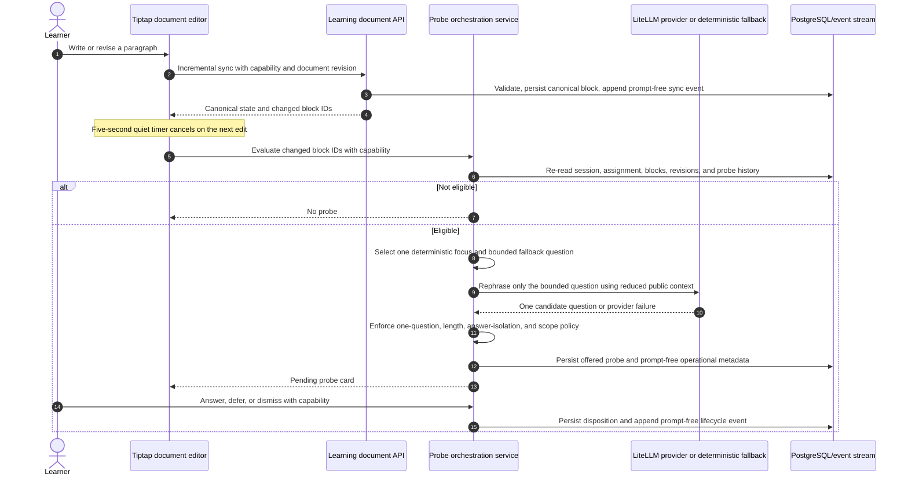

# Slice 2: Proactive Socratic Probes and Real-Time Evidence Capture

**Author:** Manus AI  
**Status:** Approved, implemented, and validated on 2026-09-10  
**Parent work:** [Epic #39](https://github.com/darkaengl/fiosra/issues/39), [Issue #41](https://github.com/darkaengl/fiosra/issues/41)  
**Prerequisite delivered:** [Long-form document foundation, PR #46](https://github.com/darkaengl/fiosra/pull/46)

## Decision

Slice 2 will add **proactive, non-blocking Socratic questions** to the long-form student document. After a learner saves a materially changed paragraph and then pauses, the server will decide whether that specific writing contains a claim, inference, use of evidence, causal bridge, or unexamined alternative worth testing. If so, it will offer exactly one concise, assignment-scoped question. The learner may answer, defer, dismiss, or continue writing. The resulting question and learner disposition become durable, evaluator-visible evidence; they are not an automatic grade or a claim of mastery.

> **The tutor is an examiner of reasoning, not the author of the essay.** It may ask one targeted question about a learner’s own paragraph, but it may not provide the answer, thesis, hidden rubric, reference solution, source interpretation, or completed passage.

This is an event-driven request/response workflow. It is not a continuously running autonomous process, browser polling loop, background worker, or unrestricted agent. A quiet-period request merely asks the server to evaluate an already saved block. The server independently re-checks all eligibility rules before it creates a probe or invokes a configured provider.

## Product experience

The student editor remains the visual focus. Ordinary composition does not open a chat conversation, steal focus, or move the cursor. When a qualified paragraph becomes stable, a small **Questions** indicator appears in the document chrome and a discreet margin marker identifies the paragraph under examination. The learner chooses when to open the collapsed **Evidence & Questions** drawer. The drawer shows the exact claim context, one question, the available actions, and a clear explanation of the evidence consequence.

| Learner moment | System behaviour | Learner control | Evaluator-visible record |
|---|---|---|---|
| Learner saves a meaningful revised paragraph | After a five-second quiet period, the client makes one eligibility request. The server re-reads the canonical block and determines whether a question is worthwhile. | No interruption, no mandatory modal, and no forced response. | No record if no eligible probe exists; otherwise, an offered probe with block/revision context. |
| An eligible question is ready | A compact indicator appears. The paragraph remains fully editable and the question drawer is closed by default. | Open now, continue writing, or ignore the indicator temporarily. | The offer and its target block/revision. |
| Learner answers | The learner writes a response in a separate, labelled evidence-response field. It is never inserted into the essay automatically. | Submit, revise before submit, or return to composing. | Verbatim response, response revision, question, focus type, and source/block context. |
| Learner defers or dismisses | The question is marked **later** or **dismissed**. The essay remains editable. | A later action can reopen a deferred question; dismissal is explicit. | Transparent disposition and timestamp. The related claim remains `unverified`; no automatic grade deduction occurs. |
| The paragraph changes materially after a probe | The server closes/supersedes the earlier open probe and permits at most one new probe for the new stable revision, subject to the session budget. | The learner can view historical evidence in the trace. | Probe revision chain and no silent replacement of the prior record. |

The initial experience will use copy such as: **“This question tests the reasoning in this paragraph. Answering can give your evaluator evidence to consider; choosing Later leaves this claim without a response record. Your educator—not Fiosra—assesses the evidence.”**

## Explicit boundaries

| Permitted | Not permitted |
|---|---|
| Ask one direct-observation, warrant, causal-bridge, alternative-explanation, or qualification question about a saved learner paragraph. | Supply a factual answer, thesis, completed sentence, conclusion, solution method, source interpretation, or grading judgment. |
| Rephrase a deterministic, server-selected Socratic question through the configured LiteLLM provider. | Let a model decide permissions, mutate a document, advance a grade, access Answer Vault content, or call tools. |
| Persist an offered question, learner response, deferral, dismissal, and prompt-free operational metadata. | Emit raw learner prose in generic telemetry, log a provider prompt, expose a session token, or represent silence as misconduct. |
| Use the active paragraph, surrounding heading, public assignment prompt, target KC labels, and a small approved-source excerpt set. | Send the complete essay, another learner’s work, an educator-only rubric, a reference solution, vault token, or hidden assignment data to an LLM. |
| Fall back to a deterministic question when a provider is unavailable or output fails policy checks. | Retry indefinitely, silently degrade to an answer-like response, or create a probe after a provider error without an explicit safe fallback. |

## Server-authoritative workflow

The client may request evaluation after a quiet period but is never trusted to assert that a paragraph is new, meaningful, eligible, or correctly associated with an assignment. The service reads the authorized session, canonical document revision, block revision, paragraph plaintext, parent heading, active published assignment, and prior probe history inside the server boundary.

The **probe planner** is intentionally deterministic. It evaluates a local text shape and selects one focus from an allow-list before an LLM is called. The configured provider has one limited role: it may rephrase the supplied fallback as a single supportive question. The server validates that output and substitutes the original deterministic question on failure. This retains the existing LiteLLM provider configuration for Ollama, OpenRouter, OpenAI-compatible endpoints, or Gemini while ensuring that no provider can alter workflow state.

| Focus selected by server | Eligibility signal | Example bounded question form |
|---|---|---|
| `direct_observation` | A claim uses evidence language without a concrete observable detail. | “Which specific detail in an approved source could you point to before making this claim?” |
| `warrant` | A paragraph contains a claim and an observation but lacks a stated connection. | “What is the reasoning that connects that detail to your claim?” |
| `causal_bridge` | A causal connector appears without a described mechanism or condition. | “What mechanism would need to connect the condition you describe to that outcome?” |
| `alternative_explanation` | A broad inference has no limitation, contrast, or competing explanation. | “What plausible alternative explanation should this paragraph distinguish from your claim?” |
| `qualification` | An absolute or overconfident statement appears in an interpretive task. | “What limitation would keep this claim within what your evidence can actually support?” |

The first version uses deterministic text-shape rules, not an LLM claim extractor. If no safe focus is evident, it creates no probe. A later evidence-validation slice may add structured claim candidates, but only after the product has assignment-authored evidence rules and human-review safeguards.

## Data model and migration

Migration `007_proactive_socratic_probes.sql` will add durable tables without modifying existing student prose records or deleting legacy canvas history.

| Table | Key fields | Integrity controls |
|---|---|---|
| `socratic_probes` | `probe_id`, `session_id`, `document_id`, `block_id`, `source_block_revision`, `claim_fingerprint`, `focus_type`, `question`, `status`, `offered_at`, `deferred_until`, `superseded_by`, generation metadata | Unique `(block_id, source_block_revision)` prevents duplicate automatic questions for a stable paragraph revision. Foreign keys bind the probe to one protected document/session. Status is constrained to `offered`, `deferred`, `responded`, `dismissed`, `superseded`, or `expired`. |
| `socratic_probe_responses` | `response_id`, `probe_id`, response text, response revision, optional learner-selected source/block references, timestamps | One active response per probe in Slice 2. The response is separately labelled evidence; it is never inserted into an essay block or considered proof of understanding without the later validation slice. |

A database query and service-level transaction will enforce one pending probe per block, a five-second stability check against the latest block update, a minimum material-change threshold of 100 characters, an assignment/session budget of six automatic probes, and a 90-second cool-down after an answer, deferral, or dismissal. The server will supersede a pending probe if its target paragraph changes materially before a learner responds. These values will be centrally configured with safe defaults, never supplied by the browser.

## API contract

All endpoints require `X-Fiosra-Session-Token`, verify that the session is active and assignment-bound, and never accept client-supplied question text, focus type, block plaintext, source excerpt, document state, or provider configuration.

| Method and path | Request intent | Response and key enforcement |
|---|---|---|
| `POST /learning-documents/sessions/{session_id}/probes/evaluate` | After the editor’s quiet period, request evaluation of a bounded list of changed block UUIDs at a supplied document revision. | Returns pending/created probe cards and current evidence counts. Server ignores ineligible IDs and reads canonical state itself. It returns `409` for a stale revision or inactive session and `403` for a bad capability. |
| `GET /learning-documents/sessions/{session_id}/probes` | Restore pending/deferred probe cards when the learner reloads. | Returns only that session’s allowed probe projection and no raw provider prompt, answer material, or unrelated historic student data. |
| `POST /learning-documents/sessions/{session_id}/probes/{probe_id}/responses` | Save a learner-authored response to an offered/deferred question. | Validates capability, probe/session ownership, active lifecycle state, bounded text, and optional permitted source/block references. Returns a response record with `evidence_state: evidence_submitted`; it does not claim mastery. |
| `POST /learning-documents/sessions/{session_id}/probes/{probe_id}/defer` | Mark a question for later. | Idempotently stores a transparent deferral and cool-down. It does not alter document text or grades. |
| `POST /learning-documents/sessions/{session_id}/probes/{probe_id}/dismiss` | Explicitly close a question without a response. | Idempotently records a dismissal. It does not create an automatic penalty. |

`GET /learning-documents/sessions/{session_id}` will additionally return a summary count plus only pending/deferred probe card metadata necessary to render the compact indicator. It will not load the complete response/evidence history into the editor by default.

## Frontend implementation

`LongFormDocumentEditor.svelte` will preserve writer-first interaction. The editor will notify the workspace when content activity occurs, canceling any pending local eligibility timer. After a successful sync, it will schedule one five-second evaluation request for the changed paragraph IDs. The request is not a source of truth; it simply permits timely, server-verified evaluation without a persistent background process.

`StudentWorkspace.svelte` will maintain the small pending probe state. It will render a non-modal **Questions** button and unread count near the assignment actions. The right-side Evidence & Questions drawer remains closed until opened. Its question card includes the paragraph heading/context, one question, **Answer**, **Later**, and **Dismiss** controls. An answer uses a separate textarea and explicit submit button. It never calls an AI writing action, replaces selected text, or overlays the central editor.

The existing manual `/dialogue/message` contract remains unchanged during this slice. Its hint ladder remains useful for later explicit learner requests, but it is not reused as the proactive state store. Slice 2 produces its own paragraph-bound evidence records and prompt-free lifecycle events.

## Provider and privacy policy

The feature can operate in deterministic mode without outbound data. When `FIOSRA_LLM_PROVIDER=ollama`, the rephrasing request stays in the organization-controlled local model service. When a hosted provider is intentionally configured, only the approved reduced context is sent. In all cases, the application keeps the provider-neutral LiteLLM adapter, per-call timeout, circuit breaker, and deterministic fallback already used by guarded tutor phrasing.

| Situation | Behaviour |
|---|---|
| Provider is `deterministic` | Return the server-selected fallback question; save metadata showing no live provider call. |
| Local Ollama succeeds | Return a schema/policy-validated rephrase; save provider/model/latency metadata only. |
| Hosted provider succeeds | Return the same constrained response type; no raw prompt or key is stored in the event stream. |
| Provider times out, fails, or violates policy | Save a fallback reason in prompt-free metadata, return the deterministic question, and never mutate learner text. |
| Assignment is not course-grounded | Do not make a live call; use a generic deterministic question only where eligibility remains appropriate. |

Live output must be a single question, under 260 characters, end in one question mark, avoid imperative answer delivery, avoid source quotations, and reuse only vocabulary found in the public assignment or the bounded paragraph context. Existing answer-key and solution-style filters will be extended with probe-specific checks. A provider response that fails any check cannot reach the learner.

## Evidence and evaluator representation

Slice 2 adds **evidence collection**, not automated knowledge certification. A response receives `evidence_submitted` after storage. The proposed later demonstrated-knowledge slice may validate it through assignment-authored rules, deterministic checks, and educator-review routing. Until that separate slice is approved and implemented, no probe response unlocks knowledge-expanding drafting or an automated score.

The reasoning trace and educator evidence projection will show each probe lifecycle in readable chronological order: target heading/paragraph revision, focus type, exact question, offered time, learner response or non-response disposition, optional selected source references, and provider/fallback status. Generic events will store only probe IDs, status transitions, block identifiers, and generation metadata—not raw paragraph or response text. The future PDF evidence packet will draw from this durable structured model rather than an LLM transcript.

## Validation plan

Implementation will not be considered complete until the following gates pass.

| Validation area | Required evidence |
|---|---|
| Migration integrity | Fresh and existing PostgreSQL databases apply migration `007` cleanly. Constraints reject a duplicate probe for the same block revision and mismatched session/document ownership. |
| Eligibility and rate limits | Tests cover no probe below the material-change threshold, no probe before the quiet period, one pending probe per block revision, per-session budget, cool-down, material revision supersession, and stale document revision rejection. |
| Authorization | Missing, wrong, cross-session, and post-submission capabilities receive the correct denial. A client cannot evaluate an arbitrary block, save a response for another session, or supply tutor question text. |
| Answer isolation | Tests prove the provider request and every learner-facing response exclude vault/solution/rubric data. Red-team prompts and malformed provider outputs fall back to deterministic questions. |
| Evidence lifecycle | Answer, defer, dismiss, reload, and trace projection preserve exact state with no automatic grade or demonstrated-knowledge transition. |
| Provider resilience | Deterministic, local Ollama, provider timeout, policy rejection, circuit-breaker, and course-grounding paths are all tested. A real local Ollama smoke journey proves that the UI remains writer-first and a valid question arrives only after a quiet checkpoint. |
| Browser journey | Automated browser checks cover writing a meaningful paragraph, waiting for an unobtrusive indicator, opening/closing the drawer, answering, deferring, dismissing, editing a probed paragraph, reload recovery, mobile layout, keyboard focus, and no console errors. |
| Regression release gate | Ruff, compilation, the full backend suite, the frontend production build, migration checks, `git diff --check`, and an updated developer guide pass. |

## Scope exclusions

Slice 2 deliberately excludes answer-blind `/brainstorm`, grammar/reformatting/clarity patches, evidence-gated drafting, automated grading, demonstrated-knowledge certification, external web research, real-time multi-user document collaboration, live token streaming, educator role authorization, and PDF generation. Those changes each require their own approval because they change the product’s generative or evaluation authority.

## Delivery record

The approved scope was implemented with migration `007_proactive_socratic_probes.sql`, capability-protected probe routes and lifecycle storage, deterministic focus selection, guarded optional LiteLLM rephrasing, the closed-by-default learner question drawer, prompt-free event lifecycle records, and a separate educator evidence projection. The final live smoke journey used local Ollama through LiteLLM and verified that an unsafe provider rephrase fell back to the deterministic question before it reached the learner. Complete results are recorded in [Slice 2 verification](../slice-2-proactive-socratic-probes-verification.md).

## Approval request

Approve this plan to implement **Slice 2 only**: the protected proactive-probe state machine, compact right-side question drawer, structured learner response/deferral/dismissal lifecycle, guarded LiteLLM rephrasing with deterministic fallback, local Ollama journey testing, developer-guide updates, and a pull request for review. No brainstorming, writing assistance, evidence-gated drafting, AI grading, or PDF export will be implemented under this approval.

## References

[1]: https://github.com/darkaengl/fiosra/issues/41 "Server-Authoritative Learning Workflow Orchestration"
[2]: https://github.com/darkaengl/fiosra/blob/main/fiosra/mvp/learning_document_service.py "Protected long-form document persistence service"
[3]: https://github.com/darkaengl/fiosra/blob/main/fiosra/mvp/dialogue_engine.py "Guarded Socratic dialogue engine"
[4]: https://github.com/darkaengl/fiosra/blob/main/fiosra/mvp/llm/orchestrator.py "Provider-neutral guarded generation orchestrator"
[5]: https://github.com/darkaengl/fiosra/blob/main/docs/plans/long-form-provenance-aware-editor-plan.md "Long-form provenance-aware learning editor plan"
