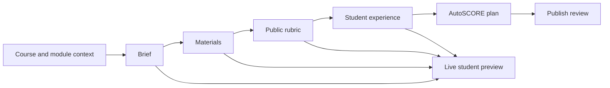

# Refined Assignment Structure Plan

**Author:** Manus AI
**Date:** 11 September 2026
**Status:** Draft for approval
**Decision requested:** Approve the proposed assignment contract, teacher workspace redesign, and phased implementation before the current assignment schema and student workspace are changed.

## Executive recommendation

Fiosra should replace the current single `QuestionSpec`-centred assignment structure with a **dual-contract assignment model**. The first contract is the **Published Assignment Contract**. It is the complete, student-facing agreement that explains the purpose, task, materials, rubric, available support, and submission requirements. The second contract is the **AutoSCORE Evaluation Plan**. It is visible to the teacher and to Fiosra’s agents, but it is never exposed to students. It maps the public rubric to curriculum concepts, approved source evidence, permissible support actions, and teacher-review evidence.

This separation is necessary because an assignment is not simply a prompt plus an internal scoring scaffold. Transparent assignment design requires students to understand the purpose, task, and criteria of the work.[1] A rubric should identify what is being evaluated and describe what differing levels of success look like.[2] The same public criteria should organize student guidance and the teacher’s review dossier. AutoSCORE can maintain a richer internal plan, but that plan must interpret the published rubric rather than introduce hidden standards.

> **Core principle:** The student sees the work to complete, the materials available, the rubric used to evaluate it, and the help available while working. The teacher sees and approves the public contract plus the hidden AutoSCORE plan. The agent uses only the approved plan and never makes the final grade decision.

## 1. Product outcomes

The refined structure creates one coherent lifecycle from authoring through student work to educator review. The teacher should be able to generate an AI proposal, edit every student-facing field, review the agent’s mappings, preview the actual student experience, and publish only when the public contract is complete and the supporting materials are grounded.

| Outcome | Student result | Teacher result | Agent result |
|---|---|---|---|
| Transparent assignment | A clear purpose, task, deliverable, source pack, rubric, and submission path. | A previewable public contract that can be edited before publication. | A stable public specification from which support and evidence rules are derived. |
| Public rubric as source of truth | Students know the criteria and performance descriptions before drafting. | The teacher controls criteria, ratings, and weights. | Each internal evidence plan maps back to one visible rubric criterion. |
| Useful source pack | Students can open, read, cite, and understand why assigned materials matter. | Teachers see source readiness, excerpts, provenance, and concept coverage. | Source chunks become bounded retrieval and evidence context. |
| Optional completion support | Students receive contextual help without being forced to submit separate claims. | Teachers define support boundaries and review applied assistance. | The completion agent selects the next useful action within the published task. |
| Explainable evaluation | Students know that the educator determines the final grade. | Teacher receives rubric-organized evidence and retains grade authority. | AutoSCORE compiles evidence but produces no autonomous final grade. |

## 2. Assignment information architecture

### 2.1 Student-facing Published Assignment Contract

The Published Assignment Contract must be complete enough for a learner to begin and finish the task without seeing teacher-only configuration. It should be versioned and immutable once a student begins a session; material changes create a new assignment version or a teacher-approved revision notice.

| Published section | Required student-facing content | Student value | Publication requirement |
|---|---|---|---:|
| **Overview** | Title, concise purpose statement, module context, estimated effort, due information when configured. | Explains why the work matters and establishes the learning context. | Required except due information. |
| **Your task** | Core task, scope and boundaries, deliverable type, expected length or format, citation/submission requirements. | Defines exactly what students must make and what belongs in the response. | Required. |
| **What you will practice** | Two to four plain-language learning goals. | Connects the assignment to course learning without exposing internal concept IDs. | Required. |
| **Assigned materials** | Source title, creator or publisher when available, readable excerpt or viewer, original link, citation details, and one sentence explaining relevance. | Makes approved evidence accessible and purposeful. | At least one substantive source for source-grounded tasks. |
| **Rubric** | Criteria, criterion descriptions, achievement levels, performance descriptions, and weights when used in grading. | Makes evaluation transparent and supports self-review. | Required. |
| **Suggested way to begin** | A short, optional start plan such as interpret the task, explore a source, outline, or begin drafting. | Removes blank-page friction without imposing one universal reasoning sequence. | Required. |
| **Help while working** | Student-selected actions such as explain the task, locate relevant material, plan a section, develop an explanation, revise, or check readiness. | Makes help completion-oriented and preserves learner control. | Required. |
| **Submission and integrity** | Completion checklist, submit action, policy on citations, permitted assistance, and a statement that the educator awards the final grade. | Establishes a predictable, trustworthy closing process. | Required. |

The student workspace must remove technical labels such as `Target Knowledge Components`, `NLI threshold`, `source grounding mode`, `cognitive trap`, `probe policy`, and `Answer Vault`. It may display concept names in ordinary course language only when those names help students understand the work.

### 2.2 Teacher-facing Authoring Contract

The teacher sees both the Published Assignment Contract and a concise design rationale. The teacher can edit every student-facing field, approve sources, revise rubric wording, adjust weights, choose support boundaries, and preview the learner experience before publication.

| Teacher area | Teacher controls | Must not appear in student view |
|---|---|---|
| **Brief and task** | Purpose, task wording, scope, deliverable, requirements, and due information. | Ambiguity score and raw generation metadata. |
| **Materials** | Source selection, ordering, relevance statement, citation metadata, and source readiness. | Chunk IDs, embeddings, content hashes, extraction method, and retrieval fallback details. |
| **Public rubric** | Criteria, weights, achievement levels, performance descriptors, and student-readable language. | NLI thresholds, inference weights, confidence values, and diagnostic prompts. |
| **Learning alignment** | Student-friendly learning goals and their links to approved curriculum concepts. | Internal concept IDs, graph traversal paths, and lexical match evidence. |
| **Student support policy** | Which optional support actions are available and when the learner sees them. | Trigger models, intervention ranking, probe templates, and internal risk signals. |
| **AutoSCORE review plan** | Criterion-to-concept mappings, accepted sources, evidence expectations, and teacher-review settings. | Nothing in this row is student-facing, except the corresponding public rubric criterion. |
| **Publication review** | Final student preview, readiness checklist, version note, and publish action. | Implementation errors and raw provider traces. |

### 2.3 Agent-facing AutoSCORE Evaluation Plan

The AutoSCORE plan is a private, teacher-approved interpretation of the public assignment. It cannot add a hidden criterion, alter a public weight, or expose reference-solution content. Every internal item must contain a `public_criterion_id` that points to the rubric criterion visible to the student.

| Private plan component | Purpose | Required boundary |
|---|---|---|
| **Concept targets** | Maps each public criterion to one or more approved course concept nodes and relevant relationships. | Uses approved course graph nodes only. |
| **Evidence targets** | Identifies approved source chunks or source types that can support the criterion. | Does not tell the student which conclusion to draw. |
| **Completion-state model** | Describes meaningful states such as task understood, materials explored, response developing, revision needed, and ready to submit. | Never requires a learner to submit an isolated claim for validation. |
| **Support action policy** | Defines optional actions the agent may offer, including task clarification, source navigation, planning, explanation development, and revision help. | Offers help; it does not overwrite the learner’s writing or silently insert content. |
| **Evidence-recognition policy** | Defines how final work, source use, revisions, and accepted assistance become teacher-review evidence. | Produces evidence and uncertainty; it does not produce a final grade. |
| **Teacher-review configuration** | Defines dossier grouping, alert conditions, and optional suggested feedback. | Teacher retains final score, grade, and feedback authority. |
| **Reference-solution boundary** | Keeps any educator reference material in the protected Answer Vault. | Never returns reference content through student APIs or support actions. |

## 3. Proposed assignment schema

The current public projection exposes technical fields such as `target_kcs`, raw rubric rules, and a fixed hint ladder. The refined schema introduces a deliberate public contract and a private evaluation plan. Both are stored in the existing assignment `spec` JSON document during the first release, which avoids a destructive database migration. A later migration may normalize version history and rubric evidence into dedicated tables.

```text
AssignmentSpecV2
├── schema_version: 2
├── assignment_id, module_id, status, created_by, version
├── published: PublishedAssignmentSpec       # safe for student APIs
├── evaluation_plan: AutoScoreEvaluationPlan # teacher and agent only
└── answer_vault_token                       # never serialized to student APIs
```

### 3.1 `PublishedAssignmentSpec`

| Field | Type | Student-facing behavior |
|---|---|---|
| `title` | string | Assignment title. |
| `purpose` | string | Why this work matters in the module or course. |
| `task` | object | Core question, scope, deliverable, requirements, and submission expectations. |
| `learning_goals` | array | Two to four plain-language goals. |
| `source_pack` | array | Curated source cards with display metadata, excerpts/viewer access, citation data, relevance guidance, and source order. |
| `public_rubric` | array | Required criteria, weights, rating levels, and descriptions. |
| `start_options` | array | Optional ways to begin; no forced five-step canvas. |
| `support_menu` | array | Student-selectable help actions and short descriptions. |
| `completion_checklist` | array | Visible self-review and submission checks. |
| `integrity_notice` | object | Citation, assistance, collaboration, and educator-review statement. |
| `version_note` | string or null | Teacher-approved explanation of a post-publication revision. |

### 3.2 `PublicRubricCriterion`

Every published assignment includes at least three public criteria. Each criterion should use a stable ID so that the rubric, support agent, teacher dossier, and final educator feedback all refer to the same standard.

| Field | Meaning |
|---|---|
| `criterion_id` | Stable public identifier, for example `historical_explanation`. |
| `title` | Student-readable criterion name. |
| `description` | What the criterion assesses. |
| `weight` | Percent or points. The total must equal 100% when weighted grading is enabled. |
| `levels` | At least three teacher-editable levels, such as Developing, Secure, and Strong. |
| `levels[].description` | Observable description of the work at that level. |
| `self_review_prompt` | A concise question the student can use before submission. |

### 3.3 `AutoScoreEvaluationPlan`

| Field | Meaning | Student exposure |
|---|---|---:|
| `public_rubric_map` | Maps a public criterion to concept IDs, evidence targets, and evidence expectations. | Never. |
| `concept_targets` | Approved concepts or relationships assessed by the assignment. | Only optional plain-language labels. |
| `source_evidence_targets` | Approved source chunk IDs and relevance data. | The source itself is visible; the target configuration is not. |
| `completion_states` | Agent model of the learner’s progress through the assignment. | Never as a score or surveillance label. |
| `support_policy` | Permitted assistance actions, consent rules, and escalation boundaries. | Only the resulting support menu. |
| `evidence_capture_policy` | What revisions, source use, and accepted support may appear in teacher review. | Plain-language notice only. |
| `review_policy` | Dossier grouping and teacher-facing attention flags. | Never. |
| `generation_provenance` | Provider/model metadata and fallback status. | Never. |

## 4. Redesigned Assignment Studio

The present page is a two-column form followed by a long technical scaffold preview. It mixes public task language, source provenance, KCs, hidden thresholds, and fixed support mechanics in one view. The replacement should be an **Assignment Studio** with a focused authoring flow and a persistent student preview.

### 4.1 Desktop layout



The desktop screen has three coordinated regions. The top bar contains the course/module breadcrumb, draft status, autosave status, **Preview as Student**, **Validate**, and **Publish**. The left rail is a six-step navigation sequence: **Brief**, **Materials**, **Rubric**, **Student Experience**, **AutoSCORE Plan**, and **Publish Review**. The centre canvas contains the focused editor for the selected step. The right panel is a persistent live student preview with tabs for **Overview**, **Sources**, **Rubric**, **Workspace**, and **Submission**.

| Region | Purpose | Interaction design |
|---|---|---|
| **Top bar** | Maintains orientation and exposes high-value actions. | Show source readiness, rubric completeness, and publication blockers as compact status chips. |
| **Left workflow rail** | Makes the authoring sequence visible without forcing a wizard. | Steps may be visited in any order, but incomplete required steps show a clear warning state. |
| **Centre canvas** | Provides one uncluttered task at a time. | Uses editable content cards, not raw JSON, technical IDs, or nested accordions. |
| **Right student preview** | Lets the teacher see what will actually be published. | Mirrors the student contract exactly and refreshes as edits are made. |
| **AutoSCORE drawer** | Provides private agent configuration only when needed. | Uses a separate teacher-only mode with clear mappings to public rubric criteria. |

### 4.2 Step details

| Studio step | Centre-canvas content | Student preview effect | Agent-facing result |
|---|---|---|---|
| **Brief** | AI starting direction, title, purpose, task, scope, deliverable, requirements, and learning goals. | Assignment overview and “Your task” sections update. | Creates task and goal context; no evaluation rule yet. |
| **Materials** | Source cards with readiness status, excerpt/viewer, relevance statement, citation details, and ordering. | Assigned materials tab updates. | Creates approved source evidence boundaries. |
| **Public rubric** | Grid editor for criterion title, description, weight, and Developing/Secure/Strong descriptions. | Rubric tab updates immediately. | Creates stable public criterion IDs. |
| **Student experience** | Optional start choices, support menu, flexible document setup, integrity notice, and completion checklist. | Workspace and help menu update. | Defines permitted support actions and consent boundaries. |
| **AutoSCORE plan** | Criterion-to-concept map, source coverage, completion-state policy, support boundaries, and teacher dossier settings. | No direct technical exposure. | Stores the private evaluation plan and validates that every internal rule maps to a public criterion. |
| **Publish review** | Readiness checklist, version note, student preview, and publication confirmation. | Final public contract preview. | Freezes the approved plan and records version provenance. |

### 4.3 AI proposal interaction

The global AI Assistant and the Studio’s **Draft with AI** action should create an editable proposal rather than immediately filling a generic form. The teacher lands in a proposal comparison view that shows: the generated public brief, the recommended sources, the public rubric, and a compact **Why this proposal** panel naming the module goals and source evidence used. The teacher can apply the whole proposal, apply individual sections, or discard it. The system must not automatically publish an AI proposal.

## 5. Publication validation

Publication should become a clear checklist rather than a single source-grounding gate. The validator must show only actionable messages and distinguish a required correction from a recommendation.

| Validation rule | Blocking status | Rationale |
|---|---:|---|
| Student-facing title, purpose, task, scope, and deliverable are present. | Blocking | Students cannot begin without a clear contract. |
| At least two learning goals are present. | Blocking | Connects purpose to intended learning. |
| At least one substantive approved source exists for a source-grounded assignment. | Blocking | Prevents publication of URL slugs or empty reference records. |
| Every source has a student display title and relevance statement. | Blocking | Materials must be usable, not merely attached. |
| Public rubric has at least three criteria. | Blocking | Students must know what will be evaluated. |
| Every rubric criterion has three performance descriptions. | Blocking | Makes expected quality observable. |
| Weights total 100% when grading weights are enabled. | Blocking | Prevents contradictory grade calculations. |
| Completion checklist and integrity notice are present. | Blocking | Makes submission expectations explicit. |
| Every AutoSCORE rule maps to one public criterion. | Blocking | Prevents hidden evaluation standards. |
| Concept graph targets are approved and source evidence links are available. | Warning in phase 1; blocking in concept-aware evaluation phase. | Supports staged adoption while graph semantic refinement continues. |
| Student preview has been opened by the teacher after the last material change. | Required acknowledgement. | Encourages review of the actual published experience. |

## 6. Data and API migration

The first release should preserve existing drafts and published assignments. Legacy `QuestionSpec` records remain readable. A compatibility adapter maps legacy `prompt`, `grounding_sources`, `rubric_criteria`, and `canvas_sections` into a minimal Published Assignment Contract. The adapter labels such records as **Legacy structure** in the teacher Studio and requires review before a material revision or republish.

| API area | Change | Compatibility rule |
|---|---|---|
| `POST /assignments/draft` | Accept `AssignmentSpecV2` draft payloads and return teacher-facing draft detail. | Continue accepting the existing request shape until migration completes. |
| `GET /assignments/{id}` | Return only `PublishedAssignmentSpec` to student clients. | Adapt legacy specs to the safe public structure. |
| `GET /assignments/{id}/authoring` | New teacher-only endpoint returning public contract, private plan, readiness, and source diagnostics. | New endpoint; no student access. |
| `PATCH /assignments/{id}/published` | Save student-facing contract changes. | New version is created for published assignments. |
| `PATCH /assignments/{id}/evaluation-plan` | Save teacher-approved AutoSCORE mappings. | Reject mappings that lack a public criterion reference. |
| `POST /assignments/{id}/validate` | Return structured readiness items. | Supersedes client-side `publishBlocked` logic. |
| `POST /assignments/{id}/publish` | Publish only a validated version. | Retains the existing endpoint and adds readiness enforcement. |
| Student session endpoints | Read the immutable public version linked at session creation. | Existing sessions retain their original assignment projection. |
| Evidence dossier endpoints | Group evidence by public `criterion_id`, with optional teacher-only concept evidence beneath each criterion. | Maintain legacy dossier output during migration. |

## 7. Implementation phases

### Phase 1 — Contract and validation foundation

Implement the versioned `PublishedAssignmentSpec`, `PublicRubricCriterion`, and `AutoScoreEvaluationPlan` schemas. Create the compatibility adapter for existing assignments. Add source-readiness checks, a structured publication validator, student-safe API projection, and tests proving that private evaluation configuration and Answer Vault values cannot appear in student responses.

### Phase 2 — Assignment Studio and public rubric editor

Replace the present single-page form with the Assignment Studio. Build the workflow rail, focused editors, source-pack cards, editable rubric grid, readiness panel, and persistent student preview. Preserve the existing AI proposal route but route it into the proposal comparison view. Add student-preview snapshots to UI tests.

### Phase 3 — Student contract workspace

Update the student workspace to render Overview, Your Task, Materials, Rubric, Help, Workspace, and Submission from the public contract. Remove KCs, raw source diagnostics, threshold language, and fixed reasoning-canvas assumptions. Keep existing document persistence and source-citation functions behind the redesigned interface.

### Phase 4 — AutoSCORE completion agent foundation

Implement the private criterion-to-concept and criterion-to-source maps. Replace paragraph-triggered mandatory probes with an optional completion-support menu. The agent should propose the next useful action from the approved task, source pack, document state, and visible rubric. It must record assistance provenance and evidence for educator review, without issuing a final grade.

### Phase 5 — Teacher evidence review alignment

Rebuild the dossier around the public rubric. Each criterion should show the student’s final work, source use, revision evidence, accepted assistance, relevant concept evidence, and an optional AutoSCORE confidence note. The educator sets the final score and grade.

## 8. Verification and acceptance criteria

| Area | Acceptance criterion |
|---|---|
| Public boundary | A student API response contains no internal KC IDs, thresholds, source chunk IDs, provider telemetry, concept graph IDs, hidden reference material, or evaluation triggers. |
| Rubric transparency | A published assignment exposes every evaluated public criterion, its weight when applicable, and all achievement descriptions. |
| Alignment | Every private AutoSCORE rule points to one public rubric criterion and is rejected if it cannot. |
| Source quality | A source-grounded assignment cannot publish with only URL text, title slugs, empty excerpts, or inaccessible source content. |
| Student usability | A student can identify the purpose, deliverable, approved materials, rubric, help options, and submission requirements without opening a teacher-only view. |
| Teacher control | The teacher can edit every public field, review the student preview, approve the private plan, and retain the final grade decision. |
| Version integrity | A student session remains attached to the exact public assignment version that was live when the session started. |
| Backward compatibility | Existing assignments remain readable and can be migrated through the Studio without data loss. |
| Security | Answer Vault tokens and private evaluation-plan values never appear in browser responses, logs, source cards, or student support prompts. |

## 9. Decisions requested

Approval of this plan authorizes implementation of the following scope: the dual-contract assignment schema; a required student-facing rubric; the Assignment Studio and live student preview; public/private API boundaries; publication validation; legacy adaptation; and the first completion-agent foundation. It does **not** authorize autonomous grading, hidden student scoring, automatic approval of concept graph changes, or exposing the internal AutoSCORE plan to learners.

## References

[1]: https://www.uvm.edu/ctl/transparent-assignment-design-tilt "University of Vermont Center for Teaching and Learning: Transparent Assignment Design (TILT)"

[2]: https://teaching.uoregon.edu/resources/rubrics-evaluate-student-work "University of Oregon Teaching Support and Innovation: Rubrics to Evaluate Student Work"
