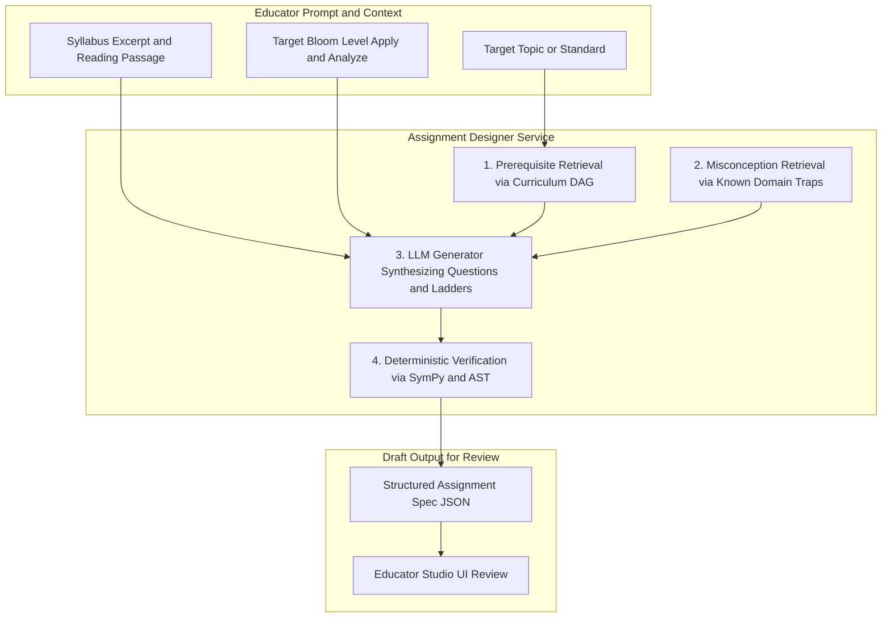

# Component 1: Assignment Designer & Syllabus RAG

## 1. Identity & Purpose

The **Assignment Designer** is an authoring co-pilot for educators. It transforms a teacher's high-level topic or syllabus excerpt into a pedagogically sound, misconception-aware assignment.

Rather than generating generic quiz questions, the Designer:
1. Anchors questions to the **Curriculum Knowledge DAG** to ensure prerequisite readiness.
2. Seeds distractors with **known student misconceptions** from the Misconception DB.
3. Automatically breaks complex questions into **subproblem scaffolding trees**.
4. Pre-authors a **4-rung hint ladder** (Level 0 to Level 3, with Level 4 locked).
5. Pre-validates reference solutions deterministically before the educator ever sees the draft.

---

## 2. Component Architecture & Data Flow



---

## 3. Detailed Functions

### Function 1: Prerequisite Graph Grounding
Before writing questions, the Designer queries the `knowledge_layer` to identify:
- The target Knowledge Component (`target_kc`).
- Immediate prerequisite KCs that the question depends on.
- *Example*: If the topic is "Solving Systems by Substitution", the Designer verifies that "Solving Linear Equations for One Variable" is recognized as an active prerequisite.

### Function 2: Misconception-Seeded Distractor Generation
For multiple-choice or multi-step questions, distractors are engineered directly from the `misconceptions` table:
- Rather than random incorrect numbers, each distractor represents a **specific cognitive failure mode**.
- When a student picks that distractor, the system instantly knows *why* without guessing.

### Function 3: Scaffolding Decomposition & Hint Authoring
For every question, the Designer authors:
- **Subproblem Steps**: Breaking a 3-step algebraic derivation or historical argument into distinct phases.
- **4-Rung Hint Ladder**:
  - **Level 0 (Metacognitive)**: Asks the student to identify the first principle.
  - **Level 1 (Conceptual)**: Points to the underlying definition or theorem.
  - **Level 2 (Procedural)**: Outlines the specific algebraic or analytical action.
  - **Level 3 (Worked Analogy)**: Shows a parallel example with different numbers/context.
  - **Level 4 (Bottom-out Answer)**: Pre-computed, but **locked** by default.

---

## 4. Pydantic Contract & Output Schema

```python
from pydantic import BaseModel, Field
from typing import List, Optional

class HintRung(BaseModel):
    level: int = Field(ge=0, le=4)
    hint_type: str # "metacognitive", "conceptual", "procedural", "worked_example", "bottom_out"
    content: str
    is_locked: bool = False

class MisconceptionDistractor(BaseModel):
    option_value: str
    misconception_id: str
    diagnostic_note: str

class ScaffoldingStep(BaseModel):
    step_id: str
    step_prompt: str
    target_kc: str
    expected_form: str

class QuestionSpec(BaseModel):
    question_id: str
    order: int
    prompt: str
    domain: str # "math", "code", "history", "business", "language"
    target_kcs: List[str]
    blooms_level: str
    subproblems: List[ScaffoldingStep]
    hint_ladder: List[HintRung]
    misconception_distractors: Optional[List[MisconceptionDistractor]] = None
    reference_solution: dict
    rubric_criteria: List[dict]

class AssignmentSpec(BaseModel):
    assignment_id: str
    title: str
    course_id: str
    created_by: str
    time_budget_minutes: int
    questions: List[QuestionSpec]
```

---

## 5. MVP Implementation Blueprint (FastAPI Endpoint)

```python
from fastapi import APIRouter, HTTPException
import openai

router = APIRouter(prefix="/assignment-designer", tags=["Assignment Designer"])

@router.post("/draft")
async def draft_assignment(
    topic: str,
    domain: str,
    grade_level: str,
    blooms_level: str,
    syllabus_context: Optional[str] = None
):
    """
    Drafts an assignment specification using Claude 3.5 / GPT-4o
    grounded with curriculum prerequisites and misconception seeds.
    """
    # 1. Fetch relevant prerequisite KCs from Knowledge Layer
    prereqs = await fetch_prerequisites(topic)
    
    # 2. Fetch top 5 common misconceptions for this domain
    misconceptions = await fetch_domain_misconceptions(topic, domain)
    
    # 3. Call LLM with strict structured JSON schema output
    assignment_json = await generate_assignment_llm(
        topic=topic,
        domain=domain,
        prereqs=prereqs,
        misconceptions=misconceptions,
        syllabus_context=syllabus_context
    )
    
    # 4. Deterministic pre-verification of reference solutions
    if domain == "math":
        verify_math_solutions(assignment_json)
        
    return assignment_json
```
