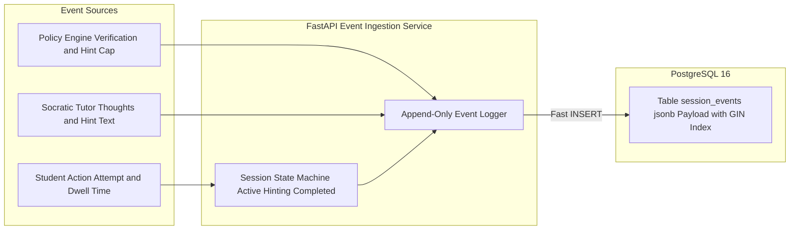

# Component 5: JSON Event Store & Session Manager

## 1. Identity & Purpose

The **JSON Event Store** is the flight recorder of the Fiosra system. While traditional learning platforms only record final letter grades or answer correctness, Fiosra logs the entire chronological reasoning process as an **append-only event stream**.

Every keystroke, attempt, SymPy check, Socratic hint, dwell-time interval, and self-correction is stored as an immutable `jsonb` record in PostgreSQL. This event stream forms the authentic, auditable **"student-owned record of learning"**.

---

## 2. Component Architecture & Event Stream



---

## 3. Database Schema (PostgreSQL 16)

```sql
-- 1. Student Session Lifecycle
CREATE TABLE student_sessions (
    session_id UUID PRIMARY KEY DEFAULT gen_random_uuid(),
    student_id VARCHAR(64) NOT NULL,
    assignment_id UUID NOT NULL,
    current_question_id VARCHAR(32) NOT NULL,
    status VARCHAR(32) DEFAULT 'active', -- 'active', 'paused', 'completed'
    started_at TIMESTAMP WITH TIME ZONE DEFAULT NOW(),
    last_activity_at TIMESTAMP WITH TIME ZONE DEFAULT NOW(),
    completed_at TIMESTAMP WITH TIME ZONE
);

-- 2. Append-Only Chronological Event Store
CREATE TABLE session_events (
    event_id BIGSERIAL PRIMARY KEY,
    session_id UUID NOT NULL REFERENCES student_sessions(session_id),
    student_id VARCHAR(64) NOT NULL,
    assignment_id UUID NOT NULL,
    question_id VARCHAR(32) NOT NULL,
    
    -- Event Classification
    event_type VARCHAR(64) NOT NULL, 
    -- Examples: 'attempt_submitted', 'verification_evaluated', 
    --           'hint_delivered', 'self_correction_achieved'
    
    created_at TIMESTAMP WITH TIME ZONE DEFAULT NOW(),
    
    -- Typed Event Data
    payload JSONB NOT NULL
);

-- GIN Index for deep querying inside JSON keys
CREATE INDEX idx_session_events_payload ON session_events USING gin (payload);

-- Fast chronological index per student session
CREATE INDEX idx_session_events_chronological ON session_events (session_id, created_at ASC);
```

---

## 4. Standard Event Payload Schemas

### Attempt Evaluated Event
```javascript
{
  "event_type": "attempt_evaluated",
  "attempt_number": 1,
  "dwell_time_seconds": 64,
  "student_input": "4x - 12 = 20 ==> 4x = 8",
  "deterministic_verdict": {
    "engine": "sympy",
    "is_correct": false,
    "error_type": "algebraic_inequivalence"
  },
  "misconception": {
    "detected": true,
    "id": "MISC_0047_SIGN_ERROR_SUBTRACTION",
    "description": "Subtracted 12 from 20 instead of adding 12"
  }
}
```

### Socratic Hint Delivered Event
```javascript
{
  "event_type": "hint_delivered",
  "hint_rung_delivered": 1,
  "hint_category": "conceptual",
  "thoughts_of_tutorbot": "Student made subtraction error across equals. Prompting balance analogy.",
  "hint_text_shown": "Notice the 12 is subtracted on the left. What is the opposite operation to cancel a minus 12?"
}
```

### Self-Correction Achieved Event
```javascript
{
  "event_type": "self_correction_achieved",
  "question_id": "q1",
  "prior_attempts_with_error": 1,
  "recovery_attempt_number": 2,
  "student_input": "4x = 32 ==> x = 8",
  "hints_consumed_before_recovery": 1
}
```

---

## 5. Event Ingestion Service Implementation (FastAPI)

```python
from fastapi import APIRouter, Depends
from pydantic import BaseModel
from typing import Dict, Any
import datetime

router = APIRouter(prefix="/events", tags=["Event Store"])

class EventCreate(BaseModel):
    session_id: str
    student_id: str
    assignment_id: str
    question_id: str
    event_type: str
    payload: Dict[str, Any]

@router.post("/log")
async def log_interaction_event(event: EventCreate, db_session = Depends(get_db)):
    """
    Appends an immutable event row to the session_events table.
    Execution time: < 2ms in PostgreSQL.
    """
    sql = """
        INSERT INTO session_events 
        (session_id, student_id, assignment_id, question_id, event_type, payload, created_at)
        VALUES (:session_id, :student_id, :assignment_id, :question_id, :event_type, :payload, NOW());
    """
    await db_session.execute(sql, {
        "session_id": event.session_id,
        "student_id": event.student_id,
        "assignment_id": event.assignment_id,
        "question_id": event.question_id,
        "event_type": event.event_type,
        "payload": event.payload
    })
    return {"status": "recorded"}
```
