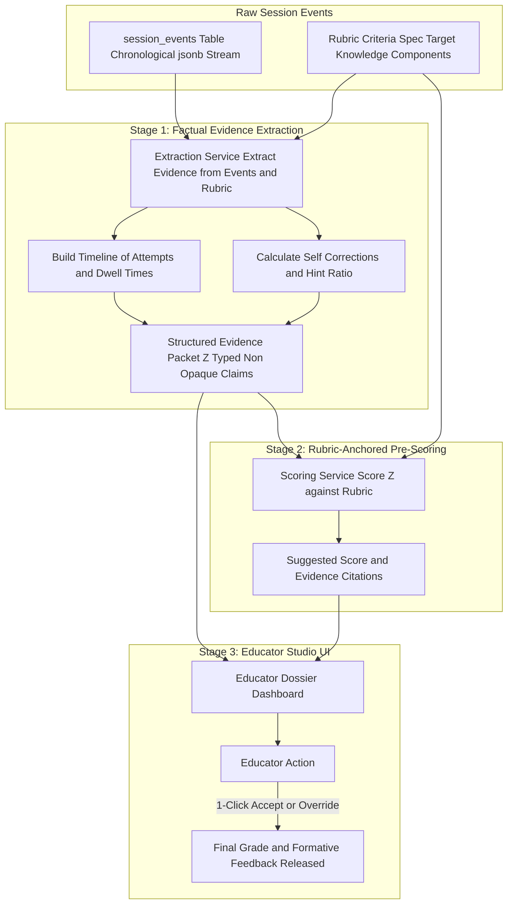

# Component 6: Evidence & Scoring Dossier Engine (AutoSCORE Light)

## 1. Identity & Purpose

The **Evidence & Scoring Dossier Engine** turns raw, chronological interaction traces into an **auditable, structured Evidence Packet ($Z$)** and a rubric-anchored review dossier for educators.

> **Pedagogical Significance**: Teachers do not have time to read 40 turns of chat per student across 30 students (1,200 messages). Instead of a generic letter grade, the Dossier Engine provides a **1-page executive reasoning summary**: showing where the student struggled, what hints helped them, whether they self-corrected, and which rubric criteria were satisfied—with direct quotes from the student's work.
> 
> **Research Basis**: Implements the **AutoSCORE** two-stage architecture ($f_{\text{extract}} \to Z \to f_{\text{score}}$), eliminating LLM grading hallucinations by decoupling factual evidence extraction from normative evaluation.

---

## 2. Component Architecture & Two-Stage Pipeline



---

## 3. Metrics Extracted from Learning Traces

When synthesizing the dossier, the engine computes five core reasoning indicators:

1. **Independent Success Rate**: Percentage of questions solved without requesting any procedural or worked-example hints (Levels 2–3).
2. **Self-Correction Ratio**: How often a student identified and resolved an error on their own after a metacognitive (Level 0) or conceptual (Level 1) nudge.
3. **Hint Dependency Score ($H_d$)**:
   $$H_d = \frac{\sum \text{hints consumed}}{\sum \text{max available hints}}$$
   Low $H_d$ indicates high autonomy; high $H_d$ signals fragile understanding.
4. **Misconception Persistence**: Did a diagnosed misconception reoccur across subsequent questions, or was it successfully remediated?
5. **Dwell Time Distribution**: Time spent reading and drafting vs. rapid guessing.

---

## 4. Evidence Packet ($Z$) Schema (JSON)

```javascript
{
  "packet_id": "pkt_stu42_asgn01",
  "student_id": "stu_42",
  "assignment_id": "asgn_linear_eq_01",
  "total_time_seconds": 940,
  "executive_summary": {
    "completion_status": "completed",
    "suggested_grade": "A-",
    "autonomy_rating": "High (Solved 3/4 independently)",
    "notable_behavior": "Encountered sign error on Q1; successfully self-corrected after Level 1 conceptual nudge."
  },
  "question_dossiers": [
    {
      "question_id": "q1",
      "target_kc": "KC_ALG_EQUATION_BALANCE",
      "solved_correctly": true,
      "total_attempts": 2,
      "hints_used": 1,
      "max_hint_level": 1,
      "self_corrected": true,
      "key_events": [
        {
          "attempt": 1,
          "input": "4x - 12 = 20 ==> 4x = 8",
          "error": "Subtracted 12 instead of adding",
          "hint_given": "Remember: balance requires inverse operations."
        },
        {
          "attempt": 2,
          "input": "4x = 32 ==> x = 8",
          "result": "correct"
        }
      ],
      "rubric_evaluations": [
        {
          "criterion_id": "crit_distribution",
          "status": "met",
          "evidence": "Correctly expanded parentheses in attempt 1."
        },
        {
          "criterion_id": "crit_isolation",
          "status": "met",
          "evidence": "Corrected subtraction to addition in attempt 2, achieving 4x = 32."
        }
      ]
    }
  ]
}
```

---

## 5. Dossier Extraction Implementation (Python)

```python
from typing import List, Dict, Any

class AutoScoreLightExtractor:
    
    @staticmethod
    def compile_evidence_packet(
        session_events: List[Dict[str, Any]],
        rubric_spec: Dict[str, Any]
    ) -> Dict[str, Any]:
        """
        Replays raw session_events in chronological order
        to produce the structured Evidence Packet (Z).
        """
        attempts_by_q = {}
        hints_by_q = {}
        self_corrections = 0
        total_time = 0
        
        for ev in session_events:
            q_id = ev["question_id"]
            ev_type = ev["event_type"]
            payload = ev["payload"]
            
            if ev_type == "attempt_evaluated":
                attempts_by_q.setdefault(q_id, []).append(payload)
            elif ev_type == "hint_delivered":
                hints_by_q.setdefault(q_id, []).append(payload)
            elif ev_type == "self_correction_achieved":
                self_corrections += 1

        # Evaluate Rubric Criteria against verified attempt timeline
        dossier = {
            "total_questions": len(attempts_by_q),
            "self_correction_count": self_corrections,
            "questions": []
        }
        
        for q_id, attempts in attempts_by_q.items():
            final_attempt = attempts[-1]
            q_hints = hints_by_q.get(q_id, [])
            
            dossier["questions"].append({
                "question_id": q_id,
                "is_correct": final_attempt.get("deterministic_verdict", {}).get("is_correct", False),
                "attempt_count": len(attempts),
                "hints_consumed": len(q_hints),
                "max_hint_rung": max([h.get("hint_rung_delivered", 0) for h in q_hints], default=0)
            })
            
        return dossier
```

---

## 6. Educator Studio UI Workflow

1. **Class Overview Table**: Educator sees a grid of all students with columns:
   - *Status* (Completed / In Progress)
   - *Self-Corrections* (e.g. 2 self-corrections = high resilience)
   - *Hints Used* (0 to 4)
   - *Suggested Score* (e.g., 92%)
2. **Student Drill-Down Modal**: Clicking a student opens their Dossier card with the timeline of attempts, the Socratic dialogue excerpts, and the pre-checked rubric.
3. **1-Click Finalization**: Educator can click **"Accept All Suggested Grades"** or make inline adjustments in seconds.
