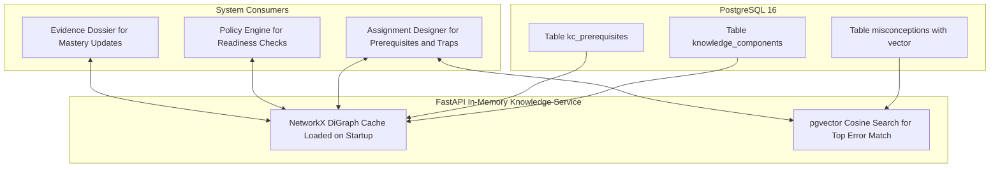

# Component 4: Curriculum Knowledge DAG & Misconception Store

## 1. Identity & Purpose

The **Knowledge Layer** represents the structural cognitive map of the learning environment. It manages two foundational data assets:
1. **Curriculum Prerequisite DAG**: The directed acyclic graph mapping which Knowledge Components (KCs) unlock downstream skills.
2. **Misconception Taxonomy**: The vector-indexed catalog of known domain error patterns, flawed rules, and diagnostic traps.

Rather than maintaining heavy external graph databases (like Neo4j) or research-grade Riemannian manifolds, the MVP stores the curriculum directly in **PostgreSQL** and caches it in memory via **NetworkX**.

---

## 2. Component Architecture & Data Flow



---

## 3. Database Schema (PostgreSQL 16)

```sql
-- 1. Knowledge Components Hierarchy
CREATE TABLE knowledge_components (
    kc_id VARCHAR(64) PRIMARY KEY,
    name VARCHAR(255) NOT NULL,
    domain VARCHAR(64) NOT NULL, -- 'math', 'code', 'history', 'business', 'language'
    description TEXT,
    parent_id VARCHAR(64) REFERENCES knowledge_components(kc_id)
);

-- 2. Prerequisite Directed Edges (DAG)
CREATE TABLE kc_prerequisites (
    kc_id VARCHAR(64) REFERENCES knowledge_components(kc_id),
    prerequisite_id VARCHAR(64) REFERENCES knowledge_components(kc_id),
    PRIMARY KEY (kc_id, prerequisite_id)
);

-- 3. Misconception Taxonomy with pgvector
CREATE EXTENSION IF NOT EXISTS vector;

CREATE TABLE misconceptions (
    misconception_id VARCHAR(64) PRIMARY KEY,
    kc_id VARCHAR(64) REFERENCES knowledge_components(kc_id),
    domain VARCHAR(64) NOT NULL,
    name VARCHAR(255) NOT NULL,
    flawed_rule TEXT NOT NULL,
    remediation_hint TEXT NOT NULL,
    embedding VECTOR(1536) -- Precomputed text-embedding of common error phrasing
);

CREATE INDEX idx_misconceptions_vector ON misconceptions 
USING ivfflat (embedding vector_cosine_ops) WITH (lists = 50);
```

---

## 4. In-Memory Graph Acceleration (Python & NetworkX)

Because a full school or collegiate curriculum contains under 2,000 nodes, the entire graph is loaded into memory on server boot. This eliminates database hops for curriculum traversal:

```python
import networkx as nx
from typing import Set, List

class CurriculumGraphService:
    def __init__(self):
        self.dag = nx.DiGraph()

    def build_from_records(self, edges: List[tuple]):
        """
        Loads prerequisite edges: (prerequisite, dependent_concept)
        """
        self.dag.clear()
        self.dag.add_edges_from(edges)
        if not nx.is_directed_acyclic_graph(self.dag):
            raise ValueError("Curriculum graph contains circular dependencies!")

    def get_all_prerequisites(self, kc_id: str) -> Set[str]:
        """
        Returns all upstream foundational concepts required (ancestors).
        Execution time: < 0.05 milliseconds.
        """
        if kc_id not in self.dag:
            return set()
        return nx.ancestors(self.dag, kc_id)

    def get_unlocked_concepts(self, mastered_kcs: Set[str]) -> Set[str]:
        """
        Returns concepts where ALL prerequisites are satisfied.
        """
        unlocked = set()
        for node in self.dag.nodes:
            prereqs = set(self.dag.predecessors(node))
            if prereqs and prereqs.issubset(mastered_kcs):
                unlocked.add(node)
        return unlocked
```

---

## 5. Misconception Matching Query (pgvector)

When a student makes an error in a problem, the system queries the `misconceptions` table to diagnose whether their input matches an established pattern:

```python
async def find_matching_misconception(
    student_error_text: str,
    target_kc: str,
    db_session
) -> Optional[dict]:
    """
    1. Embeds the student's erroneous step.
    2. Performs cosine similarity search filtered by the target KC.
    """
    query_vector = await generate_embedding(student_error_text)
    
    sql = """
        SELECT misconception_id, name, flawed_rule, remediation_hint,
               1 - (embedding <=> :query_vec) as similarity
        FROM misconceptions
        WHERE kc_id = :target_kc
        ORDER BY embedding <=> :query_vec
        LIMIT 1;
    """
    result = await db_session.execute(sql, {"query_vec": query_vector, "target_kc": target_kc})
    row = result.fetchone()
    
    # Return match only if confidence exceeds threshold
    if row and row.similarity > 0.82:
        return {
            "id": row.misconception_id,
            "name": row.name,
            "flawed_rule": row.flawed_rule,
            "remediation_hint": row.remediation_hint,
            "confidence": row.similarity
        }
    return None
```
