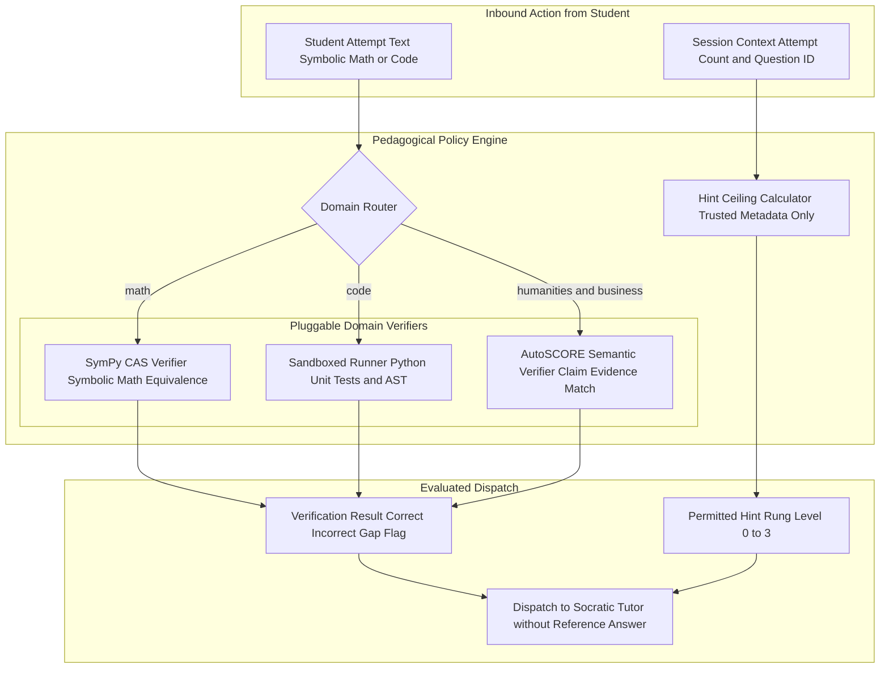

# Component 2: Pedagogical Policy Engine & Pluggable Verifier

## 1. Identity & Purpose

The **Pedagogical Policy Engine (PPE)** is the architectural guardian of Fiosra. It performs two mission-critical responsibilities:
1. **The Answer Vault**: It is the **only service** that has access to the reference solutions. It keeps answers completely isolated from student-facing conversational prompts, preventing prompt injection and cognitive offloading.
2. **Pluggable Multi-Domain Verification**: It dispatches student submissions to deterministic verifiers (SymPy for math, test runners for code, and AutoSCORE semantic matchers for humanities/business), ensuring objective correctness always outranks LLM hallucinations.

---

## 2. Component Architecture & Data Flow



---

## 3. Pluggable Domain Verifiers

### 1. Mathematics & Symbolic Domain (SymPy CAS)
Verifies mathematical expressions by testing algebraic equivalence, not literal string matching:
$$\text{simplify}(\text{student\_expr} - \text{target\_expr}) == 0$$
- Recognizes that $x = \frac{1}{2}$, $2x = 1$, and $x = 0.5$ are mathematically identical.
- Validates intermediate steps (e.g., verifying whether distributing $3(x - 4)$ resulted in $3x - 12$).

### 2. Computer Science Domain (Sandboxed Runner)
- Parses the Abstract Syntax Tree (AST) to check for required programming constructs or syntax errors.
- Runs the student's code against a hidden suite of unit tests in an isolated execution sandbox.

### 3. Humanities, Language Arts & Business (AutoSCORE Semantic Verifier)
- Evaluates constructed text responses against rubric claim criteria using Natural Language Inference (NLI):
  $$\text{Premise: Student submission} \implies \text{Hypothesis: Required rubric claim}$$
- Classifies claims as: `MET`, `PARTIALLY_MET`, `CONTRADICTED`, or `MISSING`.
- Extracts the exact textual evidence quotation from the student's writing.

---

## 4. Hint Ceiling Computation Algorithm

> **Cardinal Rule**: The hint ceiling function **never inspects raw student text**. It operates strictly on trusted metadata (attempt counts, historical mastery, and teacher policy) to eliminate prompt manipulation attacks.

```python
def compute_hint_ceiling(
    attempt_count: int,
    prior_mastery: float,
    policy_allow_answer: bool = False
) -> int:
    """
    Computes the maximum permitted hint level:
      0 = Metacognitive prompt only ("What is the first step?")
      1 = Conceptual nudge ("Remember the distributive property...")
      2 = Procedural guidance ("Multiply both terms by 4...")
      3 = Worked parallel example ("For a similar problem 3(y - 2)...")
      4 = Bottom-out final answer (Locked by default)
    """
    # 1. Base escalation: 1 hint rung per incorrect attempt
    if attempt_count <= 1:
        base_level = 0
    elif attempt_count == 2:
        base_level = 1
    elif attempt_count == 3:
        base_level = 2
    else:
        base_level = 3

    # 2. Mastery adaptation: struggling students escalate slightly faster
    if prior_mastery < 0.3 and base_level < 2:
        base_level += 1

    # 3. Bottom-out answer protection
    # Level 4 is permanently locked unless teacher explicitly issues an override
    if base_level >= 4 and not policy_allow_answer:
        base_level = 3

    return base_level
```

---

## 5. Verification Service Implementation (Python)

```python
import sympy as sp
from typing import Dict, Any

class PluggableVerifier:
    
    @staticmethod
    def verify_math(student_input: str, reference_solution: str) -> Dict[str, Any]:
        try:
            # Parse symbolic mathematical expressions
            student_expr = sp.sympify(student_input)
            target_expr = sp.sympify(reference_solution)
            
            # Check algebraic equality
            diff = sp.simplify(student_expr - target_expr)
            if diff == 0:
                return {"is_correct": True, "verdict": "exact_or_equivalent"}
            else:
                return {"is_correct": False, "verdict": "algebraic_mismatch"}
        except Exception as e:
            return {"is_correct": False, "verdict": "syntax_error", "error": str(e)}

    @staticmethod
    def verify_humanities(student_input: str, rubric_claim: str, reference_text: str) -> Dict[str, Any]:
        """
        AutoSCORE semantic evaluation: tests whether student input
        articulates the required rubric claim.
        """
        # Call fast NLI classifier or structured LLM verification prompt
        # Evaluates premise vs hypothesis
        return {
            "is_correct": True, # or False if claim missing
            "verdict": "claim_supported",
            "evidence_quote": "extracted snippet from student response"
        }
```
