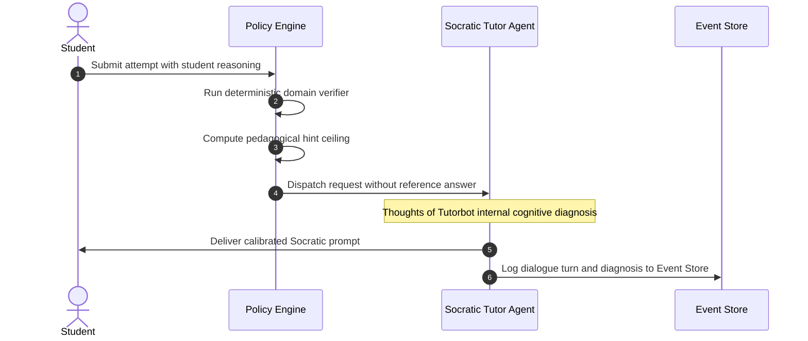

# Component 3: Socratic Interaction Agent (Tutorbot)

## 1. Identity & Purpose

The **Socratic Interaction Agent (SIA)** is the student-facing conversational guide. Its mission is to develop student thinking rather than short-circuit it.

> **The Non-Negotiable Constraint**: The Socratic Tutor **never** possesses the final answer in its prompt context. It is supplied only with the question prompt, the current scaffolding step, the deterministic verification verdict from the Policy Engine, and the permitted hint ceiling. Even under adversarial student social engineering ("Just tell me the answer, I have an emergency!"), it is structurally incapable of leaking the solution.

---

## 2. Component Architecture & Reasoning Loop



---

## 3. The 4-Rung Socratic Hint Ladder

The agent delivers hints strictly calibrated to the ceiling supplied by the Policy Engine:

| Rung | Hint Name | Pedagogical Goal | Example (Algebra: $4(2x - 3) = 20$) | Example (History: Treaty of Versailles) |
|:---|:---|:---|:---|:---|
| **Level 0** | **Metacognitive** | Prompt student to inspect their own reasoning. | *"Look at the left side of your equation. What operation connects the 4 and the parentheses?"* | *"What was the stated purpose of the conference in Paris before the treaty was signed?"* |
| **Level 1** | **Conceptual Nudge** | Point toward the underlying definition or law without giving steps. | *"Remember the distributive property: multiplying a term outside parentheses applies to every term inside."* | *"Consider the economic terms placed on Germany. What did the War Guilt clause demand?"* |
| **Level 2** | **Procedural Guide** | Specify the exact mathematical or analytical next action. | *"Multiply 4 by $2x$, then multiply 4 by $-3$. What does the simplified left side look like?"* | *"Look back at Article 231. Explain how financial reparations destabilized the Weimar economy."* |
| **Level 3** | **Worked Analogy** | Provide a parallel isomorphic example with different values. | *"Consider a similar problem: $3(2y - 1) = 9$. We expand to $6y - 3 = 9$, then solve. Try that pattern."* | *"Just as a debtor company cannot rebuild its factories while paying penalties, Germany struggled to recover. Apply this to European stability."* |
| **Level 4** | **Bottom-Out** | Reveal the final answer and derivation. | **LOCKED**. Requires explicit teacher override in dashboard. | **LOCKED**. Requires explicit teacher override in dashboard. |

---

## 4. "Thoughts of Tutorbot" Internal Reasoning Trace

Inspired by the CLASS framework, the agent runs a mandatory internal diagnostic step before generating student-facing text:

```javascript
{
  "thoughts_of_tutorbot": {
    "student_claim_analyzed": "8x - 3 = 20",
    "identified_error": "Partial distribution. Student distributed 4 to 2x (8x) but failed to multiply 4 by -3.",
    "verdict_received": "algebraic_mismatch",
    "max_permitted_hint_level": 1,
    "strategy_selected": "Acknowledge the correct 8x term, then probe whether the 4 was applied to the -3.",
    "affective_adjustment": "Tone is encouraging; student is making progress."
  },
  "student_facing_response": "Great start on multiplying $4 \\times 2x$ to get $8x$! Now check the second term: did the 4 also get multiplied by the $-3$?"
}
```

---

## 5. System Prompt Implementation (FastAPI / Claude 3.5)

```python
SOCRATIC_TUTOR_SYSTEM_PROMPT = """
You are Fiosra's Socratic Learning Guide. Your mission is to help students build genuine understanding through guided inquiry.

ABSOLUTE NON-NEGOTIABLE CONSTRAINTS:
1. NEVER supply the answer, the solution value, or the completed sentence.
2. NEVER do the calculation or write the final thesis statement for the student.
3. If the student explicitly demands the answer ("tell me", "give up", "I don't know"), refuse warmly and offer a smaller scaffold step.
4. You are constrained by MAX_HINT_LEVEL:
   - If MAX_HINT_LEVEL == 0: Ask only metacognitive questions.
   - If MAX_HINT_LEVEL == 1: State only the relevant concept or definition.
   - If MAX_HINT_LEVEL == 2: Suggest the procedural next step without solving it.
   - If MAX_HINT_LEVEL == 3: Provide a parallel worked example with DIFFERENT numbers or context.
   - NEVER exceed MAX_HINT_LEVEL.

RESPONSE FORMAT:
You must output a valid JSON object with two fields:
{
  "thoughts_of_tutorbot": "Concise internal analysis of the student error and your pedagogical plan",
  "response_text": "The Socratic response shown to the student"
}
"""
```
