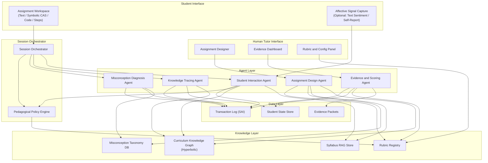
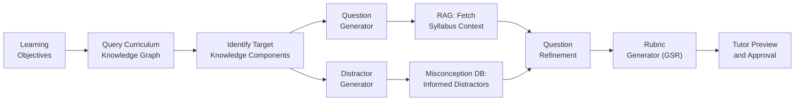
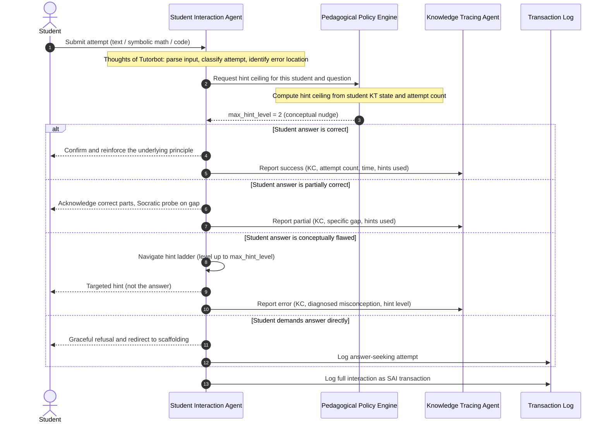
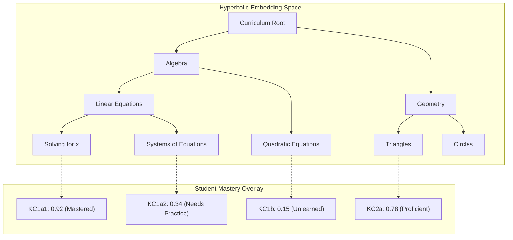
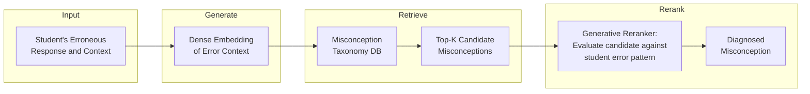
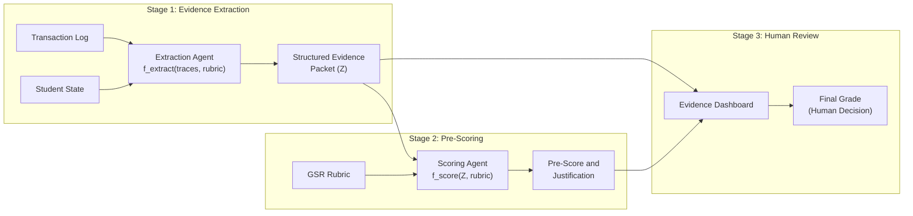

# Fiosra: A Reasoning Infrastructure Layer for Education

> **Fiosra** is a reasoning infrastructure layer for education.
>
> It helps educators design environments where thinking can be developed and gives students the space and support to demonstrate that thinking, while creating a student-owned record of learning over time.
>
> 🚀 **Building the MVP?** Check the [3–4 Week Lean Blueprint](../README.md) and explore the modular component specs in [`../mvp/`](../mvp/README.md).

---

## The Vision & Core Bottlenecks

Traditional education systems conflate **performance** (the final answer on a static worksheet) with **reasoning** (the cognitive process, struggle, and mental models that produced it). This creates three compounding structural bottlenecks:

1. **Designing for Thinking is Hard**: Educators are constrained by time and tools to creating uniform, one-size-fits-all problem sets. Crafting rubric-aligned, misconception-aware environments that develop deep conceptual understanding across Bloom's taxonomy requires deep expertise and immense labor.
2. **Students Lack Safe Space to Demonstrate Thinking**: Conventional classroom support does not scale. Without one-on-one Socratic guidance (Bloom's two-sigma effect), students either hit cognitive dead-ends or offload thinking to answer-dispensing tools, denying them the opportunity to productively struggle and build authentic mastery.
3. **The Learning Record is Opaque & Ephemeral**: Educators receive final submissions with zero visibility into the student's *reasoning process*, *struggle points*, *hint dependency*, and *misconception trajectory*. Students leave school with a transcript of letter grades rather than a verifiable, student-owned dossier of their intellectual growth.

**Fiosra** resolves these challenges by orchestrating a multi-agent cognitive architecture that augments human educators, empowers learners, and captures structured, auditable evidence of thinking as it happens.

---

## Design Principles

These principles are derived directly from the research literature and are **non-negotiable architectural constraints**:

| # | Principle | Research Basis |
|---|-----------|---------------|
| 1 | **Socratic by default** — Never reveal answers; navigate a multi-rung hint ladder | Guardrail architecture¹, CodeHelp¹⁷ |
| 2 | **Deterministic outranks probabilistic** — Verifiable facts (compiler output, CAS results, rubric definitions) always override LLM judgments | Guardrail isolation¹ |
| 3 | **Curriculum-anchored** — All generative output is grounded via syllabus-constrained RAG; out-of-syllabus methods are rejected | Curriculum trust²⁹, Dual-retrieval RAG⁶ |
| 4 | **Observable reasoning** — Every agent exposes its internal diagnostic state ("Thoughts of Tutorbot") for auditability | CLASS framework⁶ |
| 5 | **Human-in-the-loop** — The human tutor retains final authority over rubrics, scaffolding depth, hint ceilings, and grade assignment | Metacognitive offloading prevention¹ |
| 6 | **Structured evidence checkpoints** — Intermediate reasoning is captured as typed, structured JSON (not opaque embeddings) for traceability | AutoSCORE's $Z$ representation, GSR⁴⁶ |
| 7 | **Hierarchical knowledge modeling** — Student mastery is tracked in hyperbolic space to capture curriculum dependency trees | L-HAKT²¹ |

---

## High-Level Architecture



---

## Core Agents: Detailed Design

> 📄 **System Coordination & Policy Engine**: [agents/orchestrator.md](agents/orchestrator.md) — Covers Session Orchestrator lifecycle, state machine, and Pedagogical Policy Engine (PPE) hint ceiling isolation.

### Agent 1: Assignment Design Agent (ADA)

> 📄 **Detailed Specification**: [agents/assignment_design_agent.md](agents/assignment_design_agent.md)

**Role**: Assists the human tutor in creating pedagogically sound, rubric-aligned assignments.

**Inputs from Tutor**:
- Target learning objectives (free text or selected from curriculum graph)
- Bloom's taxonomy level (Remember → Create)
- Desired difficulty band
- Scaffolding depth preference (fully scaffolded → open-ended)
- Number of questions / time constraints

**Internal Pipeline**:



**Key Design Decisions**:

- **Misconception-aware distractors**: For MCQ or scaffolded questions, the agent queries the Misconception Taxonomy DB to generate distractors that correspond to *specific, known student errors* — not random wrong answers. This transforms each incorrect selection into a diagnostic signal.
- **Graph-Structured Rubric (GSR) generation**: For each question, the agent produces a typed, directed evaluation graph (per GSR framework⁴⁶) with:
  - Criterion nodes (each targeting one knowledge component)
  - Transformation operators (how to extract evidence from the response)
  - Gating mechanisms (prerequisite criteria that must pass before evaluating dependent criteria)
  - Acceptable answer variants (including equivalent symbolic forms via CAS validation)
- **Subproblem decomposition**: Complex questions are automatically decomposed into constituent subproblems, each mapped to a knowledge component. This decomposition drives the scaffolding structure the Student Interaction Agent will use.

**Output**: A structured assignment specification (JSON) containing questions, rubrics, scaffolding trees, hint ladders, and target knowledge component mappings — all subject to human tutor review and modification before deployment.

---

### Agent 2: Student Interaction Agent (SIA)

> 📄 **Detailed Specification**: [agents/student_interaction_agent.md](agents/student_interaction_agent.md)

**Role**: The student-facing Socratic tutor that guides learners through the assignment without revealing answers.

> [!CAUTION]
> This agent **never** has access to the final answer in its generation context. The answer is held exclusively by the Pedagogical Policy Engine, which controls hint escalation. This architectural isolation prevents prompt injection attacks where students attempt to socially engineer the answer.

**Interaction Loop**:



**Hint Ladder Structure** (per question, configured by tutor):

| Level | Type | Example |
|-------|------|---------|
| 0 | Metacognitive prompt | "What do you think the first step should be?" |
| 1 | Conceptual nudge | "Remember the relationship between force and acceleration." |
| 2 | Procedural hint | "Try applying Newton's second law: F = ma. What is m here?" |
| 3 | Worked sub-example | "For a similar problem: if m=5kg and a=3m/s², then F=15N. Now apply this pattern." |
| 4 | Bottom-out hint (answer) | **Locked** — requires explicit tutor override |

**Input Normalization & Deterministic Verification**:

Per Principle #2 (*Deterministic outranks probabilistic*), the SIA processes student inputs through a deterministic verification pipeline prior to generative LLM reasoning:

```
Raw Input (Text / LaTeX / Symbolic Expressions / Code)
    │
    ▼
Syntactic Normalization & Canonicalization
    │── Text: Unicode whitespace & punctuation normalization
    │── Math/Symbolic: Computer Algebra System (CAS/SymPy) canonicalization
    │── Code: AST parsing, syntax validation, sandboxed unit test runner
    │
    ▼
Deterministic Verification Engine
    │── Evaluates canonical forms against GSR-defined acceptable variants
    │── Proves symbolic algebraic equivalence (e.g., -2x + 1 == 1 - 2x)
    │── Output: { verdict: exact_match | equivalent | syntax_error | non_equivalent }
    │
    ▼
Integrated Diagnostic → Socratic Response Generation (LLM guided by deterministic output)
```

**Affective Adaptation** (optional, per MathBuddy³¹):

If webcam/sentiment signals are available:
- **Positive affect** (engaged, confident) → Increase rigor, reduce hint availability
- **Negative affect** (frustrated, confused) → Pivot to motivational scaffolding, offer to decompose into smaller substeps
- **Neutral/bored** → Introduce contextual hooks, real-world connections

---

### Agent 3: Knowledge Tracing Agent (KTA)

> 📄 **Detailed Specification**: [agents/knowledge_tracing_agent.md](agents/knowledge_tracing_agent.md)

**Role**: Maintains a real-time, hierarchical model of each student's evolving concept mastery.

**Architecture**: L-HAKT (LLM Hyperbolic Aligned Knowledge Tracing)²¹



**Why Hyperbolic Geometry?**

Educational curricula are inherently **tree-structured**: foundational axioms branch into theorems, which branch into applications. Euclidean embeddings distort these hierarchical distances. Hyperbolic space (e.g., the Poincaré ball model) naturally represents trees with exponentially growing capacity at the periphery, faithfully capturing:

- **Hierarchical propagation**: A misconception in "Solving for x" (KC1a1) cascades predictably into "Systems of Equations" (KC1a2) and "Quadratic Equations" (KC1b)
- **Root-cause identification**: The KTA can trace an error in a leaf concept back to the specific ancestor node where mastery broke down
- **Cold-start mitigation**: LLM-parsed question semantics provide difficulty estimates even for unseen questions, cross-referenced with student feedback for personalized difficulty perception bias²¹

**State Update Protocol**:

On every student interaction, the KTA receives:
```javascript
{
  "student_id": "stu_42",
  "knowledge_component": "KC1a2",
  "attempt_number": 3,
  "outcome": "partial_correct",
  "time_elapsed_seconds": 127,
  "hints_consumed": 2,
  "diagnosed_misconception": "MISC_0047_sign_error_subtraction",
  "affective_signal": "frustrated"
}
```

The KTA updates the student's mastery vector in hyperbolic space and propagates changes along the curriculum dependency graph.

---

### Agent 4: Misconception Diagnosis Agent (MDA)

> 📄 **Detailed Specification**: [agents/misconception_diagnosis_agent.md](agents/misconception_diagnosis_agent.md)

**Role**: When the SIA detects a conceptual error, the MDA identifies the *specific* flawed mental model from a standardized taxonomy.

**Architecture**: Generate → Retrieve → Rerank pipeline³⁵



**Misconception Taxonomy Structure**:
```javascript
{
  "misconception_id": "MISC_0047",
  "domain": "algebra",
  "knowledge_component": "KC1a1",
  "label": "Sign error during subtraction across equals",
  "description": "Student subtracts a term from one side but adds it to the other, or fails to flip the sign when moving a term across the equals sign.",
  "common_trigger": "Equations with negative coefficients",
  "remediation_strategy": "Demonstrate balance-scale analogy; emphasize that subtracting from both sides preserves equality",
  "severity": "foundational",
  "frequency_percentile": 87
}
```

**Output**: The diagnosed misconception ID is:
1. Sent to the **SIA** to generate targeted, remediation-aligned Socratic feedback
2. Sent to the **KTA** to update the student's mastery state
3. Logged in the **Transaction Log** as structured evidence for the tutor

---

### Agent 5: Evidence & Scoring Agent (ESA)

> 📄 **Detailed Specification**: [agents/evidence_scoring_agent.md](agents/evidence_scoring_agent.md)

**Role**: Aggregates all interaction traces into structured evidence packets for the human tutor, and optionally pre-scores using AutoSCORE-style multi-stage extraction.

**Two-Stage Pipeline** (adapted from AutoSCORE):



**Structured Evidence Packet ($Z$)**:

For each student × assignment, the ESA compiles:

```javascript
{
  "student_id": "stu_42",
  "assignment_id": "hw_07",
  "submission_timestamp": "2026-09-06T19:45:00Z",

  "per_question_evidence": [
    {
      "question_id": "q3",
      "knowledge_components": ["KC1a2"],
      "final_answer": "x = 3, y = -1",
      "final_answer_correct": true,

      "process_trace": {
        "total_attempts": 4,
        "hints_consumed": 2,
        "max_hint_level_reached": 2,
        "time_spent_seconds": 312,
        "answer_seeking_attempts": 1,
        "misconceptions_triggered": ["MISC_0047"],
        "misconceptions_resolved": true,
        "self_corrections": 1
      },

      "reasoning_snapshots": [
        {
          "attempt": 1,
          "student_input": "x + 2y = 1, so x = 1 + 2y",
          "diagnosis": "Sign error: should be x = 1 - 2y",
          "misconception": "MISC_0047",
          "hint_given": "Check the sign when you move 2y to the other side.",
          "hint_level": 1
        },
        {
          "attempt": 2,
          "student_input": "x = 1 - 2y, substituting: (1-2y) + y = 2 → 1 - y = 2 → y = -1",
          "diagnosis": "correct",
          "misconception": null,
          "hint_given": null,
          "hint_level": 0
        }
      ],

      "affective_trajectory": ["neutral", "frustrated", "engaged", "confident"],

      "rubric_evidence": {
        "criterion_1_procedural_fluency": {
          "met": true,
          "evidence": "Correctly applied substitution method after self-correction",
          "confidence": 0.91
        },
        "criterion_2_conceptual_understanding": {
          "met": "partial",
          "evidence": "Initial sign error suggests fragile grasp of equality preservation; resolved with Level 1 hint",
          "confidence": 0.72
        }
      }
    }
  ],

  "aggregate_metrics": {
    "overall_mastery_delta": "+0.12 (KC1a2: 0.34 → 0.46)",
    "total_misconceptions_encountered": 1,
    "total_misconceptions_resolved": 1,
    "hint_dependency_ratio": 0.50,
    "independent_success_rate": 0.67,
    "average_time_per_question_seconds": 245,
    "engagement_score": 0.78
  },

  "pre_score": {
    "suggested_grade": "B+",
    "justification": "Correct final answers on 4/5 questions. Strong procedural fluency but recurring sign errors suggest incomplete conceptual mastery of equality operations. Self-corrected after minimal hinting on most items.",
    "areas_for_follow_up": ["Equality preservation with negative terms", "Systems with three unknowns (not yet attempted)"]
  }
}
```

> [!IMPORTANT]
> The pre-score is a **suggestion**. The human tutor sees the full evidence packet and makes the final grading decision. The system is designed to make evaluation *faster and more informed*, not to automate it away.

---

## Knowledge Layer

### Curriculum Knowledge Graph (Hyperbolic)

The foundational data structure that all agents share. Built collaboratively:
- **Initial structure**: Automatically extracted from syllabus documents via LLM parsing
- **Refined by tutor**: Human tutor validates, corrects, and extends the graph
- **Enriched by usage**: The KTA continuously updates edge weights based on observed student transition probabilities

```
Node attributes:
  - knowledge_component_id
  - label (human-readable name)
  - bloom_level (1-6)
  - prerequisite_edges[] (directed, weighted)
  - estimated_difficulty (0.0 - 1.0)
  - common_misconceptions[] (links to Misconception DB)
  - syllabus_references[] (links to RAG Store documents)

Embedding:
  - Poincaré ball coordinates (dim=32)
  - Curvature optimized per subtree
```

### Syllabus RAG Store

Chunked, embedded, and indexed syllabus materials:
- Textbook chapters, lecture slides, video transcripts
- Exam-conventional formatting templates (per curriculum trust principle²⁹)
- Dual-retrieval index: supports queries on both main questions AND subproblem decompositions⁶

### Misconception Taxonomy DB

A curated, growing database of domain-specific misconceptions:
- Seeded from educational psychology literature and existing ITS misconception catalogs
- Continuously enriched by the MDA as new error patterns are observed and validated by tutors
- Each entry linked to knowledge components, remediation strategies, and frequency statistics

### Rubric Registry

Stores all GSR rubrics created by the Assignment Design Agent and refined by the tutor:
- Versioned (rubrics evolve as assignments are reused)
- Linked to knowledge components and Bloom's levels
- Machine-executable (typed nodes, operators, and gates — not free-text descriptions)

---

## Data Layer: Transaction Log Schema

Every student interaction is logged as a structured transaction (inspired by TutorGym's SAI triple⁷ and PSLC DataShop format):

```javascript
{
  "transaction_id": "txn_uuid",
  "timestamp": "ISO-8601",
  "session_id": "sess_uuid",
  "student_id": "stu_42",
  "assignment_id": "hw_07",
  "question_id": "q3",
  "step_id": "q3_step_2",

  "action": {
    "selection": "answer_field_q3",
    "action_type": "UpdateTextField",
    "input": "x = 1 + 2y",
    "input_modality": "text"
  },

  "evaluation": {
    "correctness": "incorrect",
    "diagnosed_misconception": "MISC_0047",
    "knowledge_components": ["KC1a2"],
    "hint_level_given": 1,
    "hint_text": "Check the sign when you move 2y to the other side."
  },

  "agent_internal_state": {
    "thoughts_of_tutorbot": "Student moved 2y across equals but failed to negate. This is a sign-preservation error (MISC_0047). Student has seen this error once before in hw_05. Escalating to Level 1 hint.",
    "confidence": 0.94,
    "affective_read": "neutral"
  },

  "student_state_snapshot": {
    "KC1a2_mastery": 0.34,
    "cumulative_attempts_this_question": 1,
    "cumulative_hints_this_question": 0
  }
}
```

---

## Human Tutor Interfaces

### 1. Assignment Designer UI

The tutor interacts with the Assignment Design Agent through:
- **Objective selector**: Pick learning objectives from the curriculum graph (visual node picker)
- **Difficulty / Bloom's sliders**: Constrain the generation space
- **Generated preview**: See questions, scaffolding trees, and rubrics before publishing
- **Rubric editor**: Modify GSR nodes, adjust hint ladders, set scaffolding policies
- **Misconception review**: See which known misconceptions each question is designed to probe

### 2. Evidence Dashboard UI

After students complete assignments, the tutor sees:
- **Class-level heatmap**: Knowledge component mastery across all students (red/yellow/green)
- **Per-student drill-down**: Full evidence packet ($Z$) with reasoning snapshots, misconception history, affective trajectory, and hint dependency
- **Pre-scored suggestions**: Agent's recommended grade with rubric-aligned justification — tutor accepts, modifies, or overrides
- **Misconception prevalence**: "72% of students triggered MISC_0047 on Q3" → signals a teaching gap, not just a student gap
- **Comparative analytics**: This cohort vs. historical cohorts on the same assignment

---

## Evaluation & Continuous Improvement

### Simulated Student Testing (TutorGym-style⁷)

Before deploying new assignments or updated agent policies to real students:

1. Generate a cohort of **PS2-style simulated students**⁴¹ spanning proficiency levels (strong ↔ weak)
2. Run the full assignment lifecycle in simulation: design → interaction → knowledge tracing → evidence collection → scoring
3. Validate:
   - Does the SIA maintain Socratic guardrails under adversarial prompting?
   - Does the hint ladder escalate appropriately for different proficiency levels?
   - Are misconceptions correctly diagnosed and remediated?
   - Do evidence packets contain sufficient, accurate information for tutor evaluation?
   - Do pre-scores align with rubric expectations?

### Agent Quality Metrics

| Agent | Primary Metric | Target |
|-------|---------------|--------|
| Assignment Design Agent | Rubric coverage (% of target KCs addressed) | ≥ 95% |
| Student Interaction Agent | Answer non-disclosure rate | ≥ 98% (per CodeHelp¹⁷) |
| Student Interaction Agent | Student-rated helpfulness | ≥ 85% |
| Knowledge Tracing Agent | Mastery prediction AUC | ≥ 0.82 (per DKT benchmarks²⁰) |
| Misconception Diagnosis Agent | Top-3 misconception accuracy | ≥ 80% |
| Evidence & Scoring Agent | Pre-score agreement with tutor (QWK) | ≥ 0.75 |

---

## Technology Stack Recommendations

| Layer | Recommended Technology | Rationale |
|-------|----------------------|-----------|
| **LLM Backbone (SIA, ADA)** | GPT-4o / Claude Opus or fine-tuned LLaMA-3.1-70B | AutoSCORE showed 70B+ models close the gap with GPT-4 when structured pipelines are used |
| **LLM Backbone (MDA, ESA)** | Fine-tuned LLaMA-3.1-8B per agent | MAGIC framework¹ showed small, specialized agents outperform monolithic large models; enables local hosting for privacy |
| **Knowledge Graph** | Neo4j + custom hyperbolic embedding layer | Native graph queries + Poincaré ball embeddings |
| **RAG Store** | LlamaIndex / LangChain with syllabus-chunked FAISS index | Dual-retrieval (main + subproblem) |
| **Misconception DB** | PostgreSQL + pgvector | Structured taxonomy + dense retrieval |
| **Transaction Log** | **PostgreSQL** (`jsonb` event table); upgrade to PostgreSQL + **TimescaleDB** at district scale, or Kafka → ClickHouse only at 100K+ concurrent users | Single-DB simplicity for prototype→production; time-series extension adds learning-curve analytics without extra infrastructure |
| **Orchestrator** | LangGraph / custom state machine | Multi-agent coordination with typed state transitions |
| **Frontend** | Next.js + D3.js (evidence dashboards) | Rich interactive UI for both tutor and student |

---

## Open Questions for Discussion

> [!IMPORTANT]
> These decisions will significantly shape the implementation. Please review.

1. **Domain scope**: Should we target a specific subject area first (e.g., middle school algebra, introductory physics, programming) or build domain-agnostic from day one?

2. **Affective computing**: The MathBuddy-style webcam integration yields +23pt gains but raises significant privacy concerns. Should we include it as opt-in, defer it entirely, or rely solely on text-based sentiment analysis?

3. **LLM hosting**: Should the system be cloud-only (OpenAI/Anthropic APIs) for simplicity, self-hosted (LLaMA) for privacy/cost, or hybrid (small agents local, large agents cloud)?

4. **Human tutor authority level**: Should tutors be able to override the Socratic guardrails mid-assignment (e.g., "for this student, reveal the answer to Q3")? The research suggests yes (Level 4 hint unlocking¹), but this needs explicit UX design.

5. **Misconception DB bootstrapping**: Should we seed the misconception taxonomy from existing educational research databases, or build it organically from student interaction data?

6. **Deployment model**: Is this envisioned as a SaaS platform for schools, an open-source framework for researchers, or a white-label system for tutoring companies?

---

## References

Key research underpinning this architecture:

| ID | Paper / System | Primary Contribution to Fiosra |
|----|---------------|--------------------------------|
| 1 | Teaching an LLM Tutor to Withhold the Answer (2025) | Socratic guardrail architecture, hint ladders, refusal-under-knowledge |
| 6 | CLASS Framework (Sonkar et al., EMNLP 2023) | "Thoughts of Tutorbot" internal reasoning, scaffolding + conversational dataset design |
| 7 | TutorGym (Weitekamp et al., 2025) | SAI interaction model, simulated student evaluation, completeness profiles |
| 17 | CodeHelp (2024) | 98% answer non-disclosure rate with 86% helpfulness |
| 21 | L-HAKT (2025) | Hyperbolic knowledge tracing for hierarchical curricula |
| 29 | AITutor Ethnographic Study (2025) | Curriculum trust, student resistance to forced Socratic dialogue |
| 31 | MathBuddy (2025) | Affective tutoring scaffolding |
| 35 | Misconception Diagnosis: Generate-Retrieve-Rerank (2025) | Scalable misconception classification pipeline |
| 41 | PS2 Framework (2025) | Parameterized simulated student proficiency |
| 46 | Graph-Structured Rubrics (GSR) (2025) | Type-safe, directed evaluation graphs for rubric automation |
| — | AutoSCORE (Wang et al., AAAI 2026) | Two-stage extraction→scoring pipeline, structured evidence $Z$ |
