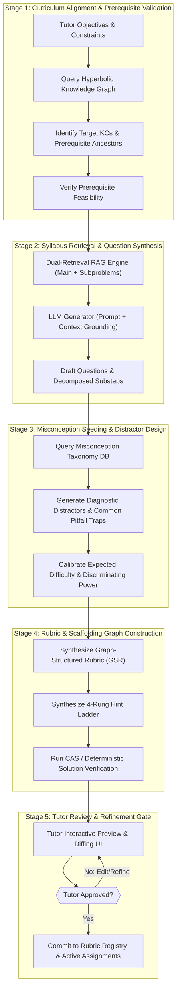

# Assignment Design Agent (ADA) — Component Specification

## Identity & Role

The Assignment Design Agent (ADA) acts as an expert pedagogical co-pilot for human tutors. It accelerates the creation of curriculum-aligned, misconception-aware, and rubric-governed assignments. 

> **Cardinal Rule**: The ADA is an **authoring accelerator, not an autonomous publisher**. All generated questions, scaffolding trees, hint ladders, and Graph-Structured Rubrics (GSR) are drafts presented to the human tutor for inspection, modification, and final sign-off.

---

## Interface Contract

### Inputs (from Human Tutor Interface)

| Field | Type | Source | Description |
|-------|------|--------|-------------|
| `learning_objectives` | array[string] / array[node_id] | Tutor UI | Target objectives (free text or selected from Curriculum Knowledge Graph) |
| `blooms_level` | enum (1-6) | Tutor UI | Target Bloom's taxonomy level (`remember`, `understand`, `apply`, `analyze`, `evaluate`, `create`) |
| `target_difficulty` | float (0.1 - 1.0) | Tutor UI | Desired difficulty parameter $\theta$ (aligned with IRT/KT scales) |
| `scaffolding_depth` | enum | Tutor UI | `unscaffolded` (single prompt), `adaptive` (subproblems triggered on error), `fully_scaffolded` (step-by-step) |
| `question_formats` | array[enum] | Tutor UI | `mcq`, `short_symbolic`, `multi_step_derivation`, `code_exercise` |
| `question_count` | integer | Tutor UI | Number of target questions |
| `time_budget_minutes` | integer | Tutor UI | Estimated completion time for the assignment |
| `syllabus_anchors` | array[string] | RAG Store | Specific syllabus sections, textbook chapters, or lecture notes to constrain content |

### Outputs (to Session Orchestrator & Rubric Registry)

| Field | Type | Destination | Description |
|-------|------|-------------|-------------|
| `assignment_id` | string (UUID) | DB / Registry | Unique identifier for the assignment specification |
| `questions` | array[QuestionSpec] | Session Store | Complete list of generated questions, subproblems, and context |
| `rubrics` | array[GSRSpec] | Rubric Registry | Graph-Structured Rubrics with criteria nodes, operators, and gates |
| `hint_ladders` | map[question_id, HintLadder] | PPE Store | Multi-rung hint ladders (levels 0-3 pre-authored, level 4 locked) |
| `kc_coverage_matrix` | map[node_id, float] | Tutor UI / KTA | Mapping of questions to curriculum knowledge components and weights |
| `misconception_traps` | array[TrapSpec] | MDA / Transaction Log | Pre-registered diagnostic misconceptions embedded in distractors/prompts |

---

## Core Pipeline & Generation Stages



---

## Detailed Component Workflows

### 1. Curriculum Grounding & Prerequisite Checking
Before composing questions, the ADA queries the Curriculum Knowledge Graph (embedded in Poincaré hyperbolic space). It checks:
1. **Target Node Validity**: Are the selected Knowledge Components (KCs) well-defined in the current curriculum syllabus?
2. **Prerequisite Subtree**: Which ancestor nodes must a student understand before tackling these questions?
3. **Cognitive Load & Bloom Level Alignment**: Ensures verbs and demands match the requested Bloom's taxonomy tier (e.g., "calculate and justify" for `apply`/`analyze`, rather than rote "identify" for `remember`).

### 2. Misconception-Aware Distractor Engineering
For multiple-choice and multi-step questions, random distractors provide virtually zero diagnostic value. The ADA queries the **Misconception Taxonomy DB** for known student failure modes linked to the target KCs:
- **Algebra Example**: When asking to solve $3(x - 4) = 12$, instead of generic options, ADA generates:
  - Distractor A: $x = 8$ (Correct answer)
  - Distractor B: $x = 0$ (Triggered by forgetting distribution: $3x - 4 = 12 \rightarrow 3x = 16$ or $3x - 12 = 12 \rightarrow 3x = 24$... or distributing incorrectly)
  - Distractor C: $x = 5.33$ (Triggered by dividing 12 by 3 first, then subtracting 4 instead of adding 4: $x - 4 = 4 \rightarrow x = 0$)
  - Distractor D: $x = 16$ (Sign error: $3x - 12 = 12 \rightarrow 3x = 48$)
- Each distractor is explicitly tagged with a `misconception_id`. When a student picks an option, the Student Interaction Agent and Misconception Diagnosis Agent instantly obtain a high-confidence diagnostic hypothesis.

### 3. Graph-Structured Rubric (GSR) Synthesis
Rather than a traditional text-based paragraph rubric (which LLM graders interpret inconsistently), the ADA generates a **Graph-Structured Rubric** (per GSR framework):
- **Criterion Nodes ($C_i$)**: Specific, atomic knowledge components to be verified.
- **Extraction Operators ($O_i$)**: Formal extraction rules (e.g., regex, symbolic CAS equivalence, AST check, or constrained LLM semantic extractor).
- **Gating Edges ($G_{i \rightarrow j}$)**: Conditional prerequisites (e.g., Criterion $C_2$ "Substitutes value into formula" is only evaluated if Criterion $C_1$ "States valid formula" passes).
- **Point Weights & Partial Credit Rules**.

### 4. Deterministic Verification of Reference Solutions
Per Design Principle #2 (*Deterministic outranks probabilistic*):
- Symbolic expressions and mathematical equations are verified using **SymPy / CAS** engines to verify algebraic consistency and generate equivalent representation sets (e.g., $x = \frac{1}{2}$ vs $2x - 1 = 0$ vs $x = 0.5$).
- Coding questions generate an automated Python/language test suite with hidden test cases and edge cases.
- Any mathematical question whose generated solution fails CAS verification is automatically regenerated before reaching the tutor preview.

---

## Assignment Specification Schema (JSON)

```javascript
{
  "$schema": "https://fiosra.org/schemas/assignment_spec.v1.json",
  "assignment_id": "asgn_alg1_linear_equations_01",
  "metadata": {
    "title": "Single-Variable Linear Equations with Parentheses",
    "course_id": "math_grade8",
    "created_by": "tutor_prof_smith",
    "authoring_agent_version": "ada-v1.2",
    "blooms_target": "apply",
    "target_difficulty": 0.55,
    "time_budget_minutes": 30
  },
  "questions": [
    {
      "question_id": "q1",
      "order": 1,
      "knowledge_components": ["KC_ALG_DISTRIBUTIVE_PROP", "KC_ALG_EQUATION_BALANCE"],
      "blooms_level": "apply",
      "prompt": "Solve for $x$: $$4(2x - 3) = 20$$ Show your intermediate algebraic steps.",
      "input_type": "symbolic_math_multi_step",
      "subproblems": [
        {
          "step_id": "q1_s1",
          "description": "Distribute 4 through $(2x - 3)$",
          "target_kc": "KC_ALG_DISTRIBUTIVE_PROP",
          "expected_form": "8x - 12 = 20"
        },
        {
          "step_id": "q1_s2",
          "description": "Isolate the variable term by adding 12 to both sides",
          "target_kc": "KC_ALG_EQUATION_BALANCE",
          "expected_form": "8x = 32"
        },
        {
          "step_id": "q1_s3",
          "description": "Solve for x by dividing both sides by 8",
          "target_kc": "KC_ALG_EQUATION_BALANCE",
          "expected_form": "x = 4"
        }
      ],
      "reference_solution": {
        "final_value": "x = 4",
        "symbolic_canonical": "Eq(x, 4)",
        "acceptable_equivalents": ["x = 4", "4 = x", "x = 32/8"]
      },
      "misconception_distractors": [
        {
          "form": "8x - 3 = 20",
          "misconception_id": "MISC_0012_PARTIAL_DISTRIBUTION",
          "diagnostic_note": "Student distributed coefficient to the first term only."
        },
        {
          "form": "8x = 8",
          "misconception_id": "MISC_0047_SIGN_ERROR_SUBTRACTION",
          "diagnostic_note": "Student subtracted 12 from 20 instead of adding 12."
        }
      ],
      "hint_ladder": [
        {
          "level": 0,
          "type": "metacognitive",
          "text": "What algebraic property allows you to simplify parentheses multiplied by a constant?"
        },
        {
          "level": 1,
          "type": "conceptual",
          "text": "Remember to apply the distributive property: $a(b - c) = ab - ac$."
        },
        {
          "level": 2,
          "type": "procedural",
          "text": "Multiply both $2x$ and $-3$ by $4$, then simplify the equation to the form $Ax + B = C$."
        },
        {
          "level": 3,
          "type": "worked_subexample",
          "text": "For a similar problem like $3(2y - 1) = 9$, we get $6y - 3 = 9 \\rightarrow 6y = 12 \\rightarrow y = 2$. Now follow that pattern."
        },
        {
          "level": 4,
          "type": "bottom_out_answer",
          "text": "Expand to $8x - 12 = 20$, add $12$ to get $8x = 32$, and divide by $8$ to get $x = 4$.",
          "locked": true
        }
      ],
      "rubric_graph": {
        "nodes": [
          {
            "id": "crit_distrib",
            "name": "Correct Distribution",
            "points": 2,
            "kc": "KC_ALG_DISTRIBUTIVE_PROP",
            "operator": "sym_match",
            "pattern": "Eq(8*x - 12, 20)"
          },
          {
            "id": "crit_isolate",
            "name": "Term Isolation",
            "points": 2,
            "kc": "KC_ALG_EQUATION_BALANCE",
            "operator": "sym_match",
            "pattern": "Eq(8*x, 32)",
            "depends_on": ["crit_distrib"]
          },
          {
            "id": "crit_final",
            "name": "Final Evaluation",
            "points": 1,
            "kc": "KC_ALG_EQUATION_BALANCE",
            "operator": "sym_match",
            "pattern": "Eq(x, 4)",
            "depends_on": ["crit_isolate"]
          }
        ]
      }
    }
  ]
}
```

---

## Tutor Co-Design UX & Control Mechanisms

The ADA provides a collaborative drafting interface for the tutor:

1. **Syllabus Explorer & Anchor Picker**: The tutor selects specific sub-units from their uploaded syllabus or curriculum graph.
2. **Interactive Rubric Adjuster**: The tutor can click on any criterion node in the GSR diagram to change point weights, add extra diagnostic checks, or adjust prerequisites.
3. **Distractor & Misconception Review**: The tutor sees a preview of *why* each distractor was chosen and what misconception it tests.
4. **Difficulty & Time Budget Simulation**: ADA estimates completion time and item difficulty using historical cohort data and simulated student profiles.
5. **Instant Regeneration**: Tutor can highlight any individual question or hint rung and request: *"Make this hint more Socratic"*, *"Increase rigor to Bloom Level 4"*, or *"Add a real-world word problem wrapper"*.
