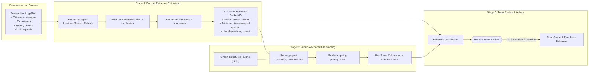

# Evidence & Scoring Agent (ESA) — Component Specification

## Identity & Role

The Evidence & Scoring Agent (ESA) transforms messy, conversational interaction logs into **transparent, structured evidence packets** ($Z$) and generates rubric-anchored pre-scoring suggestions for human tutors.

> **Pedagogical Rationale**: Human tutors do not have time to read through 50 turns of dialogue per student across 30 students (1,500 messages). The ESA distills every student's problem-solving trajectory down to an evidence-backed dossier—highlighting where they struggled, what hints they leaned on, whether they self-corrected, and which rubric criteria they satisfied.
>
> **Research Grounding**: Implements the **AutoSCORE** two-stage architecture ($f_{\text{extract}} \rightarrow Z \rightarrow f_{\text{score}}$)³, proving that separating factual evidence extraction from normative evaluation eliminates LLM scoring hallucinations and matches human grading consistency.

---

## Interface Contract

### Inputs (Triggered upon Assignment Completion or Submission)

| Field | Type | Source | Description |
|-------|------|--------|-------------|
| `assignment_id` | string (UUID) | Session Store | Identifier of the submitted assignment |
| `student_id` | string (UUID) | Session Store | Identifier of the student |
| `transaction_traces` | array[Transaction] | Transaction Log | Complete chronological log of student actions, attempts, hints, and thoughts |
| `rubric_spec` | GSRSpec | Rubric Registry | Graph-Structured Rubric (nodes, operators, and gates) |
| `student_kt_deltas` | object | KTA | Concept mastery deltas observed during this session |

### Outputs (to Evidence Dashboard & Student Record)

| Field | Type | Destination | Description |
|-------|------|-------------|-------------|
| `evidence_packet_z` | object (JSON) | Evidence Store | Typed, structured evidence representation $Z$ (non-opaque, auditable) |
| `criterion_evaluations`| map[node_id, EvalResult] | Evidence Dashboard | Met / Unmet status, extracted evidence snippet, confidence |
| `suggested_score` | object | Evidence Dashboard | Suggested point totals, grade band, and rubric-anchored rationale |
| `diagnostic_summary` | string | Evidence Dashboard | Executive summary of student's conceptual strengths and persistent gaps |
| `tutor_review_flags` | array[string] | Evidence Dashboard | Specific anomalies requiring human judgment (e.g., edge-case method) |

---

## Two-Stage Processing Architecture (AutoSCORE Framework)



### Stage 1: Deterministic & Semantic Evidence Extraction ($f_{\text{extract}}$)
Rather than passing raw transcripts directly to an evaluation LLM (which suffers from recency bias, context truncation, and hallucinated student quotes), the Extraction Agent compiles an intermediate structured representation $Z$:
1. **Filtering**: Strips standard conversational greetings, automated Socratic prompts, and boilerplate confirmations.
2. **Snapshot Pinpointing**: Identifies the key transition moments:
   - Initial hypothesis attempt
   - The specific error triggering a hint
   - The student's subsequent attempt post-hint
   - Final resolution (or abandonment)
3. **Metric Computation**: Computes exact statistics:
   - Total attempts per question
   - Hint dependency score ($H_d = \frac{\text{hints consumed}}{\text{max available hints}}$)
   - Self-correction count (correcting an error *without* escalating to higher hint levels)
   - Dwell time before attempting

### Stage 2: GSR Evaluation & Pre-Scoring ($f_{\text{score}}$)
With $Z$ established, the scoring agent evaluates each node of the Graph-Structured Rubric:
1. **Gating Checks**: Evaluates prerequisite criteria first. If a prerequisite gate fails (e.g., student failed to distribute correctly), dependent criteria (e.g., term isolation) are automatically flagged as dependent failures without hallucinating credit.
2. **Evidence Linking**: Every criterion outcome references an exact snippet from $Z$ (e.g., *"Met: In attempt 2, student wrote '8x - 12 = 20', correctly applying distributive property"*).
3. **Score Assembly**: Sums validated criterion points and generates an explanatory feedback paragraph composed entirely of verified observations.

---

## Evidence Packet ($Z$) Specification (JSON)

```javascript
{
  "$schema": "https://fiosra.org/schemas/evidence_packet.v1.json",
  "packet_id": "ev_packet_stu42_asgn01",
  "student_id": "stu_42",
  "assignment_id": "asgn_alg1_linear_equations_01",
  "completed_at": "2026-09-06T20:15:22Z",
  "time_on_task_total_seconds": 1284,

  "executive_summary": {
    "completion_status": "completed",
    "suggested_score_pct": 85.0,
    "questions_solved_independently": "3/4",
    "primary_misconception": "MISC_0047_SIGN_ERROR_SUBTRACTION",
    "learning_trajectory": "Resilient; encountered 1 foundational misconception on Q1 but self-corrected on Q3 after Level 1 hint."
  },

  "per_question_dossier": [
    {
      "question_id": "q1",
      "target_kcs": ["KC_ALG_DISTRIBUTIVE_PROP", "KC_ALG_EQUATION_BALANCE"],
      "final_verdict": "correct",
      "attempts_count": 3,
      "hints_used_count": 1,
      "max_hint_rung": 1,
      "dwell_time_seconds": 312,

      "critical_event_timeline": [
        {
          "timestamp": "2026-09-06T19:50:10Z",
          "event_type": "attempt",
          "attempt_number": 1,
          "content": "8x - 3 = 20",
          "deterministic_check": "failed_equivalence",
          "diagnosis": "MISC_0012_PARTIAL_DISTRIBUTION",
          "hint_issued": null
        },
        {
          "timestamp": "2026-09-06T19:52:05Z",
          "event_type": "hint_delivery",
          "hint_level": 1,
          "content": "Remember to apply the distributive property to both terms: a(b - c) = ab - ac."
        },
        {
          "timestamp": "2026-09-06T19:53:40Z",
          "event_type": "attempt",
          "attempt_number": 2,
          "content": "8x - 12 = 20  ==>  8x = 32  ==>  x = 4",
          "deterministic_check": "exact_match",
          "diagnosis": "correct",
          "self_correction_credit": true
        }
      ],

      "rubric_criterion_results": [
        {
          "criterion_id": "crit_distrib",
          "name": "Distributive Property Execution",
          "max_points": 2,
          "awarded_points": 2,
          "status": "met",
          "evidence_citation": "Correctly expanded to 8x - 12 in attempt 2 following Level 1 hint."
        },
        {
          "criterion_id": "crit_isolate",
          "name": "Term Isolation Across Equals",
          "max_points": 2,
          "awarded_points": 2,
          "status": "met",
          "evidence_citation": "Added 12 to both sides to achieve 8x = 32 without sign error."
        },
        {
          "criterion_id": "crit_final",
          "name": "Final Arithmetic Resolution",
          "max_points": 1,
          "awarded_points": 1,
          "status": "met",
          "evidence_citation": "Divided by 8 to reach canonical solution x = 4."
        }
      ]
    }
  ],

  "class_level_aggregation_signals": {
    "cohort_difficulty_relative": "nominal",
    "misconception_co_occurrence": ["MISC_0012", "MISC_0047"]
  }
}
```

---

## Human Tutor Evaluation Workflow

The Evidence Dashboard gives the tutor total visibility and streamlined decision-making:

1. **Cohort Heatmap**: Visual grid of all students $\times$ knowledge components. Tutors instantly see if an entire class stumbled on a specific concept (triggering a whole-class review lesson).
2. **Student Evidence Card**: Tutors click a student name to see their dossier:
   - Final answers and whether they are mathematically correct.
   - The exact reasoning trace and timeline of attempts.
   - The pre-scored rubric recommendations with direct citations to the student's work.
3. **One-Click Approval or Adjustment**:
   - Tutors can click **"Accept Pre-Score"** (takes $< 5$ seconds per student).
   - Tutors can click any criterion to adjust awarded points or append custom feedback.
4. **Audit Trail**: All tutor overrides are recorded in the database, enabling continuous calibration and training of future scoring models.
