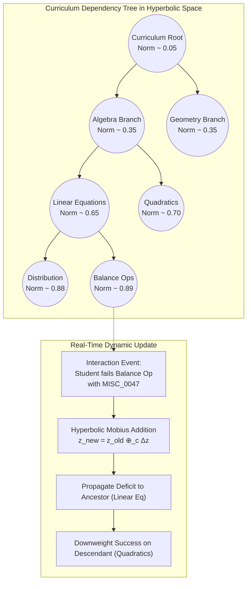

# Knowledge Tracing Agent (KTA) — Component Specification

## Identity & Role

The Knowledge Tracing Agent (KTA) maintains a continuous, mathematically grounded model of each student's evolving concept mastery. Rather than viewing student performance as isolated test scores, the KTA traces cognitive growth across a structured curriculum hierarchy in real time.

> **Research Grounding**: Implements **L-HAKT** (LLM Hyperbolic Aligned Knowledge Tracing)², combining the expressive hierarchical geometry of Poincaré embeddings with LLM-extracted semantic features of questions and student reasoning steps.

---

## Interface Contract

### Inputs (Streaming from Session Orchestrator / Transaction Log)

| Field | Type | Source | Description |
|-------|------|--------|-------------|
| `student_id` | string (UUID) | Session Store | Unique student identifier |
| `transaction_id` | string (UUID) | Transaction Log | Specific interaction event identifier |
| `knowledge_component` | string | Assignment Spec | Targeted curriculum KC node identifier (e.g., `KC_ALG_EQUATION_BALANCE`) |
| `attempt_number` | integer | Session Store | Attempt count for this specific subproblem / question |
| `outcome` | enum | SIA / Evaluator | `correct`, `partially_correct`, `conceptually_flawed`, `answer_seeking` |
| `time_spent_seconds` | float | Student Client | Dwell time elapsed before submitting this attempt |
| `hints_consumed` | integer | PPE / SIA | Number of hint rungs requested/shown during this question |
| `diagnosed_misconception` | string / null | MDA | Misconception ID if diagnosed (e.g., `MISC_0047`) |
| `question_embedding_h` | vector (dim=32) | Knowledge Graph | Hyperbolic coordinate of the question item in the Poincaré ball |

### Outputs (to PPE, ESA, and Evidence Dashboard)

| Field | Type | Destination | Description |
|-------|------|-------------|-------------|
| `student_mastery_vector` | map[kc_id, float] | Student State Store | Real-time mastery probabilities $p \in [0, 1]$ per KC |
| `hyperbolic_state_vector` | vector (dim=32) | Student State Store | Coordinate $\mathbf{z}_{s} \in \mathbb{D}^{32}$ representing student's global cognitive location |
| `predicted_success_prob` | float (0.0 - 1.0) | PPE | Predicted probability of success on next step $P(Y_{t+1}=1)$ |
| `mastery_delta` | float | Transaction Log | Net change in mastery for the targeted KC ($\Delta \mu$) |
| `propagated_updates` | map[kc_id, float] | Student State Store | Induced changes in ancestor/descendant KCs in the curriculum graph |

---

## Architectural Model: L-HAKT in the Poincaré Ball

Curriculum structures are inherently trees: foundational concepts branch into specialized subtopics, which branch into advanced applications. In traditional Euclidean spaces, the volume of a sphere grows as $r^n$ (polynomial), while trees branch exponentially as $b^d$. This creates severe geometric distortion when projecting knowledge trees into Euclidean vectors.

In **Hyperbolic space** (modeled via the Poincaré ball $\mathbb{D}^n$ with curvature $c < 0$), volume grows exponentially $\sim e^{c r}$, allowing tree structures to embed with virtually zero distortion.



### 1. Distance Metric in Poincaré Space
For points $u, v \in \mathbb{D}^n$, the hyperbolic distance is defined as:
$$d_{\mathbb{D}}(u, v) = \text{arcosh}\left(1 + 2 \frac{\|u - v\|^2}{(1 - \|u\|^2)(1 - \|v\|^2)}\right)$$

- Points close to the origin (low norm $\|u\|$) represent high-level, overarching concept categories.
- Points near the boundary ($\|u\| \rightarrow 1$) represent specific, granular knowledge components.
- The hyperbolic distance between a student's cognitive state $\mathbf{z}_s$ and a question item $\mathbf{q}_j$ reflects the true structural prerequisite gap.

### 2. State Update Formulation
Upon observing response $y_t \in \{0, 1\}$ at time $t$:
1. **Interaction Embedding**: An input vector $\mathbf{x}_t$ combines the question item, student response correctness, hint penalty, and time penalty:
   $$\mathbf{x}_t = \mathbf{e}_{q} + \alpha y_t - \beta \cdot \frac{\text{hints\_consumed}}{4} - \gamma \cdot \log(1 + t_{\text{elapsed}})$$
2. **Tangent Space Mapping**: The vector is projected onto the tangent space of the student's previous state $\mathbf{z}_{t-1}$ via the exponential map:
   $$\Delta \mathbf{z}_t = \exp_{\mathbf{z}_{t-1}}^{c}(\mathbf{W}_h \mathbf{x}_t)$$
3. **Möbius Gyrovector Addition**: The student state coordinate is updated along the hyperbolic geodesic:
   $$\mathbf{z}_t = \mathbf{z}_{t-1} \oplus_c \Delta \mathbf{z}_t$$

### 3. Bidirectional Graph Propagation
When an update occurs at node $KC_k$:
- **Upward Propagation (Ancestors)**: If $KC_k$ fails repeatedly, the mastery of ancestor concepts is penalized proportionally to their hyperbolic distance, detecting foundational prerequisite decay.
- **Downward Propagation (Descendants)**: Mastery gains in $KC_k$ unlock readiness for child concepts, updating the student's *Zone of Proximal Development* (ZPD) frontier.

---

## Student State Snapshot Schema (JSON)

```javascript
{
  "student_id": "stu_42",
  "last_updated": "2026-09-06T20:12:45Z",
  "global_hyperbolic_coord": [
    0.142, -0.451, 0.082, 0.315, 0.009, -0.198, 0.541, 0.023,
    -0.311, 0.119, 0.045, -0.076, 0.231, -0.184, 0.092, -0.218,
    0.054, -0.112, 0.387, 0.015, -0.093, 0.176, -0.224, 0.065,
    -0.038, 0.145, -0.089, 0.201, -0.167, 0.084, -0.012, 0.103
  ],
  "mastery_profile": {
    "KC_ALG_DISTRIBUTIVE_PROP": {
      "mastery_score": 0.88,
      "confidence": 0.94,
      "total_attempts": 14,
      "success_rate": 0.85,
      "average_hints_used": 0.3,
      "last_tested": "2026-09-06T19:55:10Z"
    },
    "KC_ALG_EQUATION_BALANCE": {
      "mastery_score": 0.46,
      "confidence": 0.81,
      "total_attempts": 9,
      "success_rate": 0.44,
      "average_hints_used": 1.8,
      "active_misconceptions": ["MISC_0047_SIGN_ERROR_SUBTRACTION"],
      "last_tested": "2026-09-06T20:12:45Z"
    },
    "KC_ALG_SYSTEMS_SUBSTITUTION": {
      "mastery_score": 0.22,
      "confidence": 0.65,
      "total_attempts": 3,
      "success_rate": 0.33,
      "average_hints_used": 2.5,
      "last_tested": "2026-09-06T18:30:00Z"
    }
  },
  "zpd_recommendations": {
    "ready_to_learn": ["KC_ALG_EQUATION_BALANCE_REMEDIATION"],
    "currently_blocked": ["KC_ALG_QUADRATIC_FACTORING"]
  }
}
```

---

## Pedagogical Protections & Integrity

1. **Anti-Guessing Dampener**: High-speed correct answers on complex questions ($t < 3\text{ seconds}$) receive a discounted mastery increment until confirmed on subsequent items (preventing lucky guesses or copy-pasting from inflating mastery).
2. **Hint Penalty Weighting**: Consuming a Level 3 hint diminishes positive mastery delta by 70%, and a Level 4 hint yields 0 positive delta.
3. **No Direct Student Overrides**: The KTA vector can only be modified by deterministic transaction outcomes and validated agent assessments—never by student self-reports or conversational claims.
4. **Tutor Manual Calibrations**: The human tutor can inspect and manually override any student's KC mastery in the Evidence Dashboard, resetting the baseline coordinate if external diagnostic data dictates.
