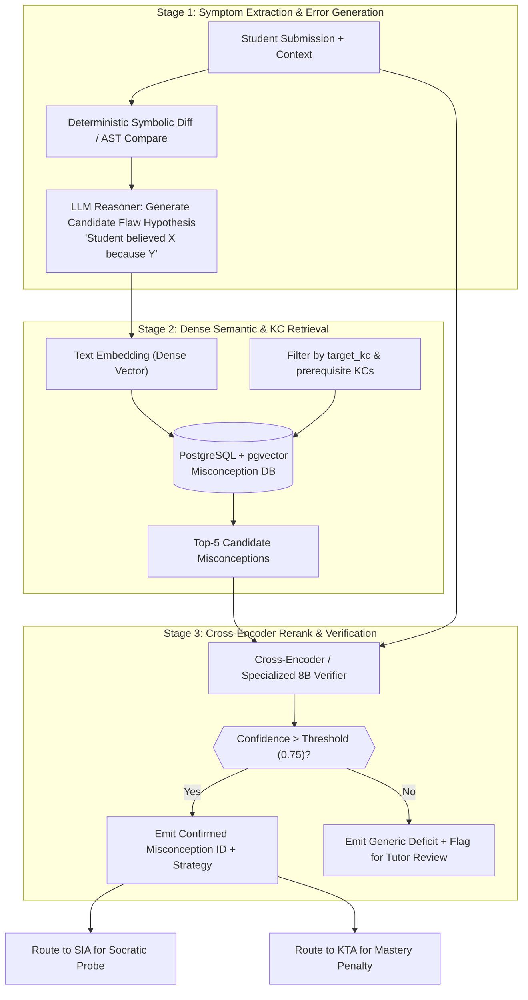

# Misconception Diagnosis Agent (MDA) — Component Specification

## Identity & Role

The Misconception Diagnosis Agent (MDA) is the diagnostic clinician of the multi-agent system. When a student makes an error, the MDA determines **why** the student made that specific error by mapping their observable behavior to an underlying flawed mental model.

> **Pedagogical Significance**: A student error is rarely random noise; it is almost always the systematic execution of a flawed, internally coherent rule (e.g., "when moving a term across '=', keep its sign" or "multiply only the first term in parentheses"). Diagnosing the specific rule enables surgical remediation instead of repetitive, unhelpful "try again" nudges.

---

## Interface Contract

### Inputs (Triggered by SIA on Error Detection)

| Field | Type | Source | Description |
|-------|------|--------|-------------|
| `student_response` | string | Student Client | The erroneous submission (text, symbolic math equation, code) |
| `step_context` | object | Assignment Spec | The specific subproblem prompt, expected solution, and target KC |
| `pre_seeded_traps` | array[TrapSpec] | Assignment Spec | Known misconception distractors authored for this question |
| `recent_history` | array[object] | Session Store | Prior 2-3 turns of dialogue or previous attempts on this question |
| `target_kc` | string | Knowledge Graph | Current knowledge component ID (e.g., `KC_ALG_EQUATION_BALANCE`) |

### Outputs (to SIA, KTA, and Transaction Log)

| Field | Type | Destination | Description |
|-------|------|-------------|-------------|
| `misconception_id` | string / null | SIA, KTA, TL | Standardized taxonomy identifier (e.g., `MISC_0047_SIGN_ERROR_SUBTRACTION`) |
| `confidence` | float (0.0 - 1.0) | KTA, TL | Diagnostic confidence score |
| `flawed_reasoning_summary` | string | Transaction Log | Concise description of the student's inferred flawed logic |
| `remediation_strategy` | string | SIA | Pedagogical counter-intervention to guide the next Socratic prompt |
| `is_novel_pattern` | boolean | DB / Admin | True if error is consistent but uncataloged in current taxonomy |

---

## Diagnostic Pipeline: Generate $\rightarrow$ Retrieve $\rightarrow$ Rerank

To combine scalability with high precision, the MDA operates a 3-stage hybrid neuro-symbolic pipeline:



### Stage 1: Error Hypothesis Generation
1. **Symbolic Difference**: If dealing with algebra or code, the deterministic engine computes the syntactic difference between the student's expression and the expected target.
2. **Generative Diagnosis**: A lightweight, fine-tuned LLaMA-3.1-8B model generates a one-sentence hypothesis explaining what rule the student appears to have applied.

### Stage 2: Filtered Dense Retrieval
The generated hypothesis is embedded and matched against the **Misconception Taxonomy Database** stored in PostgreSQL using `pgvector`:
- Retrieval is strictly filtered by the target knowledge component and its immediate ancestor branches in the curriculum tree.
- If the question contains pre-seeded distractors (authored during Assignment Design), their misconception IDs are given an immediate prior boost.

### Stage 3: Verification & Reranking
The top-5 retrieved candidates are evaluated against the student's actual work:
- The agent tests if the student's submission can be reproduced by applying the candidate's `flawed_rule` to the problem prompt.
- If an exact mathematical or rule-based match occurs, confidence is set to $\ge 0.90$.
- If confidence falls below 0.75, the agent does not force an erroneous label; it returns `null` with a generic diagnostic tag, preventing inaccurate student profiling.

---

## Misconception Taxonomy Schema (PostgreSQL + pgvector)

```sql
CREATE TABLE misconception_taxonomy (
    misconception_id VARCHAR(64) PRIMARY KEY,
    domain VARCHAR(64) NOT NULL,
    knowledge_component_id VARCHAR(64) NOT NULL,
    name VARCHAR(255) NOT NULL,
    description TEXT NOT NULL,
    flawed_rule TEXT NOT NULL,
    correct_rule TEXT NOT NULL,
    common_trigger_patterns TEXT[],
    remediation_strategy TEXT NOT NULL,
    severity VARCHAR(32) CHECK (severity IN ('trivial_slip', 'procedural_gap', 'foundational_flaw')),
    frequency_percentile FLOAT,
    embedding VECTOR(1536)
);

CREATE INDEX ON misconception_taxonomy USING ivfflat (embedding vector_cosine_ops)
    WITH (lists = 100);
```

### Example Taxonomy Record:
```javascript
{
  "misconception_id": "MISC_0047_SIGN_ERROR_SUBTRACTION",
  "domain": "algebra",
  "knowledge_component_id": "KC_ALG_EQUATION_BALANCE",
  "name": "Sign Inversion Omission Across Equals Sign",
  "description": "Student moves an additive or subtractive term across the equals sign without inverting its operational sign.",
  "flawed_rule": "x + a = b  ==>  x = b + a (or x - a = b ==> x = b - a)",
  "correct_rule": "Applying an inverse operation to maintain balance: x + a - a = b - a ==> x = b - a",
  "common_trigger_patterns": [
    "Equations with negative coefficients",
    "Multi-step equations where variables appear on both sides"
  ],
  "remediation_strategy": "Ask student what operation undoes addition, then use the balance-scale metaphor to show that doing the same operation to both sides preserves the equal sign.",
  "severity": "foundational_flaw",
  "frequency_percentile": 87.4
}
```

---

## Unsupervised Novel Error Discovery Loop

When students make repeated systematic errors that fail to match any entry in the existing database with confidence $\ge 0.75$:

1. **Transaction Stash**: Unclassified error interactions are saved in an unclassified cluster table.
2. **Periodic DBSCAN Clustering**: Every night, unclassified error vectors within the same KC are clustered using HDBSCAN.
3. **Cluster Candidate Generation**: When a cluster reaches $\ge 5$ students, an LLM synthesizes a draft taxonomy card (name, flawed rule, remediation strategy).
4. **Tutor Review Inbox**: The draft card appears in the human tutor's **Misconception Review Queue**:
   - The tutor reviews the representative student quotes and symbolic traces.
   - The tutor clicks *Accept*, *Edit*, or *Reject (Trivial Noise)*.
   - Accepted cards are promoted to the permanent taxonomy database and immediately indexed for future real-time diagnosis.
