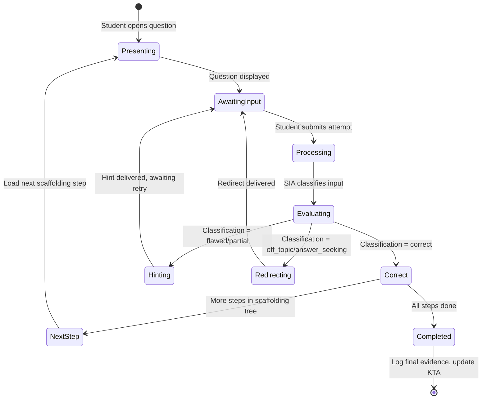

# Orchestrator & Pedagogical Policy Engine — Component Specification

## Overview

The Orchestrator is the central coordinator that routes messages between agents, manages session state, and enforces pedagogical policies. The Pedagogical Policy Engine (PPE) is a sub-component that computes hint ceilings and scaffolding decisions based on **trusted data only**.

---

## Session Orchestrator

### Responsibilities

1. **Session lifecycle management**: Create, resume, pause, and close student work sessions
2. **Message routing**: Route student inputs to the correct agent pipeline
3. **State machine management**: Track the current state of each student × question interaction
4. **Concurrency control**: Ensure agents process interactions in order per student session
5. **Timeout handling**: Detect abandoned sessions and trigger appropriate logging

### State Machine (per student × question)



### Message Flow

```
Student UI → Orchestrator → [Modality Router]
                                │
                    ┌───────────┼───────────┐
                    ▼           ▼           ▼
               Text Input  Symbolic / CAS   Code Input
                    │           │           │
                    └───────────┼───────────┘
                                │
                    Orchestrator assembles context:
                    • Question spec (no answer)
                    • Conversation history
                    • RAG context
                    • KTA state
                    • Affect signal
                    • PPE hint ceiling
                                │
                                ▼
                    Student Interaction Agent
                                │
                    ┌───────────┼───────────┐
                    ▼           ▼           ▼
              Response     Diagnosis    Misconception
              to Student   to KTA       Flag to MDA
                                │
                                ▼
                    Transaction Logger
```

---

## Pedagogical Policy Engine (PPE)

### Purpose

The PPE is the **only component with access to correct answers**. It computes the maximum allowable hint level for each interaction based exclusively on trusted data sources. **It never reads raw student text input.**

### Hint Ceiling Computation

```python
def compute_hint_ceiling(
    student_id: str,
    question_id: str,
    attempt_count: int,
    assignment_policy: ScaffoldingPolicy,
    student_kc_state: dict[str, float],
    question_kcs: list[str],
    answer_seeking_count: int
) -> int:
    """
    Compute the maximum hint level for this interaction.
    
    CRITICAL: This function MUST NOT receive or inspect 
    the raw student text input. It operates on trusted 
    metadata only.
    
    Returns:
        int: Maximum hint level (0-4)
            0 = Metacognitive prompt only
            1 = Conceptual nudge
            2 = Procedural hint
            3 = Worked sub-example
            4 = Bottom-out (answer) — requires tutor override
    """
    
    # Base level from attempt count
    base_level = min(
        attempt_count // assignment_policy.attempts_per_escalation,
        assignment_policy.max_hint_level_default
    )
    
    # Adjust based on student's mastery of relevant KCs
    avg_mastery = mean([student_kc_state.get(kc, 0.5) for kc in question_kcs])
    
    if avg_mastery < 0.3:
        # Struggling student: allow faster escalation
        base_level = min(base_level + 1, assignment_policy.max_hint_level_default)
    elif avg_mastery > 0.8:
        # Strong student: slower escalation to encourage independence
        base_level = max(base_level - 1, 0)
    
    # Answer-seeking does NOT escalate hints
    # (prevents gaming: deliberately failing to get hints)
    
    # Level 4 (answer) is ONLY available via explicit tutor override
    if base_level >= 4 and not assignment_policy.allow_answer_reveal:
        base_level = 3
    
    return base_level
```

### Answer Verification

When the SIA reports a student response as potentially correct, the PPE performs the actual verification:

```python
def verify_answer(
    student_answer: str,
    correct_answer: CorrectAnswer,
    question_type: str
) -> VerificationResult:
    """
    Deterministic answer verification.
    Uses CAS for symbolic math, exact match for factual,
    and rubric-based for open-ended.
    
    DETERMINISTIC signals outrank PROBABILISTIC (LLM) judgments.
    """
    
    if correct_answer.cas_validation_expression:
        # Symbolic equivalence via Computer Algebra System
        return cas_verify(student_answer, correct_answer.cas_validation_expression)
    
    if student_answer in correct_answer.acceptable_variants:
        # Exact match against known variants
        return VerificationResult(correct=True, method="exact_match")
    
    # Normalized comparison (whitespace, case, formatting)
    normalized = normalize(student_answer)
    for variant in correct_answer.acceptable_variants:
        if normalize(variant) == normalized:
            return VerificationResult(correct=True, method="normalized_match")
    
    return VerificationResult(correct=False, method="no_match")
```

### Tutor Override Protocol

Human tutors can issue real-time overrides via the Evidence Dashboard:

| Override | Effect | Use Case |
|----------|--------|----------|
| `unlock_answer(student_id, question_id)` | Sets max_hint_level=4 for one question | Student is stuck and tutor decides direct instruction is appropriate |
| `adjust_scaffolding(student_id, policy)` | Updates scaffolding policy mid-assignment | Tutor observes class-wide struggle and loosens constraints |
| `flag_for_review(student_id, question_id)` | Marks interaction for detailed human review | Agent behavior seems incorrect or student is distressed |
| `pause_agent(student_id)` | Suspends AI interaction, tutor takes over | Sensitive situation requiring human judgment |

---

## Technology Recommendation

| Component | Recommended Implementation |
|-----------|--------------------------|
| State Machine | LangGraph (typed state transitions, conditional edges) |
| Message Queue | Redis Streams or Kafka (ordered, per-student partitioning) |
| PPE | Deterministic Python service (no LLM calls for hint ceiling) |
| CAS Integration | SymPy (Python) or Maxima (server) |
| Session Store | Redis (fast reads) + PostgreSQL (durable) |
