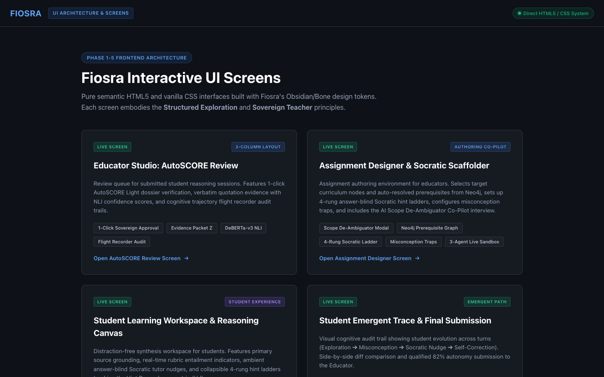

# Fiosra UI/UX Architecture & Product Experience

Welcome to the **Fiosra UI/UX Architecture** repository. Fiosra provides a dual-sided reasoning environment designed to make the development of knowledge visible for both students and educators.

---

## 📁 Directory Structure

```
ui-ux/
├── student-experience/
│   └── README.md              # Detailed Specification of the Student Reasoning Experience
│
├── teacher-experience/
│   └── README.md              # Detailed Specification of the Educator Studio & Observability
│
├── lms-experience/
│   └── README.md              # Detailed Specification of Course & Curriculum Management Layer
│
└── frontend/                  # Interactive Semantic HTML5 & Vanilla CSS Screen Implementations
    ├── index.html             # Central Screen Hub & Navigation
    ├── educator_lms_courses.html   # Educator Course Portfolio & Syllabus Grounding Hub
    ├── educator_lms_modules.html   # Curriculum Modules, Sequencer & Cohort Roster
    ├── student_lms_portal.html     # Student Course Portal, Timeline & Reasoning Portfolio
    ├── educator_studio_review.html # AutoSCORE Review Queue & Evidence Dossier
    ├── assignment_designer.html    # Assignment Designer & Scope De-Ambiguator Co-Pilot
    ├── student_workspace.html      # Sectional Scaffolding Reasoning Canvas
    ├── student_trace.html          # The Emergent Path & Deliberate Submission
    ├── cohort_diagnostics.html     # Misconception Cluster Heatmap & 1-Click Remediation
    ├── knowledge_graph.html        # Interactive Neo4j + pgvector Topological Graph
    ├── student_home.html           # Student Course Home & Learning Frontier
    ├── css/
    │   └── design-system.css   # Core Obsidian/Bone Design Tokens & Responsive Primitives
    └── screenshots/            # Verified Headless Raster Captures
```



---

## 🎓 1. [Student Experience Specification](student-experience/README.md)
* **Metaphor:** *Knowledge in Motion & Structured Exploration*
* **Core Invariants:** Answer isolation, no chatbot dominance, no red error banners, no gamification theatrics.
* **Key Workflows:**
  - **Learning Frontier Detection** (`student_home.html`): *What should I work on now? Where am I? What's next?*
  - **Sectional Reasoning Canvas** (`student_workspace.html`): Section-by-section decomposed scaffolding with zero-penalty mechanical assists (Speech-to-Thought 🎙️, Clip-to-Claim 📎, Rhetorical Launchpads 💡) and 1-click synthesis weaving.
  - **The Emergent Path** (`student_trace.html`): Turn-by-turn diff comparisons and qualified autonomy submission.

👉 **Read the full specification:** [`ui-ux/student-experience/README.md`](student-experience/README.md)

---

## 👩‍🏫 2. [Teacher Experience Specification](teacher-experience/README.md)
* **Metaphor:** *The Sovereign Educator*
* **Core Invariants:** AI proposes; teacher approves. 15-second verifiable grading. Observability $\neq$ analytics theatre.
* **Key Workflows:**
  - **Scope De-Ambiguator Co-Pilot** (`assignment_designer.html`): Ingests raw syllabi, diagnoses ambiguities ($A_i > 30\%$), conducts 3-question alignment interview, auto-populates 4-rung hint ladders, and runs 3-agent live sandbox dry-runs.
  - **AutoSCORE Review Queue** (`educator_studio_review.html`): 1-click sovereign approval backed by Packet $Z$ and DeBERTa NLI verbatim quote evidence.
  - **Cohort Diagnostics & Heatmap** (`cohort_diagnostics.html`): Class-wide misconception frequency clusters, Neo4j bottleneck diagnosis, and 1-click targeted micro-primer remediation.
  - **Knowledge Graph Explorer** (`knowledge_graph.html`): Interactive topological visualizer connecting Neo4j prerequisite DAGs and `pgvector` semantic vector proximity.

👉 **Read the full specification:** [`ui-ux/teacher-experience/README.md`](teacher-experience/README.md)

---

## 🏛️ 3. [LMS Experience Specification](lms-experience/README.md)
* **Metaphor:** *Sovereign Course Grounding & Intellectual Portfolio*
* **Core Invariants:** Rejects legacy LMS administrative bloat. Anchors active reasoning in formal syllabi and primary source corpora. Replaces empty letter grades with cryptographic evidence dossiers.
* **Key Workflows:**
  - **Educator Course Portfolio & Grounding Hub** (`educator_lms_courses.html`): Term management, active cohort monitoring, and 4-stage syllabus corpus ingestion into `pgvector` and Neo4j.
  - **Curriculum Architecture & Cohort Roster** (`educator_lms_modules.html`): Linear & DAG-locked units, assignment lifecycle states (Evaluated, In Review, Active Canvas), and 24-student diagnostic autonomy matrix with 1-click micro-scaffold dispatching.
  - **Student Course Portal & Reasoning Transcript** (`student_lms_portal.html`): Enrolled course timeline, integrated primary source clipping reader, and verified reasoning portfolio showcasing autonomy rate ($88.4\%$), entailed claims, and teacher endorsements.

👉 **Read the full specification:** [`ui-ux/lms-experience/README.md`](lms-experience/README.md)

