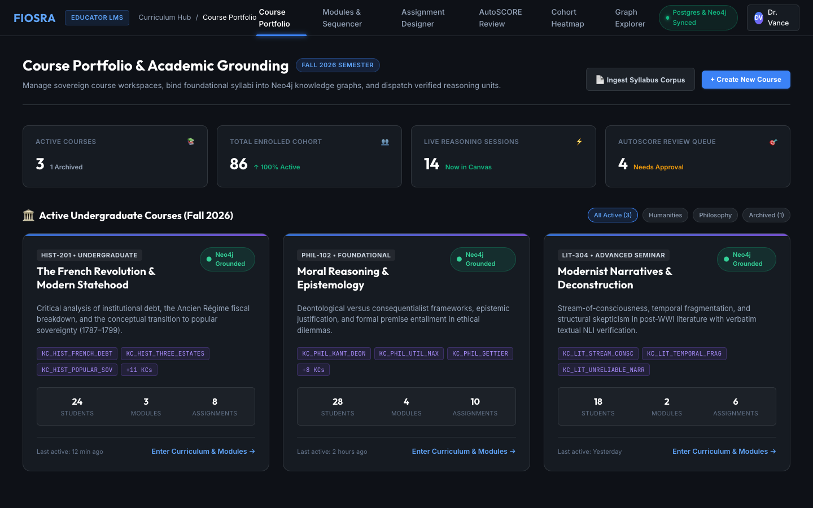
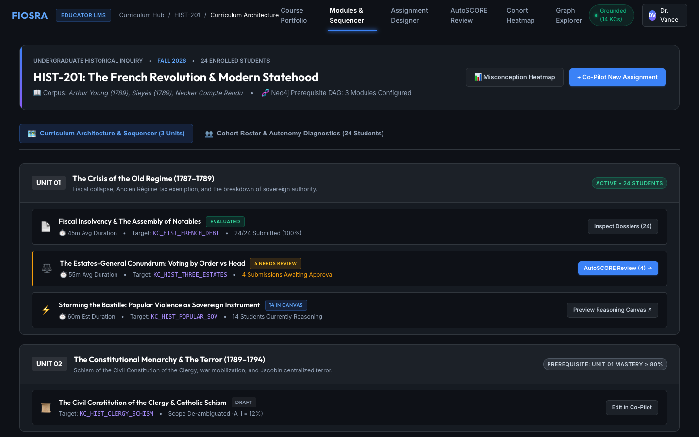
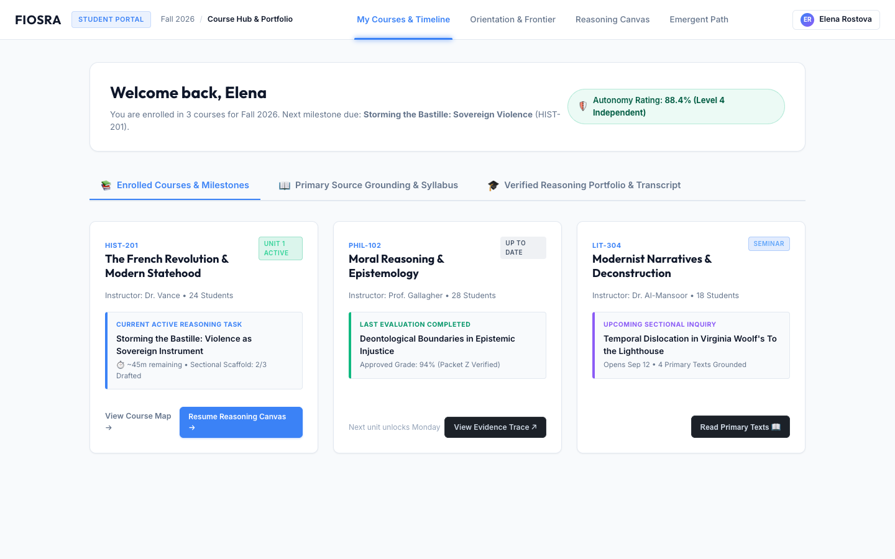

# Fiosra LMS Experience: Course & Curriculum Management Layer

> **"Reasoning cannot happen in an academic void. Before a student enters the Socratic arena, and before a teacher reviews an evidence dossier, their intellectual journey must be anchored in syllabus context, prerequisite knowledge structures, and cohort milestones."**

---

## 🏛️ Executive Summary & Philosophical Invariants

Traditional Learning Management Systems (Canvas, Blackboard, Moodle) treat education as an administrative spreadsheet: bloated discussion boards, passive document repositories, and superficial click-tracking.

**Fiosra rejects the legacy LMS model.** The Fiosra LMS layer is not a clerical filing cabinet—it is a **Curriculum Grounding & Sovereignty Hub**. It provides:
1. **Academic Grounding for Reasoning**: Anchors reasoning tasks into formal undergraduate syllabi, primary source corpora, and target Knowledge Components ($KC$).
2. **Sovereign Course Architecture**: Empowers educators to structure linear units and prerequisite DAG-locked modules without administrative bureaucracy.
3. **Reasoning Portfolios over Letter Grades**: Transcends empty letter grades by showcasing verified claim entailment rates ($E \ge 0.85$), unassisted self-corrections, and cryptographic evidence dossiers.

```
┌────────────────────────────────────────────────────────────────────────────────────────┐
│                              FIOSRA LMS DUAL TOPOLOGY                                  │
└───────────────────────────────────────────┬────────────────────────────────────────────┘
                                            │
           ┌────────────────────────────────┴────────────────────────────────┐
           ▼                                                                 ▼
┌──────────────────────────────────────┐                   ┌──────────────────────────────────────┐
│       EDUCATOR LMS WORKSPACE         │                   │         STUDENT LMS PORTAL           │
├──────────────────────────────────────┤                   ├──────────────────────────────────────┤
│ 1. Course Portfolio & Grounding Hub  │                   │ 1. My Enrolled Courses & Timeline    │
│ 2. Syllabus Corpus Ingestion Pipeline│                   │ 2. Grounded Primary Source Reader    │
│ 3. Curriculum Architecture Sequencer │                   │ 3. Active Reasoning Launchboard      │
│ 4. Cohort Roster & Autonomy Matrix   │                   │ 4. Cryptographic Reasoning Portfolio │
└──────────────────┬───────────────────┘                   └──────────────────┬───────────────────┘
                   │                                                          │
                   ▼                                                          ▼
┌──────────────────────────────────────┐                   ┌──────────────────────────────────────┐
│ Educator Studio Co-Pilot             │                   │ Sectional Reasoning Canvas           │
│ (Assignment Designer & AutoSCORE)    │                   │ (Speech-to-Thought & Emergent Trace) │
└──────────────────────────────────────┘                   └──────────────────────────────────────┘
```

---

## 🖥️ Screen 1: Educator Course Portfolio & Academic Grounding

**File Reference**: [`ui-ux/frontend/educator_lms_courses.html`](file:///Users/anupamasadanandan/Documents/project/tutor/ui-ux/frontend/educator_lms_courses.html)

### Purpose & Pedagogy
The Educator Course Portfolio provides the institutional command center for the academic term (e.g., *Fall 2026 Semester*). It displays active course workspaces, cohort enrollment metrics, live reasoning sessions, and pending AutoSCORE evaluations.

### Key Workflows:
1. **Sovereign Course Cards**:
   - Each card displays course code, undergraduate level, syllabus grounding status (`● Neo4j Grounded`), active student headcount, and bound Knowledge Components.
   - 1-click entry into curriculum sequencer (`Enter Curriculum & Modules →`).
2. **Syllabus Corpus Ingestion Pipeline (Modal)**:
   - Educators drag-and-drop course syllabi (PDF, Markdown, EPUB).
   - Fiosra’s automated pipeline performs 4-stage grounding:
     - *Document Structure & Unit Extraction* (Deterministic header parsing).
     - *Chunking & Vector Embeddings* (1536-dim indexed into `pgvector` for DeBERTa claim verification).
     - *Prerequisite DAG Extraction* (Resolves $KC$ dependencies into Neo4j Cypher queries).
     - *Misconception Trap Pre-population* (Binds known student failure modes from seed registry).
3. **Cohort Pulse Stats Ribbon**:
   - Real-time visibility into active reasoning sessions (e.g. *14 students currently in canvas*) and triage queues (*4 AutoSCORE evaluations awaiting review*).



---

## 🖥️ Screen 2: Educator Curriculum Architecture & Cohort Roster

**File Reference**: [`ui-ux/frontend/educator_lms_modules.html`](file:///Users/anupamasadanandan/Documents/project/tutor/ui-ux/frontend/educator_lms_modules.html)

### Purpose & Pedagogy
Provides granular control over curriculum sequencing, prerequisite locks, and student cohort readiness within a single course workspace (*HIST-201: The French Revolution & Modern Statehood*).

### Two Interactive Surfaces:

#### Tab A: Curriculum Architecture & Module Sequencer
- **Unit 01: The Crisis of the Old Regime (1787–1789)** [Active • 24 Students]
  - *Assignment 1.1 (Fiscal Insolvency)*: Evaluated (`24/24 Submitted`, 91% verified claims). 1-click access to evidence dossiers.
  - *Assignment 1.2 (Estates-General Conundrum)*: Active review queue (`4 Submissions Awaiting Approval`). 1-click launch into AutoSCORE Review.
  - *Assignment 1.3 (Storming the Bastille)*: Active reasoning canvas (`14 Students Currently Reasoning`). 1-click live student preview.
- **Unit 02: The Constitutional Monarchy & The Terror (1789–1794)** [Locked]
  - Enforces prerequisite DAG rule: *Locked until Unit 01 Cohort Mastery $\ge 80\%$*.
- **Unit 03: Thermidorian Reaction & Napoleonic Consolidation (1795–1799)** [Locked by Prerequisite DAG]

#### Tab B: Cohort Roster & Autonomy Diagnostics Matrix
- Full 24-student class roster displaying:
  - **Autonomy Score ($\bar{A}_s$)**: Visual progress meter measuring independent reasoning without teacher nudges.
  - **Hint Ceiling Index ($H_d$)**: Tracks scaffold usage depth (0.15 = minimal hints, 0.55 = moderate scaffold dependency).
  - **Active Cognitive Traps**: Highlights specific misconception traps (e.g., Marcus Vance flagged for `MISC_TAILLE_EQUALITY`).
  - **1-Click Class-wide Intervention**: `🚀 Dispatch Targeted Socratic Micro-Scaffold` delivers a 2-minute interactive Socratic primer on institutional debt directly to flagged students' canvases.



---

## 🖥️ Screen 3: Student Course Portal & Reasoning Portfolio

**File Reference**: [`ui-ux/frontend/student_lms_portal.html`](file:///Users/anupamasadanandan/Documents/project/tutor/ui-ux/frontend/student_lms_portal.html)

### Purpose & Pedagogy
The student portal provides a calm, distraction-free learning environment built with Fiosra’s **Bone Light Design System** (`#f8fafc`). It connects enrolled course milestones with primary source reading materials and verifiable proof of intellectual growth.

### Key Workflows:
1. **Enrolled Courses & Active Launchboard**:
   - High-density cards for enrolled undergraduate subjects (*HIST-201*, *PHIL-102*, *LIT-304*).
   - Clear active task cards indicating exactly what milestone requires cognitive focus, time estimates, and sectional completion rate (e.g. *2/3 Sections Drafted*).
   - 1-click button: `Resume Reasoning Canvas →`.
2. **Integrated Primary Source Grounding Reader**:
   - In-browser reading surface for assigned historical texts (*Arthur Young: Travels in France 1789*, *Abbé Sieyès: What is the Third Estate?*).
   - One-click action: `📎 Clip Excerpt to Reasoning Canvas` transfers relevant historical quotes directly into the student’s scratchpad without context-switching.
3. **Cryptographic Reasoning Portfolio & Transcript**:
   - Replaces empty letter grades with an authentic intellectual transcript:
     - **Autonomy Index**: $88.4\%$ (Top decile independent reasoning).
     - **Verified Claims Entailed**: $18 / 20$ rubric criteria proved via DeBERTa-v3 NLI.
     - **Autonomous Self-Corrections**: 4 instances where the student encountered cognitive friction, rejected a misconception trap, and corrected course unassisted.
   - **Verifiable Teacher Endorsement**: Dr. Vance’s cryptographically signed qualitative appraisal grounded in Structured Evidence Packet $Z$.
   - Export action: `📄 Export Verifiable Proof of Reasoning (.json-ld / PDF)`.



---

## 🔗 Seamless Interoperability Matrix

| From LMS Surface | User Action | Destination Target | Context Passed |
|:---|:---|:---|:---|
| `educator_lms_courses.html` | Click *Enter Curriculum & Modules →* | `educator_lms_modules.html` | Course ID: `HIST-201` |
| `educator_lms_modules.html` | Click *+ Co-Pilot New Assignment* | `assignment_designer.html` | Course ID + Target Module |
| `educator_lms_modules.html` | Click *AutoSCORE Review (4)* | `educator_studio_review.html` | Assignment ID + Filter: `needs_review` |
| `educator_lms_modules.html` | Click *Misconception Heatmap* | `cohort_diagnostics.html` | Course ID + Cohort Traps |
| `student_lms_portal.html` | Click *Resume Reasoning Canvas →* | `student_workspace.html` | Student ID + Active Section |
| `student_lms_portal.html` | Click *View Evidence Trace ↗* | `student_trace.html` | Session ID: `STU081-REV24` |
