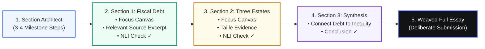

# Fiosra Student Experience (UX/UI Specification)
### The Architecture of Structured Inquiry, Cognitive Autonomy, and Visible Thinking

> **Core Metaphor:** *Knowledge in Motion* — Knowledge is not an object to be downloaded or a terminal test score to be gamed. It is investigated, tested through struggle, and synthesized into authentic understanding.

---

## 🧭 1. Executive Summary & Design Philosophy

Traditional educational platforms vacillate between two harmful extremes:
1. **The Blank-Page Void:** Dumping the student into an empty, intimidating text area where blank-page paralysis and working-memory overload cause cognitive freeze.
2. **The Conversational Ghostwriter:** Providing an unrestricted generative chatbot that solves the problem, writes the paragraphs, or gives away the thesis—destroying genuine learning through total cognitive offloading.

**Fiosra replaces both with the *Structured Exploration* Model:**
- **Structured Freedom:** The workspace provides a clear path forward (decomposed sectional milestones, primary source evidence anchors, and ambient Socratic probes) while leaving 100% of the cognitive labor, reasoning, and synthesis in the student's hands.
- **Answer-Blind Socratic Guidance:** The student-facing AI (*Dialogue Agent*) never sees or holds the reference answer in its prompt context. It asks questions that expose contradictions in the student's own claims rather than dispensing facts.
- **A Path Made Visible:** Rather than grading only the final terminal text, Fiosra records and visualizes the student's authentic developmental journey (*"The Emergent Path"*), celebrating self-corrections and earned autonomy.

### What the Student Experience Banishes:
- 🚫 **No Chatbot Dominance:** AI never occupies 50% of the screen. The dominant element is always the active reasoning canvas. AI sits quietly in the periphery and recedes when the student types.
- 🚫 **No Red for Educational Mistakes:** Red is strictly reserved for system crashes. Cognitive misconceptions trigger neutral or amber Socratic reflection—never alarming failure banners.
- 🚫 **No Gamification Gimmicks:** No badges, confetti, streak counts, XP points, or leaderboards. Progress is quiet, adult, and intrinsically earned.
- 🚫 **No Surveillance Anxieties:** Keystroke logging is not surveillance; it is converted into a proud visual trace showing how the student outgrew their initial misconceptions.

---

## 🗺️ 2. The 3 Core Student Surfaces

The student journey is structured across three interconnected, distraction-free surfaces:

```
┌─────────────────────────────────────────────────────────────────────────────────────────────────────────┐
│                                       STUDENT EXPERIENCE SURFACES                                       │
├───────────────────────────────────┬───────────────────────────────────┬─────────────────────────────────┤
│ 1. COURSE HOME & ORIENTATION      │ 2. REASONING CANVAS               │ 3. EMERGENT TRACE & SUBMISSION  │
│    student_home.html              │    student_workspace.html         │    student_trace.html           │
├───────────────────────────────────┼───────────────────────────────────┼─────────────────────────────────┤
│ • What to work on now?            │ • Primary source anchor           │ • The Emergent Path (○─○─●─○)   │
│ • Where am I? (Mastery graph)     │ • Section-by-section stepper      │ • Turn-by-turn diff view        │
│ • What's next? (Locked frontiers) │ • Zero-penalty writing assists    │ • Autonomy score qualification  │
│ • Active Assignment Hero Card     │ • Ambient Socratic guide          │ • 1-click dossier dispatch      │
│ • Zero dashboard noise            │ • 4-rung hint ladder (Hd = 0.25)  │ • Deliberate finalisation       │
└───────────────────────────────────┴───────────────────────────────────┴─────────────────────────────────┘
```

---

## 🖥️ Surface 1: Student Course Home & Orientation
* **File:** [`ui-ux/frontend/student_home.html`](../frontend/student_home.html)
* **Design Intent:** A calm, restrained orientation surface that eliminates dashboard anxiety and answers three vital questions at a single glance:
  1. *What should I work on now?*
  2. *Where am I in the course?*
  3. *What comes next?*

### Key UI Components:
1. **Hero Focus Card (Active Assignment):**
   - Dominant focus card for the current assignment: *HIST-201 • Assignment 4: Economic & Social Catalysts of 1789*.
   - Displays estimated focus time (25–30 min), deadline, and current draft state (*Turn 4 in progress*).
   - Prominent, primary action button: `Resume Reasoning Canvas →`.
2. **Curriculum Knowledge Mastery Cards (Neo4j Frontier):**
   - Concept cards reflecting mastered nodes from the Neo4j curriculum graph:
     - `KC_HIST_ANCIEN_REGIME`: *Absolutist Monarchy & Divine Right* (Mastered • 100%)
     - `KC_HIST_THREE_ESTATES`: *Social Stratification & Tax Privileges* (Mastered • 94%)
     - `KC_HIST_FRENCH_DEBT`: *Crown Fiscal Insolvency* (In Progress • Active)
3. **Upcoming Locked Milestones:**
   - Previews future conceptual units (*Module 2: The Constitutional Monarchy & The Terror*) that remain locked until prerequisite competencies are demonstrated.
   - Prevents cognitive overload by hiding future complexity until foundational prerequisites are grounded.

---

## 🖥️ Surface 2: Sectional Reasoning Canvas & Scaffolding
* **File:** [`ui-ux/frontend/student_workspace.html`](../frontend/student_workspace.html)
* **Design Intent:** The primary environment where thinking, struggle, drafting, and discovery occur. Replaces the intimidating blank-page void with a **Section-by-Section Decomposed Inquiry Model**.



### Key UI Components & Behavioral Mechanics:

### 1. Sectional Roadmap Stepper Strip (`.roadmap-strip`)
- Above the canvas, a horizontal progress stepper shows the assignment broken into digestible milestones:
  - `✓ 1. Crown Fiscal Insolvency (84w)` [Completed & Entailed]
  - `● 2. Three Estates & Taille Inequity ACTIVE` [Active Canvas]
  - `🔒 3. Institutional Synthesis` [Locked Milestone]
- Eliminates blank-page dread: writing 100 words on "war debt" is approachable, whereas writing 800 words on "The French Revolution" causes paralysis.

### 2. The Section Stack
- **Completed Section 1 (Accordion):**
  - Displays verified green border, student's completed paragraph, and primary source citation.
  - Collapsible to keep the workspace clean, with an `Edit Section 1` override.
- **Active Section 2 (Focused Canvas):**
  - Dedicated writing box with targeted goal directive (*"Explain how tax exemptions for Clergy and Nobility forced the Third Estate to shoulder the taille alone"*).
  - Real-time entailment pill: `✓ Criterion B: Taille Inequity (Self-Corrected • NLI 91%)`.
- **Locked Section 3 (Upcoming Milestone):**
  - Displays preview of upcoming goal; automatically unlocks once Section 2 achieves NLI entailment ($\ge 0.85$).

### 3. Zero-Penalty Mechanical Writing Assists
Fiosra distinguishes between **clerical/physical writing friction** (which deserves zero penalty) and **conceptual reasoning hints** (which adjust the hint dependency metric):

| Assist Tool | Trigger | Action | Autonomy Impact |
| :--- | :--- | :--- | :--- |
| **🎙️ Think Out Loud** | Speech-to-Thought Mic | Transcribes student's spoken voice and crystallizes it into structured bullet premises using their authentic vocabulary. | **0% Penalty** |
| **📎 Clip Primary Source** | 1-Click Quote Anchor | Highlights text in Arthur Young's travelogue and formats it directly into the active section as cited evidence. | **0% Penalty** |
| **💡 Rhetorical Launchpad** | Sentence Starter Stems | Inserts academic transitions (*"Consequently, institutional deadlock occurred when..."*) to build momentum without providing facts. | **0% Penalty** |

### 4. Ambient Socratic Guide (Right Sidebar)
- **Answer-Blind Nudge Card:** Slides in with a targeted inquiry prompt (*"You've connected Rousseau to freedom, but how did the Social Contract challenge divine right?"*).
- **4-Rung Socratic Hint Ladder:**
  - *Rung 1 (Conceptual Probe):* Answer-blind inquiry into root causes ($H_d = 0.25$).
  - *Rung 2 (Key Distinction):* Clarifies confusable categories ($H_d = 0.50$).
  - *Rung 3 (Structural Anchor):* Directs attention to institutional frameworks ($H_d = 0.75$).
  - *Rung 4 (Source Analysis):* Explicit grounding in primary source text ($H_d = 1.00$).
- **Live Autonomy Gauge:** Displays live autonomy rating in the header ($82\%$ with a green progress fill) so students see their independence earned in real time.

### 5. 1-Click Synthesis Weaving (`#weaveModal`)
- Once the sectional milestones are satisfied, the student clicks `📄 Weave Sections into Continuous Essay →`.
- A modal preview displays the discrete blocks seamlessly compiled into continuous academic prose, showing an aggregate **92.5% NLI Entailment Score**.

---

## 🖥️ Surface 3: The Emergent Path & Deliberate Finalisation
* **File:** [`ui-ux/frontend/student_trace.html`](../frontend/student_trace.html)
* **Design Intent:** Reconstructs the student's authentic learning trajectory as a proud visual cognitive artifact before final submission to the teacher.

### Key UI Components:
1. **The Emergent Path ($\circ\text{───}\circ\text{───}\bullet\text{───}\circ$):**
   - An interactive linear node sequence charting the student's cognitive evolution:
     $$\text{Initial Moral Claim} \longrightarrow \text{Misconception Detected} \longrightarrow \text{Socratic Nudge} \longrightarrow \text{Self-Correction} \longrightarrow \text{Rigorous Synthesis}$$
   - Clicking each node progressively reveals quotes, verifier scores, and timestamps.
2. **Turn-by-Turn Diff Comparison:**
   - Side-by-side comparison showing **Turn 1 Draft** (*"The King was evil and starved the peasants"*) vs **Turn 4 Synthesis** (*"Crown fiscal insolvency compounded by Seven Years' War debt and regressive taille tax exemptions..."*).
   - Concrete proof of genuine intellectual growth.
3. **Autonomy Qualification & 1-Click Submission Bar:**
   - Displays qualified autonomy score ($82\%$), 2 self-corrections, and $0.25$ hint dependency.
   - Prominent action button: `🚀 Submit Qualified Reasoning Trace to Dr. Vance`.
   - Packages the session into **Structured Evidence Packet $Z$** for instant educator review.

---

## 📊 Cognitive Science & Pedagogical Foundations

| Cognitive Principle | Scientific Foundation | How Fiosra Implements It |
| :--- | :--- | :--- |
| **Cognitive Load Theory** | Sweller (1988) | Sectional decomposition breaks a monolithic 800-word essay into 3 manageable milestones, preventing working memory exhaustion. |
| **Zone of Proximal Development** | Vygotsky (1978) | The 4-rung calibrated hint ladder provides exactly the level of scaffolding needed to bridge current competence to mastery. |
| **Answer Isolation** | Fiosra Core Invariant | The student-facing model never possesses the reference solution, preventing adversarial prompt engineering and cognitive offloading. |
| **Bloom's 2-Sigma Effect** | Bloom (1984) | Replicates 1-on-1 expert human tutoring through answer-blind Socratic dialogue and formative feedback. |
| **Metacognitive Reflection** | Flavell (1979) | The Emergent Path makes the student's own thought evolution visible, cultivating metacognition and long-term learning habits. |

---

## 🔗 Quick Reference to Frontend Artifacts
- **Navigation Hub:** [`ui-ux/frontend/index.html`](../frontend/index.html)
- **Student Home:** [`ui-ux/frontend/student_home.html`](../frontend/student_home.html)
- **Reasoning Canvas:** [`ui-ux/frontend/student_workspace.html`](../frontend/student_workspace.html)
- **Emergent Trace:** [`ui-ux/frontend/student_trace.html`](../frontend/student_trace.html)
- **Visual Renders:** [`ui-ux/frontend/screenshots/`](../frontend/screenshots/)
