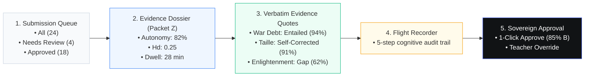
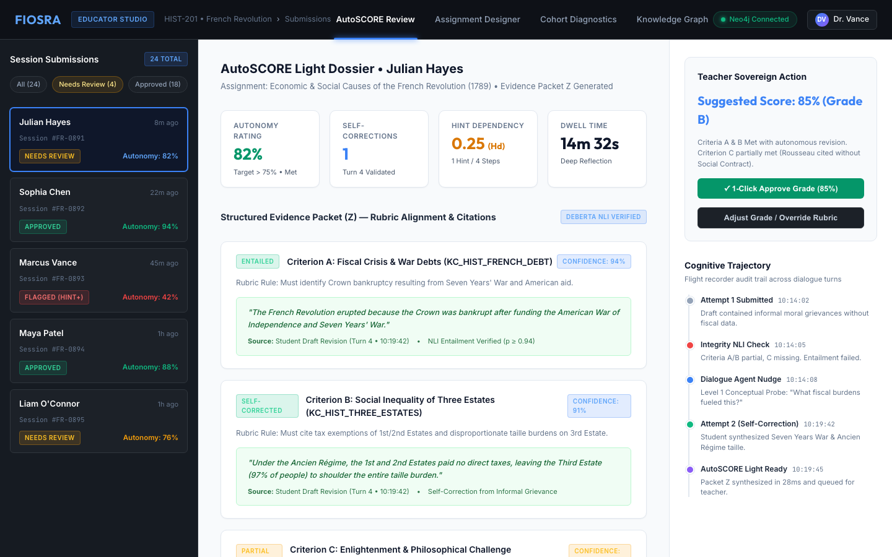
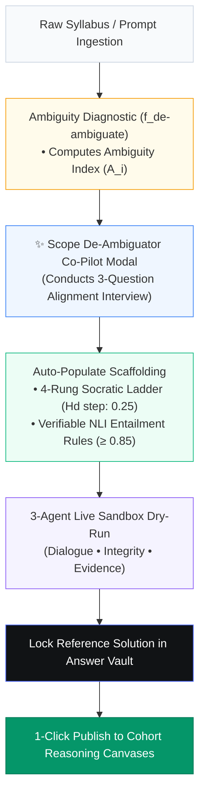
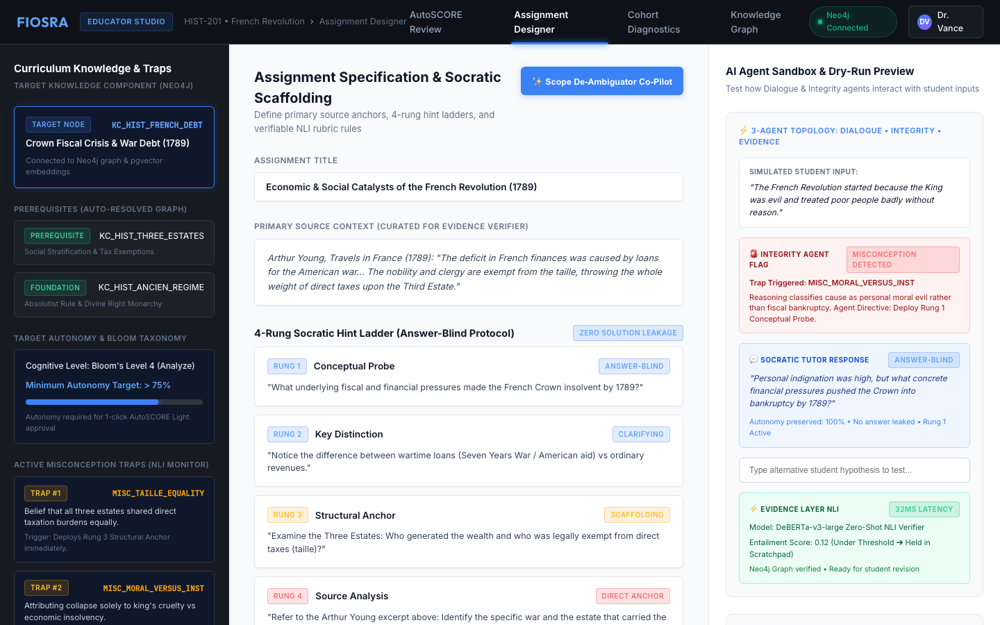
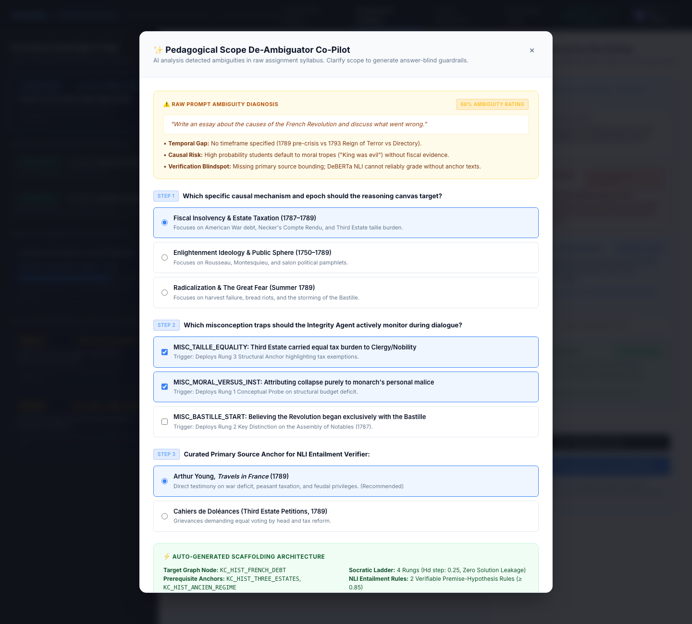
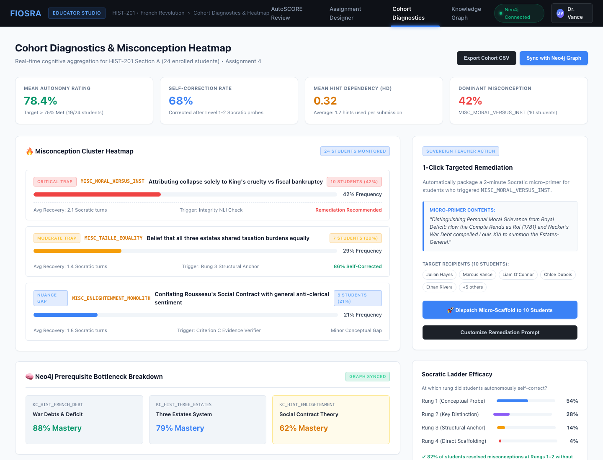
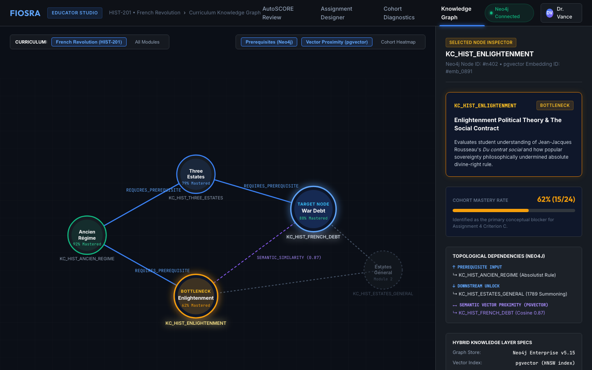

# Fiosra Teacher Experience (UX/UI Specification)
### The Architecture of Sovereign Evaluation, Actionable Observability, and Pedagogical Co-Piloting

> **Core Metaphor:** *The Sovereign Educator* — AI is an ambient synthesis engine and diagnostic auditor, not an autonomous grading authority. The system prepares evidence, highlights friction points, and proposes evaluations; the educator retains absolute authority over final student assessment.

---

## 🧭 1. Executive Summary & Design Philosophy

Traditional learning management systems (LMS) and grading software burden teachers with two flawed paradigms:
1. **Administrative Grading Grunt Work:** Staring at 100 identical essays or terminal multiple-choice exams without knowing *how* the student arrived at the answer, forcing teachers to spend hours hunting for plagiarism or AI ghostwriting.
2. **Analytics Theatre:** Dashboards filled with meaningless vanity metrics (click counts, login times, generic heatmaps, and completion percentages) that look impressive but answer none of the teacher's vital questions: *"Where did my students get conceptually stuck, and what should I teach tomorrow?"*

**Fiosra replaces both with Sovereign Teacher Observability:**
- **The Sovereign Teacher Principle:** AI never silently issues final grades, unilateral credential changes, or disciplinary penalties. The Evidence Agent compiles an auditable **Structured Evidence Packet ($Z$)** with exact verbatim quotes, allowing teachers to review and confirm grades in under 15 seconds.
- **Observability $\neq$ Analytics Theatre:** Observability asks: *"What deserves my attention right now?"* Fiosra surfaces prioritized signals using the **Signal ➔ Context ➔ Interpretation ➔ Action** protocol.
- **Pedagogical Scope Co-Piloting:** When instructors bring broad, ambiguous syllabi, an AI Co-Pilot diagnoses prompt gaps and auto-populates answer-blind Socratic hint ladders and verifiable rubric entailment rules.

### What the Teacher Experience Banishes:
- 🚫 **No Black-Box Automated Grading:** Every suggested score is mathematically grounded in verbatim student quotations evaluated by DeBERTa-v3 NLI claim verifiers.
- 🚫 **No Walls of Charts:** Replaces generic bar charts and scatterplots with prioritized action cards and targeted 1-click remediation triggers.
- 🚫 **No Tedious Schema Authoring:** Educators don't write complex JSON schemas; the Scope De-Ambiguator conducts rapid 3-question interviews to calibrate scaffolding.

---

## 🗺️ 2. The 4 Core Educator Studio Tabs

The Educator Studio is organized into 4 integrated, professional tabs sharing the Obsidian / Bone design system:

```
┌────────────────────────────────────────────────────────────────────────────────────────────────────────┐
│                                       EDUCATOR STUDIO SURFACES                                         │
├────────────────────────────────┬───────────────────────────────┬───────────────────────────────────────┤
│ 1. AUTOSCORE REVIEW QUEUE      │ 2. ASSIGNMENT DESIGNER        │ 3. COHORT DIAGNOSTICS & HEATMAP       │
│    educator_studio_review.html │    assignment_designer.html   │    cohort_diagnostics.html            │
├────────────────────────────────┼───────────────────────────────┼───────────────────────────────────────┤
│ • 1-click sovereign approval   │ • Scope De-Ambiguator Co-Pilot│ • Class-wide cognitive aggregation    │
│ • Evidence Packet Z summary    │ • Neo4j prerequisite graph    │ • Misconception cluster heatmap       │
│ • Verbatim quote citations     │ • 4-rung Socratic ladder      │ • Prerequisite bottleneck analysis    │
│ • Flight recorder audit trail  │ • 3-agent live sandbox dry-run│ • 1-click targeted remediation dispatch│
├────────────────────────────────┴───────────────────────────────┴───────────────────────────────────────┤
│ 4. CURRICULUM KNOWLEDGE GRAPH EXPLORER (knowledge_graph.html)                                          │
│    • Interactive SVG topological visualizer (Neo4j DAG + pgvector semantic vector proximity)           │
│    • Real-time cohort mastery overlays & in-depth concept bottleneck inspector                         │
└────────────────────────────────────────────────────────────────────────────────────────────────────────┘
```

---

## 🖥️ Tab 1: AutoSCORE Evidence Review Queue
* **File:** [`ui-ux/frontend/educator_studio_review.html`](../frontend/educator_studio_review.html)
* **Design Intent:** Enables teachers to audit and confirm student learning trajectories in under 15 seconds, backed by verifiable evidence rather than blind trust.



### Key UI Components:
1. **Submission Triage Column (Left):**
   - Filter chips: `All (24)`, `Needs Review (4)`, `Approved (18)`.
   - Student cards displaying student avatar, submission timestamp, autonomy score badge (`82% Autonomy`), and attention pills (`Self-Corrected`, `Low Autonomy`, `Flagged Gap`).
2. **Evidence Dossier (Packet $Z$) Summary Cards (Center Top):**
   - **Autonomy Score:** $82\%$ (ratio of milestones resolved without heavy hints).
   - **Hint Dependency ($H_d$):** $0.25$ (1 of 4 hint rungs accessed).
   - **Self-Corrections:** 2 instances where student corrected an initial misconception following a Socratic probe.
   - **Dwell Time:** 28 minutes of active reasoning.
3. **Verbatim Quotation Evidence (Center Body):**
   - Every rubric criterion is paired with the exact student quote and a DeBERTa NLI confidence badge:
     - *Criterion A (War Debt):* `"The deficit in French finances was caused by loans for the American war..."` ➔ <span class="badge badge-success">ENTAILED 94%</span>
     - *Criterion B (Taille Inequity):* `"Under the Ancien Régime, the 1st and 2nd Estates paid no direct taxes..."` ➔ <span class="badge badge-success">SELF-CORRECTED 91%</span>
     - *Criterion C (Enlightenment):* `"Rousseau inspired people to want freedom from kings..."` ➔ <span class="badge badge-warning">PARTIAL GAP 62%</span>
4. **Cognitive Flight Recorder Audit Trail (Right Column):**
   - Replays the 5-step chronological interaction stream:
     1. `Session Started` (10:04:12)
     2. `Hypothesis 1 Submitted: Moral Malice Claim` (10:08:30)
     3. `Integrity Flag: MISC_MORAL_VERSUS_INST` (10:08:31)
     4. `Socratic Dialogue: Rung 1 Probe Delivered` (10:08:32)
     5. `Self-Correction Achieved: Fiscal Debt Integrated` (10:14:05)
5. **Sovereign Grade Action Card (Bottom Right):**
   - Displays AI-recommended score: **85% (Grade B)** with rationale.
   - Prominent 1-click sovereign button: `✓ Approve Evaluation & Dispatch Grade`.
   - Override controls: teacher can adjust the slider or leave direct qualitative voice notes.



---

## 🖥️ Tab 2: Assignment Designer & Scope De-Ambiguator Co-Pilot
* **File:** [`ui-ux/frontend/assignment_designer.html`](../frontend/assignment_designer.html)
* **Design Intent:** Empowers educators to author rigorous, misconception-aware assignments from raw syllabus text, eliminating the fatal downstream errors of ambiguous prompts.



### Key UI Components & Behavioral Mechanics:

### 1. Pedagogical Scope De-Ambiguator Modal (`#alignmentModal`)
- **Ambiguity Diagnosis Alert:** Triggers if the raw prompt has an Ambiguity Index $A_i > 30\%$. Shows:
  - Raw prompt quote: *"Write an essay about the causes of the French Revolution and discuss what went wrong."*
  - Identified gaps: Temporal gap (missing epoch), Causal risk (moral hand-waving), Verification blindspot (missing primary source bounding).
- **3-Question Alignment Interview:**
  - *Step 1 (Temporal & Causal Focus):* Selects epoch from Neo4j (e.g. *Fiscal Insolvency & Estate Taxation 1787–1789* vs *Enlightenment Public Sphere*).
  - *Step 2 (Active Misconception Traps):* Selects traps for the Integrity Agent to monitor (`MISC_TAILLE_EQUALITY`, `MISC_MORAL_VERSUS_INST`).
  - *Step 3 (Primary Source Anchor):* Selects curated anchor text (Arthur Young's *Travels in France*).
- **1-Click Auto-Populate:** Applies alignment to instantly configure hint ladders and rubric entailment rules.

### 2. 3-Column Designer Layout:
- **Column 1: Curriculum Knowledge Graph & Traps:**
  - Target Node: `KC_HIST_FRENCH_DEBT` (Crown Fiscal Crisis & War Debt 1789).
  - Auto-resolved prerequisites from Neo4j: `KC_HIST_THREE_ESTATES`, `KC_HIST_ANCIEN_REGIME`.
  - Target Autonomy: $> 75\%$ required for 1-click AutoSCORE approval.
- **Column 2: Socratic Scaffolding & NLI Rubric Rules:**
  - Configurable 4-rung Socratic hint ladder (Conceptual Probe ➔ Key Distinction ➔ Structural Anchor ➔ Source Analysis).
  - Machine-verifiable NLI criteria: $\text{Premise}(\text{Student Argument}) \xrightarrow{\text{NLI } \ge 0.85} \text{Hypothesis}(\text{Rubric Criterion})$.
- **Column 3: 3-Agent Live Simulator Sandbox:**
  - Educator types test student hypotheses into a live dry-run sandbox.
  - Simulates the interaction between:
    - *Simulated Student Input:* "The king was evil and starved people."
    - *Integrity Agent:* Flags `MISC_MORAL_VERSUS_INST`.
    - *Dialogue Agent:* Formulates answer-blind Socratic probe.
    - *Evidence Layer:* Evaluates DeBERTa NLI score in 32ms.
  - **Publish Button:** Locks reference solution into the encrypted Answer Vault and dispatches assignment to 24 student reasoning canvases.





---

## 🖥️ Tab 3: Cohort Diagnostics & Misconception Heatmap
* **File:** [`ui-ux/frontend/cohort_diagnostics.html`](../frontend/cohort_diagnostics.html)
* **Design Intent:** Provides class-wide cognitive observability, identifying systemic cognitive bottlenecks across all 24 students and enabling 1-click targeted remediation.

### Key UI Components:
1. **Misconception Cluster Heatmap:**
   - Visualizes frequency of cataloged error models across the cohort:
     - `MISC_MORAL_VERSUS_INST`: **42% of class (10 students)** — Attributing fiscal collapse to personal malice.
     - `MISC_TAILLE_EQUALITY`: **38% of class (9 students)** — Believing direct taxation was shared equally across estates.
     - `MISC_BASTILLE_START`: **12% of class (3 students)** — Assuming revolution began exclusively with Bastille storming.
2. **Neo4j Prerequisite Bottleneck Diagnosis:**
   - Highlights upstream graph bottlenecks causing downstream assignment failures:
     - `KC_HIST_ENLIGHTENMENT`: **62% Cohort Mastery (CRITICAL BOTTLENECK)**.
     - Graph traversal reveals that failure to understand the *Social Contract* prevents students from explaining why the Third Estate rejected the traditional voting-by-order protocol.
3. **1-Click Targeted Remediation Dispatcher:**
   - Instead of lecturing the entire class for an issue affecting only 10 students, the teacher clicks:
     `🚀 Dispatch Targeted Micro-Scaffold to 10 Flagged Students`.
   - Sends a 2-minute interactive Socratic primer on institutional debt directly to the affected students' reasoning canvases.



---

## 🖥️ Tab 4: Curriculum Knowledge Graph Explorer
* **File:** [`ui-ux/frontend/knowledge_graph.html`](../frontend/knowledge_graph.html)
* **Design Intent:** Interactive topological graph visualizer powered by Neo4j and PostgreSQL `pgvector`, providing educators with deep visibility into curriculum dependencies and semantic error proximity.

### Key UI Components:
1. **Interactive SVG Topological Graph:**
   - **Nodes:** Curriculum concepts (`KnowledgeComponent`) color-coded by cohort mastery level (Green: $> 80\%$, Yellow: $60–80\%$, Amber: $< 60\%$).
   - **Solid Edges:** `REQUIRES_PREREQUISITE` directed acyclic graph (DAG) dependencies from Neo4j.
   - **Dashed Glow Edges:** Semantic vector proximity derived from 1536-dimensional `pgvector` cosine similarity (`SEMANTIC_SIMILARITY 0.87`).
2. **Node Inspector Panel (Right Column):**
   - Displays selected concept metadata (`KC_HIST_FRENCH_DEBT`).
   - Prerequisite ancestor tree (depth 1, depth 2).
   - Cohort mastery rate ($78\%$), average hint dependency ($0.28$), and downstream unlocked concepts.
   - Bound misconception traps and `pgvector` cosine distance distributions.



---

## 🔬 Scientific & Technical Pipeline: AutoSCORE Light (AAAI 2026)

Fiosra's evaluation engine decouples raw event extraction from scoring, preventing hallucinated grading:

$$\text{Raw Event Stream } (E) \xrightarrow{f_{\text{extract}}} \text{Structured Evidence Packet } (Z) \xrightarrow{f_{\text{score}}} \text{Auditable Grade Recommendation } (\hat{Y})$$

1. **Stage 1 ($f_{\text{extract}}$):** Replays chronological keystrokes, dialogue turns, verifier checks, and hint requests to extract the **5 Core Learning Metrics**:
   - *Autonomy Rating:* Ratio of subproblems resolved without accessing Level 2+ hints.
   - *Self-Correction Count:* Instances where an initial verifier failure was revised after a Socratic probe.
   - *Hint Dependency ($H_d$):* Total hint requests divided by total attempted steps.
   - *Dwell Time Trajectory:* Time spent reflecting and revising vs. rapid guessing.
   - *Misconception Remediation:* Resolution status of diagnosed conceptual errors.
2. **Stage 2 ($f_{\text{score}}$):** Evaluates Packet $Z$ against the rubric criteria, pairing every suggested grade with clickable verbatim quotes verified by DeBERTa-v3 NLI zero-shot classification ($\text{Premise} \xrightarrow{\ge 0.85} \text{Hypothesis}$).
3. **Stage 3 (Sovereign Approval):** The educator inspects Packet $Z$ and confirms or overrides the grade in $< 15$ seconds.

---

## 🔗 Quick Reference to Frontend Artifacts
- **Navigation Hub:** [`ui-ux/frontend/index.html`](../frontend/index.html)
- **AutoSCORE Review Queue:** [`ui-ux/frontend/educator_studio_review.html`](../frontend/educator_studio_review.html)
- **Assignment Designer:** [`ui-ux/frontend/assignment_designer.html`](../frontend/assignment_designer.html)
- **Cohort Diagnostics:** [`ui-ux/frontend/cohort_diagnostics.html`](../frontend/cohort_diagnostics.html)
- **Knowledge Graph Explorer:** [`ui-ux/frontend/knowledge_graph.html`](../frontend/knowledge_graph.html)
- **Visual Renders:** [`ui-ux/frontend/screenshots/`](../frontend/screenshots/)
